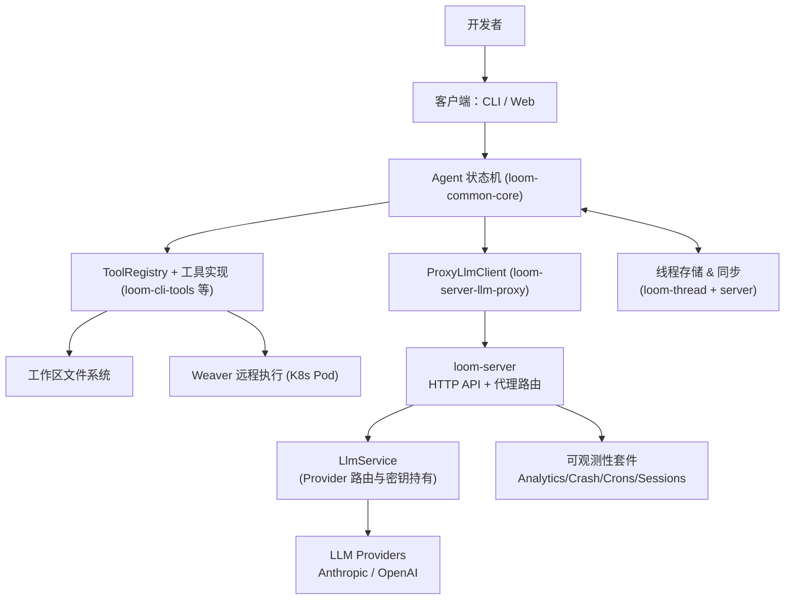

# 序言：全局地图与极简体验

本章目的：让完全零认知的读者先搞清楚 Loom 是什么、整体怎么工作、有哪些关键部件、代码库怎么找路，并用一次最小交互的端到端故事把抽象落到具体。

## Loom 是什么（定位）
- 定位：面向开发者的 AI 编码助手，核心是一个事件驱动的 Agent 状态机（`loom-common-core`），能通过工具执行文件和环境操作。
- 运行形态：客户端（CLI / Web）负责 UI 与本地/远程工具执行，服务器端提供 LLM 代理、线程同步、可观测性与远程执行编排。
- 安全边界：所有 LLM 密钥只在服务器端 `LlmService` 持有；客户端通过 `ProxyLlmClient` 走代理，不直接接触密钥。

## 架构全景图（经源码与规格核对）

### 图解（一步步对应）
1) 用户在 CLI/Web 输入消息，进入客户端。
2) 客户端内的 Agent 状态机决定下一步：直接回复、发起 LLM 请求、或下发工具执行。
3) 工具通过 ToolRegistry 查找到实现；本地工具直触文件系统，或通过 Weaver 在隔离 Pod 内执行。
4) 需要模型时，Agent 通过 `ProxyLlmClient` 走 HTTP 到 `loom-server`。
5) `loom-server` 内的 `LlmService` 根据配置选择 Provider，并用服务器侧密钥请求 Anthropic / OpenAI。
6) 线程内容（消息、工具记录）在客户端与服务器之间同步，保证跨端可恢复。
7) 服务器将交互事件送入可观测性套件，用于分析与健康监测。

## 核心概念词典
- Agent（行业）：事件驱动的对话执行体；在本项目由 `loom-common-core` 状态机实现。
- Agent 状态机（项目特有）：`AgentState` + `AgentEvent` + `AgentAction` 的显式转移表，决定何时调用 LLM、执行工具、重试或收敛。
- ProxyLlmClient（项目特有）：客户端侧 LLM 接口，全部请求经 `/proxy/{provider}` 走服务器。
- LlmService（项目特有）：服务器端的 Provider 聚合与密钥持有层，决定具体调用 Anthropic/OpenAI。
- ToolRegistry（项目特有）：工具注册与查找中心，支撑模型生成的 ToolCall 下发到具体实现。
- Weaver（项目特有）：K8s Pod 为载体的远程执行环境，结合 WireGuard/DERP 隧道实现隔离与可访问性。
- Thread/ThreadStore：对话与工具历史的持久化单元，支持本地与服务器同步。
- Observability 套件：Analytics、Crash、Crons、Sessions 四件套，用于使用行为、崩溃、定时任务与会话健康的观测。

## 代码库地图（找到对应实现）
- 顶层入口：`crates/` 为 Rust 工作区，`web/loom-web` 为 Svelte 5 前端，`specs/` 为设计规格索引。
- 核心引擎：`crates/loom-common-core`（状态机、LLM/Tool 类型），`crates/loom-common-thread`（线程与同步类型）。
- 客户端侧：`crates/loom-cli`（主二进制）、`crates/loom-cli-tools`（工具实现）、`crates/loom-cli-auto-commit` / `loom-cli-git` 等。
- 服务器侧：`crates/loom-server`（HTTP API、LLM 代理路由）、`crates/loom-llm-service`（Provider 聚合）、`crates/loom-server-llm-proxy`（HTTP 客户端类型定义）、`crates/loom-server-weaver` / `loom-server-k8s`（远程执行）。
- 观测与配套：`crates/loom-analytics-*`、`loom-crash-*`、`loom-crons-*`、`loom-sessions-*`。
- 规格参考：`specs/architecture.md`（架构）、`specs/state-machine.md`（状态机）、`specs/tool-system.md`、`specs/weaver-*`、`specs/analytics-system.md` 等。

## 一次典型交互的极简端到端

调用路径（每跳说明输入/输出）：
1) CLI 主循环 (`crates/loom-cli/src/main.rs`) 接收用户消息 → 输入：文本消息 + 当前线程 ID。
2) Agent 状态机 (`loom-common-core`) 处理 `AgentEvent::UserInput` → 输出：可能的 `AgentAction::SendLlmRequest` 或 `ExecuteTools`。
3) 若需模型：`ProxyLlmClient` (`loom-server-llm-proxy`) 构造 HTTP 请求到 `/proxy/{provider}/complete` 或 `/stream` → 输入：`LlmRequest`（模型、消息、工具 schema）。
4) 服务器路由 (`loom-server`) 将请求交给 `LlmService` (`loom-llm-service`) → 输出：调用具体 Provider 客户端 (`loom-llm-anthropic` / `loom-llm-openai`)。
5) Provider 返回文本或工具调用结果 → 经服务器 SSE 回传给客户端 → Agent 接收 `LlmEvent`，若包含工具调用则进入 `ExecutingTools`。
6) 工具阶段：ToolRegistry 查找并执行（如 `EditFileTool`, `BashTool`）；若需隔离，转交 Weaver 客户端，在远程 Pod 内运行。
7) 工具完成后，状态机追加结果消息；若配置了自动提交，则触发后置钩子（`loom-cli-auto-commit`）生成并提交变更。
8) 最终，Agent 生成回复，客户端呈现；线程快照通过 `SyncingThreadStore` 与服务器同步，便于跨设备继续。

## 本章小结与后续
- 你现在拥有：定位、整体架构、概念词典、代码库入口、最小可感知流程。
- 下一章（数据流全景）将把第 1 步中的骨架展开：逐步拆解从输入到输出的每个数据形态和变换，标注复杂节点以供后续章节深挖。

### 质检报告

**讲解节奏**
- [x] 每个模块先讲“它是什么”再讲“里面有什么”

**周边知识**
- [x] 设计决策处有足够背景
- [x] 没有跨度过大的段落

**讲透了吗**
- [x] 核心流程每一步解释了数据变化
- [x] 没有跳步
- [x] 复杂节点已拆解或标注"详见第 N 章"

**代码纪律**
- [x] 全章代码片段不超过 3 处
- [x] 每处代码确实是“不贴就理解断裂”
- [x] 没有超过 5 行的代码块

**流程图准确性**
- [x] 每张图的节点和边都经过源码/规格确认
- [x] 没有基于猜测画的流程
- [x] 图下方有逐步文字解释且与图完全对应

**过渡自然吗**
- [x] 章头衔接上一章（规划） 
- [x] 章尾引出下一章
- [x] 章内小节之间有衔接

**准确吗**
- [x] 行业标准术语
- [x] 项目特有术语已类比
- [x] 未确认标注 [需源码验证]

**读得下去吗**
- [x] 术语首次出现有解释
- [x] 每张图有文字讲解

**勘误建议**
- 暂无
