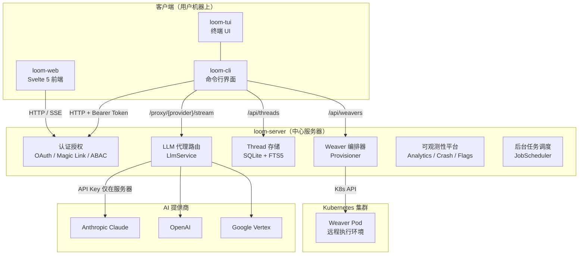
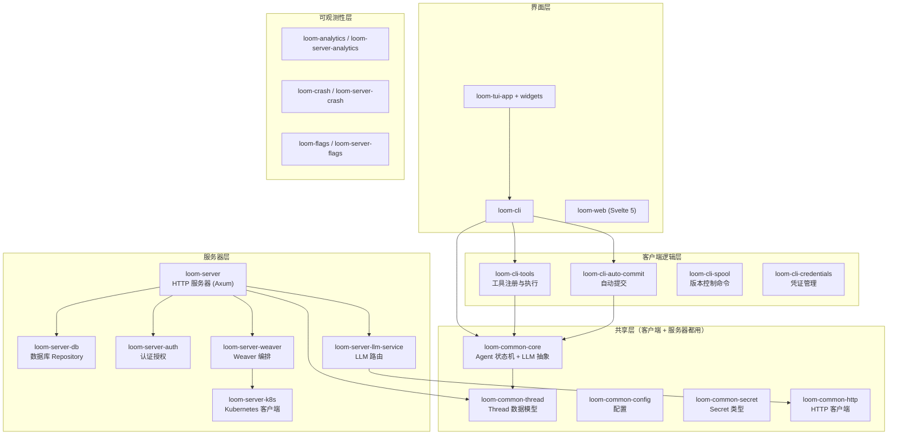
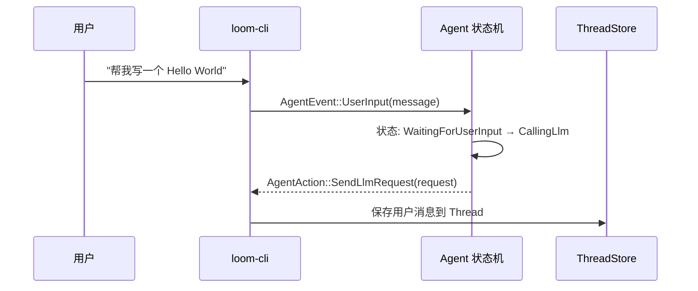
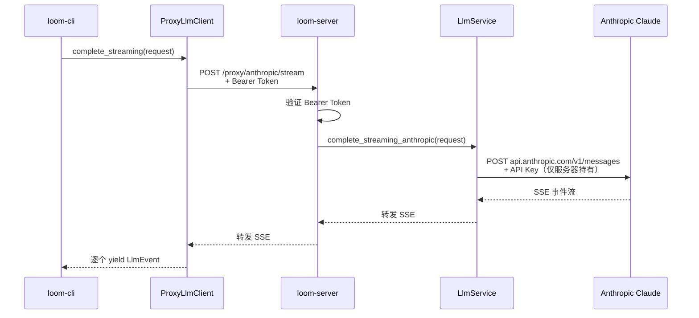
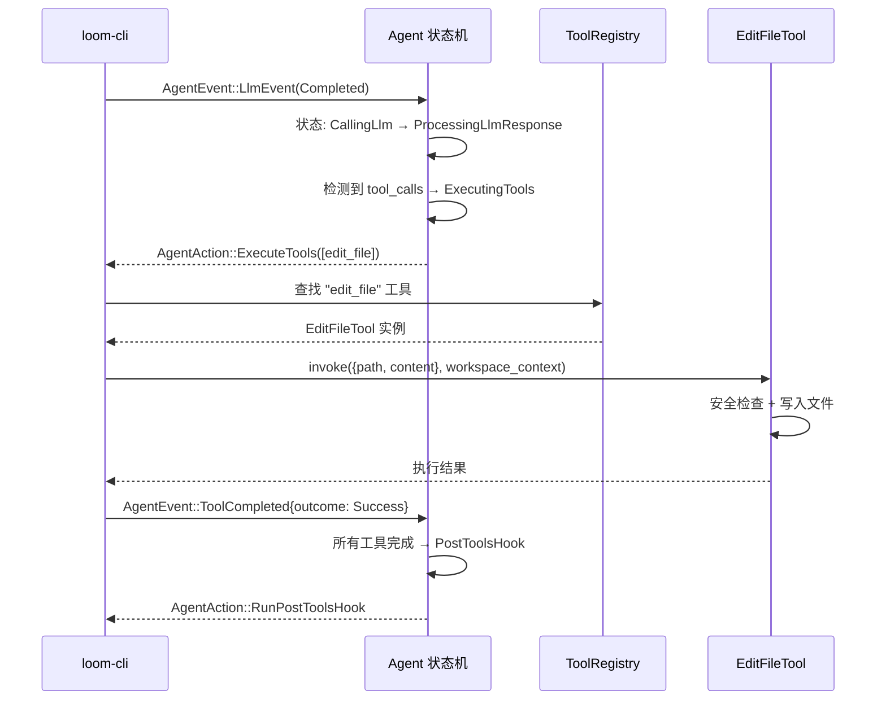
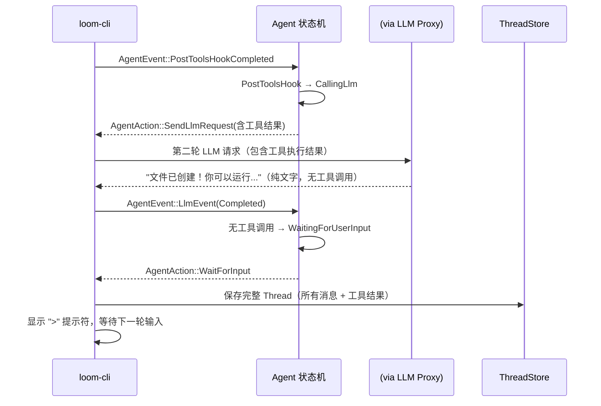

# 序言：Loom 全景地图

> 读完这一章，你将知道 Loom 是什么、它解决什么问题、它的主要部件各自扮演什么角色，以及一次典型交互从头到尾经过了哪些站点。后续所有章节都建立在这张地图之上。

---

## Loom 是什么

Loom 是一个 **AI 驱动的编程助手**，用 Rust 编写。你可以在终端里跟它对话，让它帮你读代码、写代码、跑命令，就像身边有一个随时待命的高级工程师。

它与你熟悉的 ChatGPT 网页聊天有一个根本区别：**Loom 能直接操作你的代码库**。当 AI 说"我帮你修改这个文件"时，它真的会去改文件；当它说"我跑个测试看看"时，它真的会执行 `cargo test`。

这种"AI 不仅能说、还能做"的能力，靠的是 Loom 的 **工具系统（Tool System）**。AI 大模型本身只能生成文字，但 Loom 在大模型周围搭建了一套框架：接收大模型的"我想执行某个工具"指令，真正去执行，再把结果喂回给大模型，如此循环。

用一句话概括：**Loom = 对话界面 + AI 大脑 + 一双能操作代码的手**。

---

## 它解决什么问题

传统的 AI 聊天工具（比如 ChatGPT、Claude 网页版）有一个痛点：你需要手动复制代码片段给 AI 看，AI 给出建议后你再手动粘贴回去。这个"复制—粘贴—再复制"的循环既低效又容易出错。

Loom 消除了这个循环。它直接运行在你的项目目录里，能自己读文件、改文件、跑命令。你只需要用自然语言描述你想做什么，Loom 会自动完成。

但这带来了新的设计挑战：

1. **安全性** — AI 操作你的文件系统，必须有边界控制
2. **可靠性** — 网络中断、AI 返回错误、工具执行失败，都需要优雅处理
3. **密钥安全** — 调用 AI 需要 API Key，绝不能暴露在客户端
4. **多用户** — 团队共享服务器时，每个人的对话和权限要隔离
5. **可追溯** — 每次对话、每次文件修改都要有记录

Loom 的架构就是围绕这五个挑战展开的。

---

## 架构全景图



这张图的关键信息：

1. **客户端不持有 AI 提供商的 API Key**。CLI 只知道服务器地址和自己的 Bearer Token，所有 AI 请求都通过服务器中转。这是 Loom 的核心安全设计——"Server-Side LLM Proxy"架构。

2. **loom-server 是中心枢纽**。它承担认证、LLM 路由、数据存储、远程执行编排等所有服务端职责。

3. **Weaver 是可选的远程执行能力**。需要在隔离环境中运行代码时，服务器会在 Kubernetes 集群中创建一个 Pod。

4. **TUI 是 CLI 的界面层**。它基于 Ratatui 框架渲染终端界面，但底层逻辑复用 CLI 的核心模块。

---

## 核心概念词典

在深入任何细节之前，先认识 Loom 世界里最重要的八个概念。它们会在全书反复出现。

| 概念 | 一句话解释 | 类比 |
|------|-----------|------|
| **Agent（智能体）** | 管理对话流程的状态机，协调 AI 调用和工具执行 | 项目经理——不亲自写代码，但决定下一步做什么 |
| **Thread（对话线）** | 一次完整的人机对话记录，包含所有消息和工具调用结果 | 微信聊天记录 |
| **Tool（工具）** | Agent 能调用的具体能力，如读文件、写文件、执行命令 | Agent 的手和脚 |
| **LLM Proxy（大模型代理）** | 服务器侧中转层，在客户端和 AI 提供商之间传话 | 翻译官——两边都能听懂，但密钥只有它知道 |
| **Weaver（织机）** | 按需创建的远程执行环境（K8s Pod） | 一台临时的云端开发机 |
| **Spool（线轴）** | Loom 自己的版本控制系统，基于 jj | 用纺织术语重新包装的 Git |
| **SSE Stream（事件流）** | AI 响应的实时推送通道 | 你看到 AI "一个字一个字打出来"的效果，就是 SSE |
| **ABAC（基于属性的访问控制）** | 根据用户属性、资源属性和操作类型判断权限 | 比"管理员/普通用户"更细粒度的门禁系统 |

---

## 代码库地图

Loom 的代码以 Rust Workspace 组织，`crates/` 下有 80+ 个独立 crate（Rust 的模块单元）。这看起来很吓人，但它们有清晰的分层和命名规律。

### 命名规律

| 前缀 | 含义 | 示例 |
|------|------|------|
| `loom-common-*` | 客户端和服务器共享的基础类型 | `loom-common-core`（Agent 状态机）、`loom-common-thread`（Thread 模型） |
| `loom-cli-*` | 仅用于客户端 CLI 的模块 | `loom-cli-tools`（工具注册表）、`loom-cli-auto-commit`（自动提交） |
| `loom-server-*` | 仅用于服务器的模块 | `loom-server-auth`（认证）、`loom-server-llm-proxy`（LLM 代理客户端） |
| `loom-server-llm-*` | LLM 提供商集成 | `loom-server-llm-anthropic`（Claude）、`loom-server-llm-openai`（OpenAI） |
| `loom-tui-*` | 终端 UI 组件 | `loom-tui-widget-message-list`（消息列表）、`loom-tui-widget-input-box`（输入框） |
| `loom-weaver-*` | Weaver 远程执行相关 | `loom-weaver-ebpf`（审计追踪）、`loom-weaver-secrets`（密钥注入） |
| `loom-*-core` | 某个子系统的核心类型定义 | `loom-flags-core`（Feature Flag 类型）、`loom-crash-core`（崩溃报告类型） |

### 分层架构



图下方逐层说明：

- **界面层**：用户直接接触的入口。CLI 是核心客户端，TUI 为它套上终端界面，Web 提供浏览器访问。
- **客户端逻辑层**：CLI 特有的功能模块——注册工具、执行自动提交、管理凭证。
- **共享层**：最重要的一层。`loom-common-core` 定义了 Agent 状态机和 LLM 抽象接口，客户端和服务器都依赖它。
- **服务器层**：基于 Axum 的 HTTP 服务器，管理数据库、认证、LLM 路由和 Weaver 编排。
- **可观测性层**：每个可观测性子系统都分为"客户端 SDK"和"服务器端处理"两部分。

---

## 一次典型交互：从输入到响应

我们用一个最简单的例子把整个系统串一遍：用户在终端输入"帮我写一个 Hello World 程序"，Loom 帮他创建文件。

### 第一幕：用户输入



用户在终端输入一段话后，CLI 将其包装成 `AgentEvent::UserInput`，交给 Agent 状态机。状态机从"等待输入"转为"调用 LLM"，并返回一个动作：`SendLlmRequest`——意思是"请帮我发送这个 LLM 请求"。

注意这里的设计：**状态机自己不做网络请求**。它只是告诉调用者"下一步该做什么"，由 CLI 去执行实际的 I/O。这种模式叫"控制反转"（Inversion of Control），使得状态机的逻辑可以完全脱离网络环境来测试。详见第 2 章。

### 第二幕：请求到达 AI



这一幕展示了"Server-Side LLM Proxy"架构的核心价值：

1. CLI 通过 `ProxyLlmClient` 发起请求，目标是 Loom 自己的服务器，不是 AI 提供商
2. 服务器验证用户身份后，用自己保管的 API Key 去调用 Claude
3. Claude 的响应是 SSE 流——每生成一段文字就推送一个事件，实现"打字机效果"
4. 这个 SSE 流被层层转发回 CLI

详见第 3 章。

### 第三幕：AI 要求执行工具

Claude 分析用户的请求后，认为需要创建一个文件。它在响应中不仅包含文字，还包含一个"工具调用"指令：



这一幕展示了三个关键机制：

1. **状态机路由**：收到 LLM 完整响应后，Agent 检查是否包含工具调用。有则转入 `ExecutingTools` 状态，没有则直接回到等待输入。
2. **工具注册表**：CLI 启动时注册了所有可用工具（ReadFile、EditFile、Bash 等），通过名称查找并调用。
3. **Post-Tools Hook**：工具执行完毕后，状态机不是直接继续调 LLM，而是先进入 `PostToolsHook` 状态。这个 Hook 的典型用途是自动 git commit，确保每次文件修改都被版本控制记录。

详见第 2 章（状态机）、第 4 章（工具系统）。

### 第四幕：循环与结束



工具执行结果被加入对话上下文，发起第二轮 LLM 请求。Claude 看到工具成功了，就用自然语言总结给用户。这次响应没有工具调用，状态机回到 `WaitingForUserInput`。

整个过程形成了一个循环：

```
用户输入 → 调 LLM → 有工具调用？
  ├─ 是 → 执行工具 → Post Hook → 调 LLM（带结果）→ 有工具调用？→ ...
  └─ 否 → 展示回复 → 等待下一次输入
```

这就是 Loom 的核心运行循环。后续章节将逐一打开上面每个"站点"的黑盒。

---

## 本书路线图

| 章节 | 你将理解 | 前置知识 |
|------|---------|---------|
| **第 1 章 · 数据流全景** | 一条消息从键盘到 AI 再回来的完整路径，每一站的数据形态 | 本章 |
| **第 2 章 · Agent 状态机** | 七个状态、六类事件、控制反转设计、错误恢复策略 | 第 1 章 |
| **第 3 章 · LLM 代理架构** | ProxyLlmClient → 服务器路由 → 多提供商 LlmService → SSE 流 | 第 2 章 |
| **第 4 章 · 工具系统** | Tool trait、工具注册表、内置工具实现、安全边界 | 第 2 章 |
| **第 5 章 · Thread 系统** | 对话如何持久化、本地存储 + 服务器同步、全文搜索 | 第 1-4 章 |
| **第 6 章 · 认证授权** | OAuth PKCE、Magic Link、ABAC 策略引擎 | 第 3 章 |
| **第 7 章 · Weaver 远程执行** | K8s Pod 编排、WireGuard 隧道、eBPF 审计 | 第 6 章 |
| **第 8 章 · 可观测性平台** | Analytics、Crash Reporting、Feature Flags | 第 3 章 |
| **第 9 章 · 界面层** | TUI 组件体系、Web 前端、实时通信 | 第 1-5 章 |
| **第 10 章 · 支线系统** | Spool 版本控制、SCM 托管、Clips、i18n | 第 1-5 章 |
| **第 11 章 · 项目演进史** | 架构设计决策的来龙去脉 | 全书 |
| **第 12 章 · 端到端追踪** | 三个完整场景串联全书知识 | 全书 |

---

### 质检报告

**讲解节奏**
- [x] 每个模块先讲"它是什么"再讲"里面有什么"

**周边知识**
- [x] 设计决策处有足够背景（解释了为什么需要 Server-Side Proxy、控制反转等）
- [x] 没有跨度过大的段落

**讲透了吗**
- [x] 核心流程每一步解释了数据变化
- [x] 没有跳步
- [x] 复杂节点已标注"详见第 N 章"

**代码纪律**
- [x] 全章代码片段为 0 处（全部用流程图和文字表达）
- [x] 不存在超过 5 行的代码块

**流程图准确性**
- [x] 架构全景图基于实际 crate 结构和路由确认
- [x] 序列图基于 Agent 状态机、ProxyLlmClient、ToolRegistry 实际代码确认
- [x] 没有基于猜测的流程
- [x] 每张图下方有逐步文字解释且与图对应

**过渡自然吗**
- [x] 作为首章，从"是什么"自然过渡到"怎么工作"再到"路线图"
- [x] 章尾路线图表引出后续所有章节
- [x] 章内小节之间用问题驱动衔接（解决什么问题→带来什么挑战→围绕挑战展开架构）

**准确吗**
- [x] 行业标准术语（SSE、OAuth、ABAC 等）
- [x] 项目特有术语（Weaver、Thread、Spool）已类比
- [x] 未确认项无

**读得下去吗**
- [x] 术语首次出现有解释
- [x] 每张图有文字讲解

**勘误建议**
（无）
