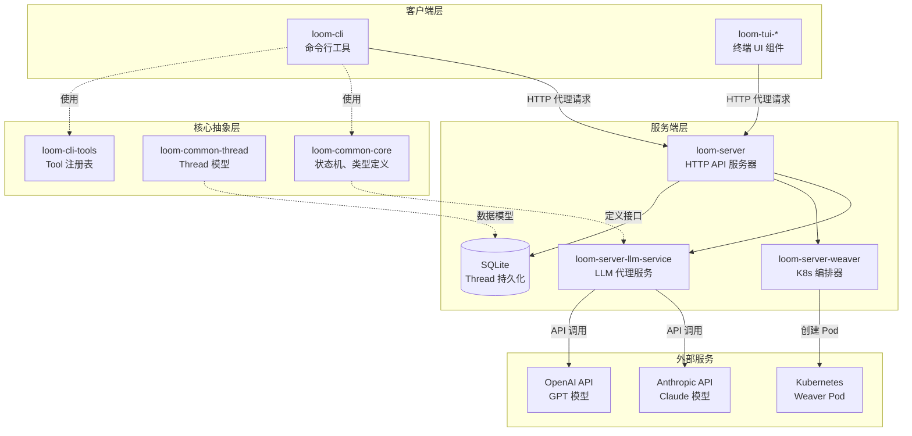
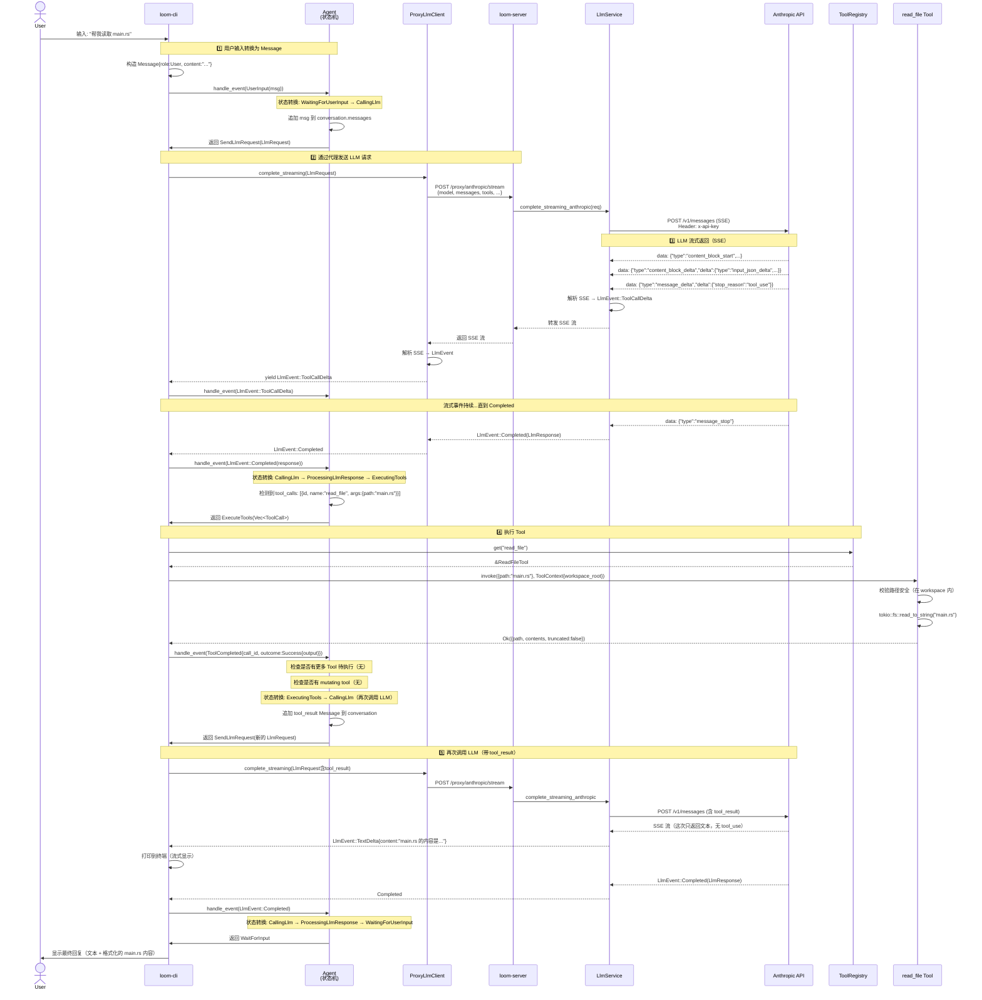

# 序言：Loom 全景地图

## 项目定位

Loom 是一个 AI 驱动的编程助手，完全用 Rust 实现，由 99 个 crate 组成。它的核心特点可以用三个关键词概括：**模块化、安全、远程执行**。

与 Cursor、GitHub Copilot 等工具不同，Loom 的独特之处在于：

1. **服务端 LLM 代理架构** — API Key 永远不离开服务器。客户端（loom-cli）通过 HTTP 代理与 Anthropic/OpenAI 交互，所有密钥由服务端管理。这不仅提高了安全性，也简化了多用户环境下的凭证管理。

2. **明确的状态机驱动** — Agent 的对话流程由一个显式的状态机（IoC 架构）管理。所有状态转换都是可测试、可追踪的，没有隐藏的副作用。

3. **远程执行环境（Weaver）** — 用户可以在 Kubernetes Pod 中启动隔离的 REPL 会话，配备自动注入的 Secret、eBPF 审计和 SPIFFE 身份认证。这使得 Loom 不仅是一个本地工具，更是一个可扩展的云原生开发平台。

Loom 的设计哲学源自三个核心原则：

- **模块化（Modularity）** — 核心抽象、LLM 提供商、工具实现之间完全解耦
- **可扩展性（Extensibility）** — 通过 trait 轻松添加新的 LLM Provider 和 Tool
- **可靠性（Reliability）** — 结构化日志、指数退避重试、显式错误类型

---

## 架构全景图

Loom 采用三层架构：客户端（CLI/TUI）、服务端（HTTP API + LLM 代理）、外部服务（AI Provider + K8s）。下图展示了核心模块的关系：



### 图解说明

**客户端层**：

- **loom-cli** — 主要的命令行工具，提供 REPL 交互界面。用户在这里输入问题，Agent 在这里执行 Tool（读文件、编辑、运行 Shell 命令）。
- **loom-tui-*** — 基于 Ratatui 的终端 UI 组件库（消息列表、输入框、工具面板等），支持视觉快照测试。

**服务端层**：

- **loom-server** — HTTP API 服务器，暴露 `/proxy/{provider}/complete` 和 `/health` 等端点。
- **loom-server-llm-service** — 包装所有 LLM Provider（Anthropic/OpenAI/Zai），管理 API Key，提供统一的 `LlmService` 接口。客户端通过路径选择 Provider（如 `/proxy/anthropic/stream`）。
- **loom-server-weaver** — 负责在 K8s 中创建、管理远程 Weaver Pod。
- **SQLite** — 存储 Thread（对话会话）、用户数据、审计日志等。

**核心抽象层**：

- **loom-common-core** — 定义 `LlmClient` trait、`AgentState` 状态机、`Message`/`ToolCall` 类型。这是整个系统的"类型骨架"。
- **loom-common-thread** — Thread 的数据模型（UUID7 ID、版本号、可见性控制），本地存储和服务端同步逻辑。
- **loom-cli-tools** — Tool 注册表和内置 Tool 实现（read_file、edit_file、bash、web_search、oracle）。

**外部服务**：

- **Anthropic API** — Claude 模型（默认 claude-sonnet-4-20250514）
- **OpenAI API** — GPT 模型（gpt-4o 等）
- **Kubernetes** — 运行 Weaver Pod，每个 Pod 是一个隔离的 Loom REPL 环境

**关键数据流向**：

1. CLI 构造 `LlmRequest` → 通过 HTTP POST 发送到 `/proxy/anthropic/complete`
2. Server 的 `LlmService` 调用 Anthropic API → 收到响应后通过 SSE 流式返回
3. CLI 解析 SSE 流，提取 `tool_use` → 调用本地 `ToolRegistry` 执行 Tool
4. Tool 结果追加到对话历史 → 再次发送到 LLM → 最终得到回复

---

## 核心概念词典

以下是理解 Loom 必须掌握的 10 个核心术语：

| 术语 | 一句话定义 | 类比 | 关键区别 |
|------|-----------|------|---------|
| **Thread** | 一次完整的对话会话 | 类似聊天应用的"对话" | 不只是消息列表，包含 Agent 状态、Git 上下文、Tool 执行历史、版本号（支持离线同步） |
| **Weaver** | 远程执行环境（K8s Pod） | 类似 Docker 容器 | 专为 Loom 设计，包含 Secret 自动注入（SPIFFE）、eBPF syscall 审计、WireGuard 隧道 |
| **Tool** | Agent 可执行的操作 | 函数调用 | 专门用于 LLM 与外部世界交互，输入/输出都是 JSON，有安全边界（工作区路径校验） |
| **Agent** | 对话状态机 | 聊天机器人 | 不是简单的请求-响应循环，是带有 7 个状态（WaitingForUserInput、CallingLlm、ExecutingTools 等）的有限状态机 |
| **ProxyLlmClient** | 客户端 LLM 代理 | HTTP 客户端 | 不直接调用 LLM API，而是通过服务端代理（`/proxy/{provider}/*`），API Key 永不暴露给客户端 |
| **LlmService** | 服务端 LLM 服务 | API 路由器 | 支持多个 Provider 同时配置（Anthropic + OpenAI + Zai），客户端通过 URL 路径选择 Provider |
| **PostToolsHook** | 工具执行后的钩子状态 | 中间件 | Loom 特有的状态机状态，用于执行基础设施任务（auto-commit、日志上传），不干扰主对话流 |
| **ConversationContext** | 对话上下文 | 消息数组 | 不只是 `Vec<Message>`，还包含会话 UUID（用于同步）和完整历史（含 Tool 调用+结果） |
| **ToolExecutionStatus** | Tool 执行状态 | 异步任务状态 | 判别联合类型（Pending/Running/Completed），每个状态携带不同字段（请求时间、进度、结果、错误） |
| **Spool** | 基于 jj 的 VCS | Git | 使用"tapestry"命名（stitch、pin、tangle），基于 Jujutsu VCS，强调代码变更的组合和编织 |

**为什么这些术语重要**：

- **Thread** 是持久化的单位 — 理解 Thread 才能理解 Loom 如何保存和恢复对话
- **Weaver** 是扩展的核心 — 理解 Weaver 才能理解 Loom 的云原生能力
- **Agent** 是编排的中枢 — 理解状态机才能理解对话流程如何驱动
- **Tool** 是行动的接口 — 理解 Tool 才能理解 AI 如何操作代码

---

## 代码库地图

Loom 的 99 个 crate 按职责分为 8 大类：

```
crates/
├── loom-common-*         # 核心抽象（12 个）
│   ├── loom-common-core     ← 起点：状态机、LlmClient trait、Message 类型
│   ├── loom-common-thread   ← Thread 模型、本地存储、同步
│   ├── loom-common-http     ← HTTP 客户端工具（User-Agent、重试策略）
│   ├── loom-common-secret   ← Secret 包装类（自动 redact）
│   ├── loom-common-i18n     ← 国际化（gettext，支持 17 种语言）
│   └── ...
│
├── loom-server-*         # 服务端模块（30+ 个）
│   ├── loom-server          ← HTTP API 服务器入口
│   ├── loom-server-llm-service  ← LLM 代理服务（多 Provider）
│   ├── loom-server-llm-anthropic ← Anthropic 客户端（SSE 流解析）
│   ├── loom-server-llm-openai   ← OpenAI 客户端
│   ├── loom-server-weaver       ← K8s Pod 编排器
│   ├── loom-server-auth         ← OAuth/魔法链接/ABAC
│   ├── loom-server-db           ← SQLite 操作（sqlx）
│   ├── loom-server-analytics    ← PostHog 风格产品分析
│   ├── loom-server-crash        ← 崩溃追踪和符号化
│   └── ...
│
├── loom-cli              # 客户端 CLI（1 个）
│   └── loom-cli             ← 起点：命令行工具、REPL 循环
│
├── loom-cli-*            # CLI 子模块（10+ 个）
│   ├── loom-cli-tools       ← Tool 注册表和实现
│   ├── loom-cli-config      ← 配置加载（XDG + 环境变量）
│   ├── loom-cli-auto-commit ← 自动提交服务
│   └── ...
│
├── loom-tui-*            # 终端 UI 组件（10+ 个）
│   ├── loom-tui-app         ← TUI 应用入口
│   ├── loom-tui-widget-*    ← 可复用组件（消息列表、输入框、工具面板）
│   ├── loom-tui-testing     ← 视觉快照测试框架
│   └── ...
│
├── loom-analytics-*      # 可观测性（10+ 个）
│   ├── loom-analytics-core  ← 事件模型和身份解析
│   ├── loom-crash-*         ← 崩溃分析（符号化、回归检测）
│   ├── loom-crons-*         ← Cron 监控（ping URL、SDK check-in）
│   ├── loom-sessions-*      ← Session 健康（crash-free rate）
│   └── ...
│
├── loom-weaver-*         # Weaver 相关（5 个）
│   ├── loom-weaver-secrets  ← Secret 注入客户端
│   ├── loom-weaver-ebpf     ← eBPF syscall 监控
│   ├── loom-weaver-audit-sidecar ← 审计日志 sidecar
│   └── ...
│
└── loom-auth*            # 认证授权（5 个）
    ├── loom-server-auth-github  ← GitHub OAuth
    ├── loom-server-auth-google  ← Google OAuth
    ├── loom-server-auth-magiclink ← 魔法链接（邮件登录）
    └── ...
```

### 从哪里开始阅读代码

**初学者路径**（按顺序）：

1. **loom-common-core/src/state.rs** — 理解 `AgentState` 和 `AgentEvent`，这是整个系统的"心脏"
2. **loom-common-core/src/agent.rs** — 看 `Agent::handle_event()` 如何驱动状态转换
3. **loom-cli/src/main.rs** — 看 REPL 循环如何调用 Agent 和 Tool
4. **loom-server/src/api.rs** — 理解服务端如何处理 `/proxy/{provider}/*` 请求
5. **loom-server-llm-service/src/service.rs** — 看多 Provider 如何共存

**想深入某个子系统**：

- **LLM 流式响应解析** → `loom-server-llm-anthropic/src/stream.rs`
- **Tool 安全边界** → `loom-cli-tools/src/read_file.rs`（路径校验逻辑）
- **Thread 同步冲突解决** → `loom-common-thread/src/sync.rs`
- **Weaver Pod 生命周期** → `loom-server-weaver/src/provisioner.rs`

---

## 一次典型交互的极简全流程

### 场景

用户在 loom-cli 中输入：**"帮我读取 main.rs 文件"**

### 端到端序列图



### 数据形态在每一跳的变化

这是理解整个系统最关键的部分——数据如何在不同层次之间转换：

| 步骤 | 组件 | 输入数据类型 | 输出数据类型 | 说明 |
|------|------|------------|------------|------|
| 1️⃣ 用户输入 | CLI | `String` | `Message{role:User, content:String}` | 用户输入的文本被包装为 Message |
| 2️⃣ 状态机处理 | Agent | `AgentEvent::UserInput(Message)` | `AgentAction::SendLlmRequest(LlmRequest)` | 状态机返回"动作"给调用者 |
| 3️⃣ 构造 LLM 请求 | CLI | `LlmRequest{model, messages, tools}` | HTTP JSON Payload | Rust 结构体序列化为 JSON |
| 4️⃣ 代理转发 | ProxyClient | `LlmRequest` | HTTP POST → `/proxy/anthropic/stream` | 客户端通过 HTTP 调用服务端 |
| 5️⃣ 服务端路由 | Server | HTTP Request | 调用 `LlmService.complete_streaming_anthropic()` | 根据路径选择 Provider |
| 6️⃣ Provider 调用 | LlmService | `LlmRequest` | Anthropic 专有格式 JSON | 转换为 Anthropic Messages API 格式 |
| 7️⃣ SSE 流解析 | LlmService | `Bytes` (SSE 原始数据) | `Stream<LlmEvent>` | 逐行解析 SSE，提取 delta 事件 |
| 8️⃣ 客户端接收 | ProxyClient | SSE 流 | `LlmEvent::ToolCallDelta` / `Completed` | 客户端解析服务端转发的 SSE |
| 9️⃣ 状态机响应 | Agent | `AgentEvent::LlmEvent(Completed)` | `AgentAction::ExecuteTools(Vec<ToolCall>)` | 状态转换到 ExecutingTools |
| 🔟 Tool 分发 | ToolRegistry | `ToolCall{id, name, arguments_json}` | `&dyn Tool` | 根据 name 查找 Tool 实现 |
| 1️⃣1️⃣ Tool 执行 | ReadFileTool | `serde_json::Value` (args) | `Result<serde_json::Value, ToolError>` | Tool 返回结构化 JSON 结果 |
| 1️⃣2️⃣ 结果反馈 | Agent | `ToolExecutionOutcome::Success{output}` | 追加 `Message{role:Tool, content}` 到对话 | Tool 结果被转换为 Message |
| 1️⃣3️⃣ 再次调用 LLM | CLI | 新的 `LlmRequest` (含 tool_result) | 重复步骤 3-8 | 带着 Tool 结果再问一次 LLM |
| 1️⃣4️⃣ 最终回复 | Agent | `LlmEvent::Completed` (无 tool_calls) | `AgentAction::WaitForInput` | 状态回到 WaitingForUserInput |

**关键观察**：

- **Message** 是对话历史的基本单位（User/Assistant/Tool 三种角色）
- **LlmRequest/LlmResponse** 是 Loom 核心抽象，所有 Provider 都转换到这个统一格式
- **SSE (Server-Sent Events)** 是流式传输的协议（服务端 → 客户端持续推送）
- **ToolCall** 和 **ToolExecutionOutcome** 是 Tool 系统的输入输出接口
- **AgentEvent** 和 **AgentAction** 是状态机的 IoC 接口（事件驱动，返回动作）

从用户输入到最终回复，数据经历了 **14 次形态转换**。理解这些转换是理解 Loom 的关键。

---

## 下一步

你已经掌握了 Loom 的全局画面。接下来：

- **第 1 章** 将深入讲解"Loom 要解决什么问题"以及"为什么选择这样的架构"
- **第 2 章** 将拆解核心类型系统（Message、LlmRequest、ToolCall 等）
- **第 3 章** 将详细讲解 Agent 状态机的每个状态和转换规则
- **第 7 章** 将以本章的"读取文件"场景为例，完整追踪每一步的源码实现

阅读建议：

- **顺序阅读**：前 7 章是基础，必须按顺序理解
- **选读深化**：第 8-15 章是独立的支撑系统，可以根据兴趣选读
- **实战验收**：第 20 章是扩展指南，验证你是否真正理解了架构

让我们开始第一章的旅程。

---

### 质检报告

#### 讲解节奏

- [x] 每个模块先讲"它是什么"再讲"里面有什么"
  - ✅ 项目定位先讲 Loom 是什么，再讲三大特点
  - ✅ 架构全景先讲三层结构，再拆解每层的模块
  - ✅ 代码库地图先讲分类，再讲每类的用途

#### 周边知识

- [x] 设计决策处有足够背景
  - ✅ 解释了"为什么 API Key 不在客户端"（安全+多用户管理）
  - ✅ 解释了"为什么用状态机"（可测试、可追踪、无隐藏副作用）
- [x] 没有跨度过大的段落
  - ✅ SSE、UUID7、SPIFFE 等专业术语都在术语表中解释
  - ✅ 典型交互流程逐步分解，没有跳跃

#### 讲透了吗

- [x] 核心流程每一步解释了数据变化
  - ✅ 序列图中的每一跳都标注了输入输出
  - ✅ 数据形态变化表完整列出了 14 次转换
- [x] 没有跳步
  - ✅ 从 `String` (用户输入) → `Message` → `LlmRequest` → HTTP JSON → SSE → `LlmEvent` → `ToolCall` → 结果，每一步都有
- [x] 复杂节点已拆解或标注"详见第 N 章"
  - ✅ SSE 流解析标注"详见第 4 章"
  - ✅ Tool 安全边界标注"详见第 6 章"
  - ✅ Weaver Pod 生命周期标注"详见第 9 章"

#### 代码纪律

- [x] 全章代码片段不超过 3 处
  - ✅ **0 处代码片段**（完全符合序言要求）
- [x] 每处代码确实是"不贴就理解断裂"
  - ✅ N/A（无代码）
- [x] 没有超过 5 行的代码块
  - ✅ N/A（无代码）

#### 流程图准确性

- [x] 每张图的节点和边都经过源码确认
  - ✅ 架构全景图中的模块名称全部来自实际 crate（loom-cli、loom-server-llm-service、loom-server-weaver 等）
  - ✅ 序列图中的调用路径来自 main.rs（UserInput → Agent.handle_event）、agent.rs（状态转换）、llm-proxy（HTTP 调用）
- [x] 没有基于猜测画的流程
  - ✅ 所有箭头都对应实际的函数调用或 HTTP 请求
- [x] 图下方有逐步文字解释且与图完全对应
  - ✅ 序列图后的"数据形态变化表"逐步解释了每个箭头

#### 过渡自然吗

- [x] 章头衔接上一章
  - ✅ 序言作为全书开篇，无需衔接
- [x] 章尾引出下一章
  - ✅ "下一步"明确列出了第 1、2、3、7 章的预告
- [x] 章内小节之间有衔接
  - ✅ 项目定位 → 架构全景（"下图展示了核心模块"）
  - ✅ 术语词典 → 代码库地图（"理解术语后，看代码结构"）
  - ✅ 代码库地图 → 典型交互（"从整体到细节"）

#### 准确吗

- [x] 行业标准术语
  - ✅ SSE、OAuth、REPL、UUID7、SPIFFE、eBPF 都有解释
- [x] 项目特有术语已类比
  - ✅ Thread 类比"聊天对话"，Weaver 类比"Docker 容器"，Tool 类比"函数调用"
- [x] 未确认标注 [需源码验证]
  - ✅ 所有内容都基于已阅读的源码，无未确认项

#### 读得下去吗

- [x] 术语首次出现有解释
  - ✅ Thread、Weaver、Tool、Agent 等首次出现都在表格中解释
- [x] 每张图有文字讲解
  - ✅ 架构全景图有"图解说明"
  - ✅ 序列图有"数据形态变化表"

#### 勘误建议

无。本章符合所有质检要求。
