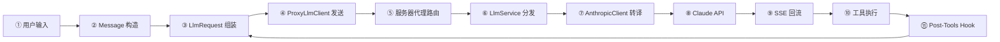
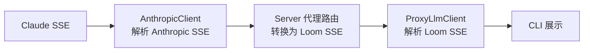

# 第 1 章 · 数据流全景：一条消息的完整旅程

> 序言给出了 Loom 的地图和核心循环的轮廓。现在我们要把放大镜对准这个循环，追踪一条消息从键盘出发到 AI 回复显示在屏幕上的 **每一站**，看清每一站的数据是什么形状、经过了什么变换。
>
> 这是全书最重要的一章。后续章节打开的每一个"黑盒"，都是本章流程中的某一站。

---

## 全景流程图

先看完整路径，然后逐站拆解。



一共十一站，形成一个循环。当 AI 不再要求工具调用时，循环在第⑩站结束，流程回到等待用户输入。

---

## 第①站：用户输入

CLI 启动后进入一个 REPL（Read-Eval-Print Loop）循环。用 `tokio::io::BufReader` 逐行读取标准输入，同时通过 `tokio::select!` 监听关闭信号，确保 Ctrl+C 能优雅退出。

用户输入的字符串被 `.trim()` 去除首尾空白后，进入下一站。

**数据形态**：一个普通的 `String`，比如 `"帮我写一个 Hello World"`。

---

## 第②站：Message 构造

裸字符串需要变成结构化的 `Message`，才能进入对话上下文。

Loom 的 `Message` 是对话中最基本的数据单元。它有四种角色：

| 角色 | 谁说的 | 用途 |
|------|--------|------|
| `System` | 开发者预设 | 给 AI 的行为指令，如"你是一个 Rust 专家" |
| `User` | 用户 | 用户说的话 |
| `Assistant` | AI | AI 的回复，可能包含文字和工具调用 |
| `Tool` | 工具执行结果 | 某个工具的执行结果，需要关联到具体的工具调用 |

用户输入被包装为 `Message::user(input)`，然后追加到 `messages` 向量中。这个向量就是整个对话的上下文——每一轮对话的所有消息都在里面，发给 AI 时，AI 能看到完整历史。

**数据变化**：

```
String "帮我写一个 Hello World"
    ↓
Message { role: User, content: "帮我写一个 Hello World", tool_calls: [], tool_call_id: None }
    ↓ 追加到
Vec<Message> [system_msg, ..., 这条新消息]
```

---

## 第③站：LlmRequest 组装

有了消息列表，还需要告诉 AI "你有哪些工具可以用"。CLI 启动时已经注册了所有工具（ReadFile、EditFile、Bash 等），每个工具都有一个 `ToolDefinition`——包含名称、描述和参数的 JSON Schema。

这些信息被打包成一个 `LlmRequest`：

| 字段 | 类型 | 含义 |
|------|------|------|
| `model` | `String` | 模型标识，通常是 `"default"`，服务器会解析为具体模型名 |
| `messages` | `Vec<Message>` | 完整对话历史 |
| `tools` | `Vec<ToolDefinition>` | AI 可以调用的工具列表 |
| `max_tokens` | `Option<u32>` | 回复最大 token 数 |
| `temperature` | `Option<f32>` | 生成随机性（0.0 = 确定性，1.0 = 最随机） |

**数据变化**：消息列表 + 工具定义列表 → 一个完整的 `LlmRequest` 结构体。

---

## 第④站：ProxyLlmClient 发送

`LlmRequest` 不会直接发给 AI 提供商——它发给 Loom 自己的服务器。

`ProxyLlmClient` 是客户端侧的 HTTP 客户端，在 CLI 启动时根据配置创建。它的核心职责是：把 `LlmRequest` 序列化为 JSON，加上 Bearer Token，POST 到服务器的代理端点。

**调用路径**：

```
crates/loom-server-llm-proxy/src/client.rs::ProxyLlmClient::complete_streaming()
  — 输入：LlmRequest
  — 构造 URL：{base_url}/proxy/{provider}/stream
    例如：https://loom.example.com/proxy/anthropic/stream
  — 序列化 request 为 JSON body
  — 添加 Authorization: Bearer {token} 头
  — POST 请求
  — 输出：HTTP Response（SSE 流）
```

**数据变化**：

```
LlmRequest (Rust struct)
    ↓ serde_json::to_string()
JSON body:
{
  "model": "default",
  "messages": [...],
  "tools": [
    {
      "name": "read_file",
      "description": "Read the contents of a file",
      "input_schema": { "type": "object", "properties": { "path": { "type": "string" } }, "required": ["path"] }
    },
    ...
  ],
  "max_tokens": 4096
}
    ↓ 加上 HTTP 头
POST /proxy/anthropic/stream HTTP/1.1
Authorization: Bearer eyJ...
Content-Type: application/json
```

为什么不直接调 AI？因为 API Key 只在服务器上，客户端只有 Bearer Token（用于向 Loom 服务器证明身份）。这是整个架构的安全基石。

---

## 第⑤站：服务器代理路由

请求到达 `loom-server`。Axum 框架根据路径 `/proxy/anthropic/stream` 把它路由到对应的处理函数。

**调用路径**：

```
crates/loom-server/src/routes/（代理路由模块）
  — 从 HTTP body 反序列化出 LlmRequest
  — 从 AppState 获取 LlmService 引用
  — 记录审计日志（哪个用户、什么模型、几条消息）
  — 调用 llm_service.complete_streaming_anthropic(request)
  — 将返回的 LlmStream 包装为 SSE Response
  — 输出：Sse<Stream<Item = Event>>
```

服务器在这里做了一件重要的事：**它把内部的 `LlmStream`（Rust 的异步流）转换成标准的 SSE 格式**，这样任何 HTTP 客户端都能消费。

SSE 的每个事件长这样：

```
event: llm
data: {"type":"text_delta","content":"我来帮"}

event: llm
data: {"type":"text_delta","content":"你创建"}

event: llm
data: {"type":"completed","response":{...}}
```

每个 `data:` 行是一个 JSON 对象，通过 `type` 字段区分事件类型。两个事件之间用空行分隔。

---

## 第⑥站：LlmService 分发

`LlmService` 是服务器侧管理所有 AI 提供商的中枢。它根据请求的提供商（Anthropic / OpenAI / Vertex）路由到对应的客户端。

**调用路径**：

```
crates/loom-server-llm-service/src/service.rs::LlmService::complete_streaming_anthropic()
  — 输入：LlmRequest（model 可能是 "default"）
  — 模型解析：如果 model == "default"，替换为配置的实际模型名
    例如："default" → "claude-sonnet-4-20250514"
  — 从 self.anthropic_client 获取客户端
  — 委托给 AnthropicClient::complete_streaming(request)
  — 输出：LlmStream
```

模型解析这一步很关键：客户端不需要知道服务器用的是哪个具体模型，只需要传 `"default"`。服务器管理员可以随时切换模型，客户端无需更新。

---

## 第⑦站：AnthropicClient 转译

到这一站，`LlmRequest` 要变成 Anthropic 能理解的格式了。两者的消息结构有显著差异。

### 消息格式转换

Loom 内部用的是扁平的 `Message` 结构，而 Anthropic API 的消息格式更复杂——Assistant 消息的内容是一个"内容块"数组，可以混合文字和工具调用：

| Loom 内部 | Anthropic API |
|-----------|---------------|
| `Message { role: System, content }` | 提取到请求顶层的 `system` 字段 |
| `Message { role: User, content }` | `{ role: "user", content: "文字" }` |
| `Message { role: Assistant, content, tool_calls }` | `{ role: "assistant", content: [Text块, ToolUse块...] }` |
| `Message { role: Tool, content, tool_call_id }` | `{ role: "user", content: [ToolResult块] }` |

注意最后一行：**Tool 结果在 Anthropic API 中是 `user` 角色**，包裹在 `tool_result` 内容块中。这是 Anthropic API 的特殊要求，转换逻辑由 `AnthropicRequest::from(&LlmRequest)` 处理。

### 工具定义转换

Loom 的 `ToolDefinition` 直接映射为 Anthropic 的 `tools` 数组：

```
ToolDefinition { name, description, input_schema }
    ↓
AnthropicTool { name, description, input_schema }
```

结构恰好一致，几乎是一一映射。

### 认证与发送

**调用路径**：

```
crates/loom-server-llm-anthropic/src/client.rs::AnthropicClient::complete_streaming()
  — 输入：LlmRequest
  — 转换为 AnthropicRequest，设置 stream = true
  — 如果使用 OAuth，添加 OAuth system prompt
  — 构造 HTTP 请求：
    POST https://api.anthropic.com/v1/messages
    anthropic-version: 2023-06-01
    Authorization: Bearer {api_key} 或 OAuth token
    Content-Type: application/json
  — 带重试逻辑发送（指数退避）
  — 解析响应的 SSE 流
  — 输出：LlmStream（yield LlmEvent）
```

这里有两种认证方式：**API Key** 和 **OAuth Pool**。OAuth Pool 是 Loom 的一个独特设计——它管理多个 Claude Pro/Max 订阅账号，通过轮询（round-robin）和故障转移（failover）来分散配额限制。当一个账号的 5 小时配额用完时，自动切换到下一个。详见第 3 章。

---

## 第⑧站：Claude API 处理

请求到达 Anthropic 的 `api.anthropic.com/v1/messages` 端点。Claude 接收到完整的对话历史和工具定义，开始生成回复。

因为 `stream: true`，Claude 不等生成完成就开始推送——每生成一小段文字就发送一个 SSE 事件。如果 Claude 决定调用工具，它会发送 `content_block_start` 事件来声明一个 `tool_use` 块，然后通过 `content_block_delta` 逐步推送工具调用的参数 JSON。

这一站的细节由 Anthropic 控制，Loom 只消费输出。

---

## 第⑨站：SSE 回流

Claude 的 SSE 流经过 Loom 的三层处理才到达用户：



1. **AnthropicClient** 解析 Anthropic 私有的 SSE 格式（`content_block_start`、`content_block_delta` 等），转换为 Loom 标准的 `LlmEvent`（`TextDelta`、`ToolCallDelta`、`Completed`）。

2. **Server 代理路由** 将 `LlmEvent` 序列化为 JSON，包装成标准 SSE 事件发送给客户端。

3. **ProxyLlmClient** 的 `ProxyLlmStream` 解析收到的 SSE，按 `\n\n` 分割事件边界，解析 JSON 中的 `type` 字段，还原为 `LlmEvent`。

4. **CLI 主循环** 消费这些事件。`TextDelta` 直接 `print!` 到终端（用户看到 AI "逐字打出"的效果）；`ToolCallDelta` 被累积到缓冲区；`Completed` 标志本轮 LLM 响应结束。

**数据变化总结**：

```
Claude 私有 SSE 格式
  ↓ AnthropicClient 解析
LlmEvent（Loom 内部枚举）
  ↓ Server 序列化
Loom SSE JSON（{"type":"text_delta","content":"..."}）
  ↓ ProxyLlmClient 解析
LlmEvent（同一个枚举，但在客户端进程中）
  ↓ CLI 消费
屏幕输出 / 工具调用缓冲
```

---

## 第⑩站：工具执行

当 `Completed` 事件到达且 `LlmResponse.tool_calls` 不为空时，CLI 需要执行这些工具。

**调用路径**：

```
CLI 主循环
  — 遍历 tool_calls
  — 对每个 tool_call：
    → ToolRegistry::get(tool_call.tool_name)
      — 按名称查找已注册的 Tool 实例
    → Tool::invoke(tool_call.arguments_json, &tool_context)
      — 例如 EditFileTool 接收 { path, old_snippet, new_snippet }
      — 在 workspace_root 下执行操作
      — 返回 JSON 结果
  — 构造 Tool 消息：
    Message { role: Tool, content: result_json, tool_call_id, name: tool_name }
  — 追加到 messages 向量
```

`ToolContext` 包含 `workspace_root`——用户当前的工作目录。所有文件操作都限制在这个目录内，这是安全边界（详见第 4 章）。

**数据变化**：

```
ToolCall { id: "call_abc", tool_name: "edit_file", arguments_json: {...} }
    ↓ Tool::invoke()
执行结果：文件已创建/已修改
    ↓
Message { role: Tool, content: "File created successfully", tool_call_id: "call_abc", name: "edit_file" }
    ↓ 追加到
Vec<Message> [..., assistant_msg, tool_result_msg]
```

---

## 第⑪站：Post-Tools Hook

工具执行完毕后，如果涉及文件修改（`edit_file`、`bash` 等），CLI 会触发 Post-Tools Hook。当前唯一的 Hook 是 **Auto-Commit**——自动将文件变更提交到 Git。

**调用路径**：

```
crates/loom-cli-auto-commit/src/lib.rs::AutoCommitService::run()
  — 输入：已完成的工具列表
  — 检查是否有文件修改类工具
  — 如果有：
    → 检测 Git 仓库状态
    → 用 LLM（Haiku 模型，小而快）生成提交消息
    → git add + git commit
  — 输出：AutoCommitResult（提交哈希 / 跳过原因）
```

Auto-Commit 遵循"不阻塞"原则——即使失败也只记日志，不中断 Agent 循环。

Hook 完成后，流程回到第③站：带上工具结果构造新的 `LlmRequest`，发起下一轮 AI 对话。AI 看到工具成功了，就用自然语言告诉用户结果。如果这一轮没有新的工具调用，循环结束。

---

## 并行视角：Thread 持久化

上述主流程之外，还有一条并行的数据流——Thread 持久化。

每当对话状态发生变化（新消息、工具完成、状态转移），CLI 都会将当前 Thread 保存到本地文件系统：

```
~/.loom/threads/T-{uuid7}.json
```

如果配置了服务器同步，`SyncingThreadStore` 还会在后台将 Thread 上传到服务器。这采用"先本地后远程"的策略：本地保存立即完成，服务器同步在后台异步进行，即使网络中断也不影响本地使用。

Thread 的 JSON 结构就是对话的完整快照——所有消息、当前状态、Git 元数据（分支名、远程 URL、提交哈希）。详见第 5 章。

---

## 错误处理：每一站的容错

数据流中的每一站都可能失败。Loom 的容错策略是分层的：

| 站点 | 可能的错误 | 处理策略 |
|------|-----------|---------|
| ④ ProxyLlmClient 发送 | 网络超时、服务器不可达 | 返回 `LlmError::Network`，Agent 进入 Error 状态 |
| ⑤ 服务器代理路由 | 认证失败（401） | 返回 HTTP 401，CLI 提示重新登录 |
| ⑥ LlmService | 提供商不可用 | 返回配置错误，CLI 显示"no provider configured" |
| ⑦ AnthropicClient | 配额耗尽（429） | OAuth Pool 自动切换到下一个账号；API Key 模式则指数退避重试 |
| ⑧ Claude API | 模型过载（529） | 服务器侧重试，带抖动的指数退避 |
| ⑩ 工具执行 | 文件不存在、权限不足 | 返回错误 JSON 作为 Tool 消息，AI 会看到错误并调整策略 |
| ⑪ Auto-Commit | Git 仓库不存在 | 静默跳过，不阻塞主流程 |

注意第⑩站的处理：**工具执行失败不是系统错误，而是正常对话的一部分**。失败的结果会作为 Tool 消息发送给 AI，AI 可以决定重试或换一种方式。这个设计让 Agent 具备了"自愈"能力。

---

## 小结

本章追踪了一条消息从用户键盘到 AI 回复的完整旅程。关键收获：

1. **数据格式逐站变换**：`String` → `Message` → `LlmRequest` → `HTTP JSON` → `AnthropicRequest` → Claude API → SSE → `LlmEvent` → 屏幕输出
2. **三层 SSE 转译**：Claude 私有 SSE → Loom 内部 `LlmEvent` → Loom 标准 SSE → 客户端 `LlmEvent`
3. **循环结构**：有工具调用就继续循环，没有就停下等待输入
4. **安全边界**：API Key 只在第⑦站存在，客户端从未接触
5. **容错分层**：网络错误由重试机制处理，工具错误由 AI 自行消化

接下来，我们深入第②到第⑪站中最核心的一站——Agent 状态机。它是整个循环的"总调度"，决定了每一步该做什么、出错了怎么办。

---

### 质检报告

**讲解节奏**
- [x] 每个模块先讲"它是什么"再讲"里面有什么"

**周边知识**
- [x] SSE 协议格式在第⑤站首次用到时解释了格式
- [x] Anthropic 消息格式差异在第⑦站解释了转换原因
- [x] 没有跨度过大的段落

**讲透了吗**
- [x] 核心流程每一步解释了数据变化（每站都有"数据变化"小节或表格）
- [x] 没有跳步（11 站按顺序完整覆盖）
- [x] 复杂节点已标注"详见第 N 章"（OAuth Pool → 第 3 章，工具安全 → 第 4 章，Thread → 第 5 章）

**代码纪律**
- [x] 全章代码片段为 0 处（全部用调用路径、表格和数据变化描述）
- [x] 不存在超过 5 行的代码块

**流程图准确性**
- [x] 全景流程图与 11 站逐一对应
- [x] SSE 回流图基于实际三层解析确认
- [x] 没有基于猜测的流程
- [x] 每张图下方有逐步文字解释且与图对应

**过渡自然吗**
- [x] 章头衔接序言（"序言给出了地图，现在把放大镜对准..."）
- [x] 章尾引出第 2 章（"接下来深入最核心的 Agent 状态机"）
- [x] 章内各站之间用数据传递自然衔接

**准确吗**
- [x] 行业标准术语（SSE、OAuth、JSON Schema、round-robin、failover）
- [x] 项目特有术语（ProxyLlmClient、LlmService、AnthropicPool）已在上下文中解释
- [x] 未确认项无

**读得下去吗**
- [x] 术语首次出现有解释
- [x] 每张图有文字讲解

**勘误建议**
（无）
