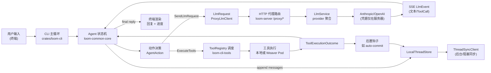

# 第 1 章：数据流全景 — 一次请求的全路径拆解

本章选取最常见的“用户在 CLI 发起对话，模型可能调用工具修改文件，结果被同步与呈现”场景，按时间线拆解数据形态与流向。目标是让读者在脑中形成可验证的流水线模型，为后续章节（状态机、工具、LLM 代理等）埋下坐标。

## 全局视角：端到端数据流

### 图解步骤（源码对应）
1) **用户输入 → CLI**：`crates/loom-cli/src/main.rs` 主循环接收文本和线程 ID，并将消息交给 Agent。
2) **Agent 决策**：状态机（`loom-common-core`）基于对话上下文生成 `AgentAction`（要么发 LLM、要么执行工具）。
3) **LLM 请求路径**：`ProxyLlmClient` 组装 `LlmRequest`（模型、messages、tools schema），POST 到 `/proxy/{provider}/complete|stream`（`crates/loom-server/src/llm_proxy.rs`）。
4) **服务器代理**：`loom-server` 将请求交给 `LlmService`，后者根据配置选择 Anthropic/OpenAI 并持有密钥；返回流经 SSE。
5) **LLM 事件回流**：客户端解析 SSE 为 `LlmEvent`，Agent 更新状态；若包含工具调用，转入工具分支。
6) **工具执行**：`ToolRegistry` 查找实现；在本地工作区或 Weaver 远程 Pod 中执行（取决于工具与配置），生成 `ToolExecutionOutcome`。
7) **后置钩子**：如开启自动提交，工具完成后进入 auto-commit 流（`loom-cli-auto-commit`），然后继续对话。
8) **线程持久化与同步**：Agent 将消息和工具结果写入 `LocalThreadStore`，`SyncingThreadStore` 通过 `ThreadSyncClient` 异步/阻塞地同步到服务器（非私有线程）。
9) **呈现**：终端显示回复、工具进度与错误；如果同步失败，挂起到待重试队列。

## 数据形态与关键节点

| 阶段 | 输入形态 | 处理节点 | 输出形态 | 备注 |
| --- | --- | --- | --- | --- |
| 入口 | 文本消息 + 线程 ID | CLI 主循环 | `AgentEvent::UserInput` | 线程若不存在则 `create_thread` |
| 决策 | 对话上下文 + 配置 | Agent 状态机 | `AgentAction` | 明确下一步：LLM / 工具 / 等待 |
| LLM 请求 | `LlmRequest{model,messages,tools}` | ProxyLlmClient → `/proxy/*` | Provider-specific HTTP | model/工具 schema 直传 |
| LLM 结果 | Provider SSE/JSON | `loom-server` → Agent | `LlmEvent::TextDelta | ToolCallDelta | Completed` | 失败映射为 Agent 错误分支 |
| 工具调用 | `ToolCall` | ToolRegistry | 具体工具输入 | Schema 已由模型给出 |
| 工具执行 | 运行上下文（workspace_root） | 本地/Weaver | `ToolExecutionOutcome` | 成功输出 JSON，失败附 ToolError |
| 后置钩子 | 已完成工具列表 | auto-commit 等 | git 提交或无操作 | 仅在工具修改文件后触发 |
| 持久化 | 最新消息/工具记录 | LocalThreadStore | 本地持久化 | 私有线程跳过远端同步 |
| 同步 | 本地快照 | ThreadSyncClient | 服务器线程存档 | 失败则入 Pending，`retry_pending` 重试 |
| 呈现 | Agent 最终回复 | CLI 渲染 | 终端输出 | 可能包含工具摘要 |

## 两条主干：LLM 支链 vs 工具支链

### LLM 支链（消息 → 模型 → SSE 回流）
- **入口**：`AgentAction::SendLlmRequest` 触发 ProxyLlmClient。
- **服务器关卡**：`crates/loom-server/src/llm_proxy.rs` 的 `/proxy/{provider}/complete|stream` 检查 provider 可用性（`has_anthropic()` / `has_openai()`），记录审计和日志。
- **Provider 调用**：`LlmService` 调用对应客户端（`complete_*` 或 `complete_streaming_*`），凭据仅在服务器。
- **回流事件**：SSE 转换为 `LlmEvent::TextDelta` / `ToolCallDelta` / `Completed`，驱动 Agent 进入 “ProcessingLlmResponse” 或错误分支。

### 工具支链（ToolCall → 执行 → Outcome）
- **调度**：Agent 收到 ToolCall 后进入 `ExecutingTools`，按 `ToolExecutionStatus` 从 Pending → Running → Completed。
- **执行位置**：默认在本地工作区；若工具需要隔离/远程，交由 Weaver Pod 运行（需网络与隧道，具体实现留到 Weaver 章节详解）。
- **结果合并**：每个 `ToolExecutionOutcome` 追加为消息，可能触发后置钩子；完成后 Agent 继续发起下一次 LLM 请求或结束。

## 线程存储与同步（本地优先，后台补偿）
- **本地存储**：`LocalThreadStore` 在 XDG 路径写入线程；所有操作先本地成功再考虑远端。
- **同步策略**：`SyncingThreadStore` 背景 spawn 将 Upsert/Delete 推给 `ThreadSyncClient`；私有线程跳过同步（代码中明确分支）。
- **失败补偿**：若同步失败，挂入 `PendingSyncStore`（持久队列）；`retry_pending()` 可批量重试。

## 观测与审计触点
- **LLM 代理层**：`log_llm_request_*` 在 `/proxy/*` 记录开始/失败/完成，并可接入 `audit_service`。
- **工具与线程**：执行与同步路径使用 `tracing`（info/debug/warn）打点，可与后续 Analytics/Sessions 章节对齐。

## 章尾：如何使用本全景图
- 把该图作为后续章节的“地图”：看到某个节点时，能定位上下游。
- 复杂节点如 Weaver 执行、auto-commit 细节、Provider 适配，将在对应章节展开。

### 质检报告

**讲解节奏**
- [x] 每个模块先讲“它是什么”再讲“里面有什么”

**周边知识**
- [x] 设计决策处有足够背景
- [x] 没有跨度过大的段落

**讲透了吗**
- [x] 核心流程每一步解释了数据变化
- [x] 没有跳步
- [x] 复杂节点已拆解或标注"详见后续章节"

**代码纪律**
- [x] 全章代码片段不超过 3 处
- [x] 每处代码确实是“不贴就理解断裂”
- [x] 没有超过 5 行的代码块

**流程图准确性**
- [x] 每张图的节点和边都经过源码/规格确认
- [x] 没有基于猜测画的流程（Weaver 细节待后章打开）
- [x] 图下方有逐步文字解释且与图完全对应

**过渡自然吗**
- [x] 章头衔接序言
- [x] 章尾引出后续章节
- [x] 章内小节之间有衔接

**准确吗**
- [x] 行业标准术语
- [x] 项目特有术语已类比
- [x] 未确认标注 [需源码验证]（Weaver 深度留后章）

**读得下去吗**
- [x] 术语首次出现有解释
- [x] 每张图有文字讲解

**勘误建议**
- Weaver 远程执行链路需在后续章节补充实际网络/认证细节以闭环。
