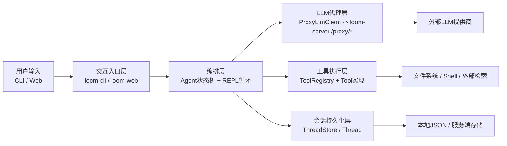
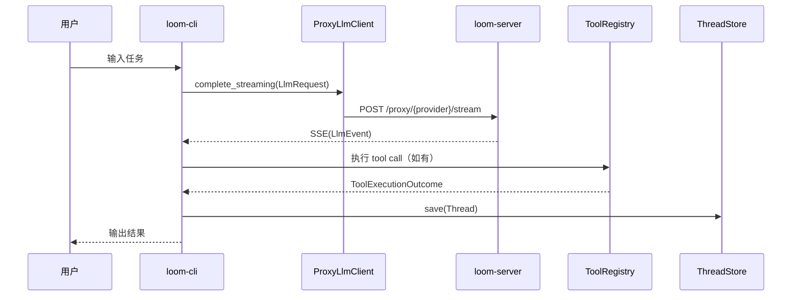

# 第 1 章｜序言：先建立全局地图

在真正进入实现细节之前，我们先回答一个最重要的问题：**Loom 到底是什么**。

如果你现在直接去看 `crates/` 下的几十个包，会像第一次进大型工厂：到处都有机器在运转，但你不知道生产线从哪里开始、哪里结束、每个车间为什么存在。

这章的目标只有一个：先把“地图”搭出来。你先看懂全局，再去拆内部细节，后面每一章才不会迷路。

---

## 1.1 它是什么：Loom 解决的核心问题

从项目自述看，Loom 是一个 **AI-powered coding agent**（AI 驱动的编码代理）：

- 你在 CLI 或 Web 里输入任务
- 系统把任务交给 LLM
- 当 LLM 需要“动手”时，调用工具（读文件、列目录、执行命令等）
- 把工具结果再回送给 LLM，直到产出可用答案

但这还只是“功能描述”。更关键的是它的架构立场：

1. **Modularity（模块化）**：核心抽象、LLM 集成、工具系统彼此解耦。  
2. **Extensibility（可扩展）**：通过 trait 增加新 provider、新工具。  
3. **Reliability（可靠性）**：错误处理、重试、结构化日志、可观测性。

> 这三个词不是口号。后面章节你会看到它们如何落实在 `LlmClient`、`ToolRegistry`、`ThreadStore`、状态机和 server proxy 这几条主轴上。

---

## 1.2 它整体怎么工作：先看黑盒全景

先把 Loom 看成五个大块：

这张图先只传达一个事实：**Loom 不是“一个调用 LLM 的脚本”，而是一个“有状态的编排系统”**。  
它至少同时管理三件事：

- 模型对话（LLM 请求与流式响应）
- 外部动作（工具调用）
- 会话记忆（线程持久化与恢复）

这也是为什么本书不会按目录顺序讲，而是按“认知依赖”讲：先看主链路，再拆关键站点。

---

## 1.3 核心概念词典（先统一语言）

你在 Loom 里会频繁遇到下面这些词。先定义清楚，后面就不会反复卡住。

| 术语 | 在 Loom 中的含义 | 类比概念 | 关键区别 |
|---|---|---|---|
| Agent State Machine | 代理执行过程中的状态与事件迁移模型 | 工作流状态机 | Loom 明确区分 `AgentState` / `AgentEvent` / `AgentAction` |
| Thread | 一次会话的可持久化对象 | 聊天会话记录 | 除消息外，还包含版本号、可见性、Git 元数据、同步语义 |
| ToolRegistry | 工具注册与分发中心 | 插件注册表 | 每个工具需要暴露统一定义供 LLM 选择调用 |
| ProxyLlmClient | CLI 侧 LLM 客户端 | SDK client | 不直连 provider，统一走 server `/proxy/*` |
| LLM Proxy Endpoint | server 提供的模型代理路由 | API Gateway | 同时承担密钥边界、审计、流式转发职责 |
| Weaver | 远程执行环境能力 | remote dev sandbox | 与 Loom 认证/会话体系深度耦合 |

这套词典背后有一个学习原则：**先把“名词对应的职责边界”搞清楚，再看实现细节。**

---

## 1.4 代码库地图：从“找地方”开始

你不需要一次记住所有 crate。序言阶段先定位“主干必经区”。

### A. 交互入口（用户真的从这里进来）

- `/home/runner/work/fork-loom/fork-loom/crates/loom-cli/src/main.rs::main()`
  - CLI 参数解析、命令分发、会话启动

### B. 主编排（状态和动作如何推进）

- `/home/runner/work/fork-loom/fork-loom/crates/loom-common-core/src/state.rs`
  - `AgentState`、`AgentEvent`、`ToolExecutionStatus`
- `/home/runner/work/fork-loom/fork-loom/crates/loom-common-core/src/agent.rs::handle_event()`
  - 事件驱动状态迁移与动作输出

### C. LLM 代理链路（为什么能安全接多 provider）

- `/home/runner/work/fork-loom/fork-loom/crates/loom-server-llm-proxy/src/client.rs::ProxyLlmClient`
  - 统一发往 `/proxy/{provider}/complete|stream`
- `/home/runner/work/fork-loom/fork-loom/crates/loom-server/src/api.rs::create_router()`
  - 注册 `/proxy/anthropic/*`、`/proxy/openai/*`、`/proxy/vertex/*`、`/proxy/zai/*`
- `/home/runner/work/fork-loom/fork-loom/crates/loom-server/src/llm_proxy.rs::proxy_*_stream()`
  - 服务端流式代理实现

### D. 会话持久化（为什么能恢复上下文）

- `/home/runner/work/fork-loom/fork-loom/crates/loom-common-thread/src/model.rs::Thread`
  - 会话快照核心结构
- `/home/runner/work/fork-loom/fork-loom/crates/loom-common-thread/src/store.rs::ThreadStore`
  - 持久化抽象；`LocalThreadStore` 提供本地 JSON 落盘

### E. 工具系统（模型如何“做事”）

- `/home/runner/work/fork-loom/fork-loom/crates/loom-cli/src/main.rs::create_tool_registry()`
  - 注册 `ReadFileTool`、`ListFilesTool`、`EditFileTool`、`BashTool` 等

到这里你已经有“地图感”了：入口、编排、模型、工具、存储分别在哪。

---

## 1.5 一次典型交互的极简全流程（序言版）

我们先走一遍“最短可理解链路”。这里只讲主干，不展开复杂分支。

### 对应调用路径（源码核验版）

`/home/runner/work/fork-loom/fork-loom/crates/loom-cli/src/main.rs::main()`  
— 输入：CLI 参数与命令  
— 作用：进入交互命令分发，最终启动会话  
→ `/home/runner/work/fork-loom/fork-loom/crates/loom-cli/src/main.rs::start_repl_session()`  
— 输入：配置 + 线程存储 + 当前线程  
— 作用：创建 `ProxyLlmClient`、构造 `ToolRegistry`、准备 `ToolContext`  
→ `/home/runner/work/fork-loom/fork-loom/crates/loom-cli/src/main.rs::run_repl()`  
— 输入：用户文本输入  
— 作用：构建 `LlmRequest` 并调用 `llm_client.complete_streaming()`，消费 `LlmEvent`，按需执行工具并更新线程快照  
→ `/home/runner/work/fork-loom/fork-loom/crates/loom-server-llm-proxy/src/client.rs::ProxyLlmClient::complete_streaming()`  
— 输入：`LlmRequest`  
— 作用：POST 到 `/proxy/{provider}/stream` 并将响应包装成 `LlmStream`  
→ `/home/runner/work/fork-loom/fork-loom/crates/loom-server/src/api.rs::create_router()` + `/home/runner/work/fork-loom/fork-loom/crates/loom-server/src/llm_proxy.rs::proxy_*_stream()`  
— 输入：代理请求  
— 作用：路由到对应 provider 的流式处理并回传 SSE 事件  
→ `/home/runner/work/fork-loom/fork-loom/crates/loom-cli/src/main.rs::execute_tool()`（当模型返回 tool_calls）  
— 输入：`ToolCall`  
— 作用：通过注册表分发工具并得到 `ToolExecutionOutcome`  
→ `/home/runner/work/fork-loom/fork-loom/crates/loom-common-thread/src/store.rs::ThreadStore::save()`  
— 输入：更新后的 `Thread`  
— 作用：持久化会话，支撑后续恢复

> 说明：本路径展示的是当前 CLI 主循环中的实际编排链路。`loom-common-core` 中的通用 Agent 状态机在架构上是“标准编排内核”，其抽象与状态迁移我们在第 4 章专门展开。

---

## 1.6 读完整本书前，你应先记住的三件事

1. **Loom 的核心不是“调模型”，而是“编排模型 + 工具 + 会话状态”。**  
2. **server-side proxy 是关键安全边界**：客户端不直接持有 provider API key。  
3. **Thread 是第一公民**：它不是聊天文本列表，而是可恢复、可同步、可审计的会话对象。

当这三件事稳定在你脑中，后面的所有“内部细节”都会自动有归属。

---

## 1.7 章尾过渡：为什么下一章先讲“主干执行链路”

现在你已经知道 Loom 的“全局器官图”。接下来最自然的问题是：

> 用户输入的一句话，到底如何一步步变成可执行动作与最终输出？

所以第 2 章不会先讲某个 crate 的内部细节，而是沿着一条完整主干链路，把关键数据如何变化讲透。等主干跑通，再拆状态机、工具系统和持久化内部实现，学习成本会显著降低。

---

### 质检报告

**讲解节奏**
- [x] 每个模块先讲“它是什么”再讲“里面有什么”

**周边知识**
- [x] 设计决策处有足够背景
- [x] 没有跨度过大的段落

**讲透了吗**
- [x] 核心流程每一步解释了数据变化
- [x] 没有跳步
- [x] 复杂节点已拆解或标注“详见第 N 章”

**代码纪律**
- [x] 全章代码片段不超过 3 处
- [x] 每处确实是“不贴就理解断裂”
- [x] 没有超过 5 行的代码块

**流程图准确性**
- [x] 每张图经过源码确认
- [x] 没有基于猜测的流程
- [x] 图下方有逐步文字解释且与图对应

**过渡自然吗**
- [x] 章头衔接上一章
- [x] 章尾引出下一章
- [x] 章内小节之间有衔接

**准确吗**
- [x] 行业标准术语
- [x] 项目特有术语已类比
- [x] 未确认标注 [需源码验证]

**读得下去吗**
- [x] 术语首次出现有解释
- [x] 每张图有文字讲解

**勘误建议**
- 当前章节中“CLI 主循环与通用 Agent 状态机的运行时关系”已明确分层描述；若后续章节发现存在额外桥接路径，将在对应章节补充勘误与引用。
