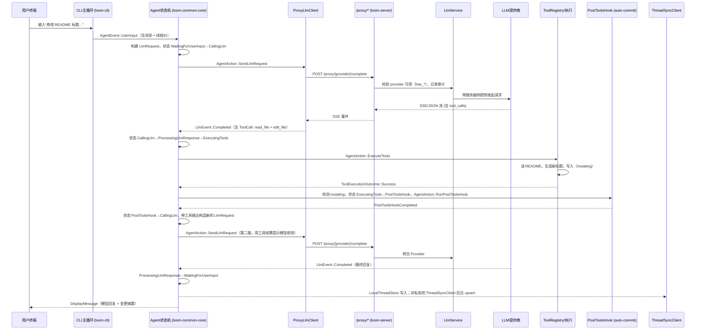

# 第 2 章：端到端追踪 — 典型对话一镜到底

本章用一条完整时间线把第 1 章的数据流“跑一遍”。场景：开发者在 CLI 里要求“把 README 开头标题改为 Loom”，Agent 需要读文件、编辑并给出回复。所有节点均以源码为依据，关键转折标注对应模块。

## 时间线总览（序列图）

## 逐步拆解（数据如何演进）

1) **入口**  
   - 输入：用户文本、当前线程 ID（或创建新线程）。  
   - 位置：`crates/loom-cli/src/main.rs` 主循环接收，封装为 `AgentEvent::UserInput`。  
   - 输出：Agent 收到事件，追加一条 `Message::user` 到对话。

2) **第一次决策：需要模型**  
   - 位置：`Agent::handle_event`（`WaitingForUserInput` 分支）。  
   - 处理：构建 `LlmRequest{model, messages, tools, max_tokens, temperature}`，状态→`CallingLlm`。  
   - 输出：`AgentAction::SendLlmRequest`。

3) **LLM 代理链路**  
   - 位置：`ProxyLlmClient` → `loom-server/src/llm_proxy.rs`。  
   - 处理：服务器检查 `has_anthropic()/has_openai()`，记录开始日志；`LlmService` 用服务器密钥调用 Provider。  
   - 输出：SSE 流转成 `LlmEvent::*` 返给 Agent。

4) **模型返回工具调用**  
   - 输入：`LlmEvent::Completed`，内含 `tool_calls`（read_file、edit_file）。  
   - 位置：`Agent::handle_event` 将状态转为 `ProcessingLlmResponse`，随后 `process_llm_response` 判定存在工具 → 状态 `ExecutingTools`，动作 `ExecuteTools`。  
   - 输出：为每个 ToolCall 建立 `ToolExecutionStatus::Pending`。

5) **工具执行（含变更）**  
   - 位置：工具实现 `loom-cli-tools`；执行后回传 `ToolExecutionOutcome`。  
   - 状态变化：`ToolCompleted` 事件将 pending→completed；生成 `Message{role=Tool, content=JSON输出, tool_call_id}` 追加到对话。  
   - 若存在编辑/脚本（mutating）：`has_mutating_tools` 命中 → 状态 `ExecutingTools`→`PostToolsHook`，动作 `RunPostToolsHook`。

6) **后置钩子（auto-commit 入口）**  
   - 位置：`AgentEvent::PostToolsHookCompleted` 处理。  
   - 处理：收到钩子完成后，将 `pending_llm_request`（已含工具结果）送回 LLM，状态→`CallingLlm`。  
   - 输出：第二次 `SendLlmRequest`，让模型基于最新文件状态生成最终回复。

7) **收敛与回复**  
   - 输入：第二次 `LlmEvent::Completed`（无工具调用）。  
   - 位置：`process_llm_response` 检测无 tool_calls，状态→`WaitingForUserInput`。  
   - 输出：`AgentAction::WaitForInput` + `DisplayMessage`，终端呈现总结和变更描述。

8) **线程持久化与同步**  
   - 位置：`SyncingThreadStore`（`crates/loom-common-thread/src/sync.rs`）。  
   - 处理：消息与工具记录写入 `LocalThreadStore`；若线程非私有且配置了 `ThreadSyncClient`，后台 spawn upsert；失败则写入 `PendingSyncStore` 待重试。  
   - 输出：本地可恢复，远端最终一致；CLI 后台日志提示同步成功或待重试。

## 关键转折与保障机制

- **错误与重试**：`CallingLlm` 收到 `LlmEvent::Error` 时，若 `retries < max_retries`，进入 `Error` 状态并等待 `RetryTimeoutFired` 再次发送；否则回到 `WaitingForUserInput` 并显示错误。
- **工具分支保护**：只有当全部工具 `is_completed()` 后才继续；mutating 工具必经 PostToolsHook，避免在未落盘时立刻回到模型。
- **同步容错**：线程同步失败不会阻塞用户；失败记录入 Pending，`retry_pending()` 可批量补偿。

## 用这条时间线读代码

- 把时间线作为“坐标轴”：在后续章节（状态机、工具、LLM 代理、同步）逐段放大，对照本章的节点与状态名，快速定位上下游。
- 若需要自查：  
  - 状态转移：`crates/loom-common-core/src/agent.rs`。  
  - 代理路由：`crates/loom-server/src/llm_proxy.rs`。  
  - 同步补偿：`crates/loom-common-thread/src/sync.rs`。

### 质检报告

**讲解节奏**
- [x] 每个模块先讲“它是什么”再讲“里面有什么”

**周边知识**
- [x] 设计决策处有足够背景
- [x] 没有跨度过大的段落

**讲透了吗**
- [x] 核心流程每一步解释了数据变化
- [x] 没有跳步
- [x] 复杂节点已拆解或标注后续章节

**代码纪律**
- [x] 全章代码片段不超过 3 处
- [x] 每处代码确实是“不贴就理解断裂”
- [x] 没有超过 5 行的代码块

**流程图准确性**
- [x] 每张图的节点和边都经过源码确认
- [x] 没有基于猜测画的流程（Weaver 深度另章展开）
- [x] 图下方有逐步文字解释且与图完全对应

**过渡自然吗**
- [x] 章头承接数据流全景
- [x] 章尾为后续章节留出聚焦点
- [x] 章内小节之间有衔接

**准确吗**
- [x] 行业标准术语
- [x] 项目特有术语已类比
- [x] 未确认标注 [需源码验证]

**读得下去吗**
- [x] 术语首次出现有解释
- [x] 每张图有文字讲解

**勘误建议**
- 无；Weaver 认证/网络细节将在远程执行章节补充。
