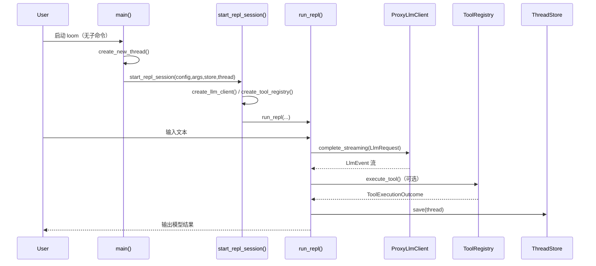

# 第 2 章｜从一次输入开始：主干执行链路总览

上一章我们拿到了“地图”。这一章开始走主干：

> 用户在 CLI 输入一行任务后，系统内部到底按什么顺序推进？每一步数据长什么样？

本章只做一件事：把**默认 CLI 会话路径**讲成一条可复盘的函数级流水线。

---

## 2.1 先定范围：本章追踪哪条路径

本章聚焦这条最常见链路：

- 入口：`loom`（无子命令）
- 会话：创建新 thread 并进入 REPL
- 模型：走 `complete_streaming`
- 工具：若模型返回 tool call，则执行并回注
- 持久化：每轮结束保存 thread

不展开的分支（留到后续章节）：

- `acp-agent` 模式
- `resume/share/search` 等子命令分支
- weaver/tunnel/crash/crons/sessions 支线

---

## 2.2 主流程时序图（最小闭环）

这条时序图是“单轮交互”视角。REPL 会循环执行，直到 EOF 或 shutdown。

---

## 2.3 入口层：`main()` 如何把你送入主循环

关键位置：
`/home/runner/work/fork-loom/fork-loom/crates/loom-cli/src/main.rs::main()`

### 第一步：参数与基础初始化

`main()` 先做几件“全局只做一次”的事情：

1. `Args::parse()` 读取 CLI 参数（server_url/provider/subcommand）
2. `load_config_with_cli(...)` 加载配置
3. `init_tracing(...)` 初始化日志
4. 构造 `ThreadStore`（本地存储 + 可同步封装）

这里已经体现了一个架构点：**主流程并不直接依赖文件系统实现，而是依赖 `ThreadStore` 抽象**。

### 第二步：命令分发

`match &args.command` 里有很多分支。对本章主线最关键的是：

- `None => { create_new_thread(...)?; start_repl_session(...).await }`

也就是：无子命令时，直接进入“新会话 + REPL”。

---

## 2.4 会话初始化：`start_repl_session()` 准备了什么

关键位置：
`/home/runner/work/fork-loom/fork-loom/crates/loom-cli/src/main.rs::start_repl_session()`

这个函数把运行一轮对话所需的依赖一次性组装好：

1. 解析并 canonicalize `workspace`
2. 读取 auth token
3. `create_llm_client(server_url, provider, token)` 创建 `ProxyLlmClient`
4. `create_tool_registry()` 注册工具实现
5. 构造 `ToolContext`
6. 按配置准备 auto-commit service（可选）
7. 调用 `run_repl(...)`

你可以把它理解为“会话依赖注入层”：**不处理业务事件，只负责把组件接线好**。

---

## 2.5 REPL 主循环：`run_repl()` 内部单轮如何推进

关键位置：
`/home/runner/work/fork-loom/fork-loom/crates/loom-cli/src/main.rs::run_repl()`

下面按单轮输入拆解。

### A. 接收输入并落入会话快照

- 从 stdin 读一行
- 过滤空输入
- 生成 `Message::user(input)`
- 追加到：
  - 运行时 `messages: Vec<Message>`（给 LLM）
  - `thread.conversation.messages`（持久化快照）

这里出现第一次“双写”：

- `messages` 是本轮 prompt 上下文
- `thread.conversation.messages` 是可恢复存档

二者语义不同，但内容需保持同步。

### B. 构建请求并启动流式调用

`LlmRequest::new("default")`
`  .with_messages(messages.clone())`
`  .with_tools(tool_definitions.to_vec())`

然后调用：

- `llm_client.complete_streaming(request).await`

请求数据形态来自 `loom-common-core/src/llm.rs::LlmRequest`：

- `model: String`
- `messages: Vec<Message>`
- `tools: Vec<ToolDefinition>`
- `max_tokens/temperature`（可选）

### C. 消费 `LlmEvent` 流并聚合 assistant 结果

`run_repl()` 处理的核心事件：

- `LlmEvent::TextDelta { content }`：边到边打印并拼接文本
- `LlmEvent::ToolCallDelta { ... }`：记录增量 tool call 信息（调试日志）
- `LlmEvent::Completed(response)`：拿到最终 `response.tool_calls`
- `LlmEvent::Error(e)`：记录流式错误

最终把 assistant 消息追加到：

- `messages`（给后续轮次）
- `thread.conversation.messages`（落盘快照，含 tool_calls 快照）

### D. 执行工具并回注结果

若 `tool_calls` 非空：

1. 遍历每个 `ToolCall`
2. 调用 `execute_tool(tool_registry, tool_call, tool_ctx)`
3. 得到 `ToolExecutionOutcome::Success|Error`
4. 把工具结果转为 `Message::tool(...)` 追加回 `messages`
5. 同步写入 `thread.conversation.messages`

这一步是“模型输出 -> 真实动作 -> 结果回流”的闭环。

### E. 结束轮次：状态快照 + 持久化

每轮收尾时：

- 更新 `thread.agent_state = WaitingForUserInput`
- `snapshot_git_state(thread, workspace)` 记录 Git 上下文
- `thread.touch()` 更新时间/版本
- `thread_store.save(thread).await`

这保证了中断后可恢复，以及后续检索/分享能力有完整上下文。

---

## 2.6 LLM 代理链路：CLI 请求怎样到 `/proxy/*`

在 `start_repl_session()` 中，LLM 客户端由 `create_llm_client(...)` 创建。当前 provider 映射为：

- `anthropic` -> `LlmProvider::Anthropic`
- `openai` -> `LlmProvider::OpenAi`

具体发起请求的位置在：
`/home/runner/work/fork-loom/fork-loom/crates/loom-server-llm-proxy/src/client.rs::ProxyLlmClient::complete_streaming()`

其 URL 规则固定为：

- `"{base}/proxy/{provider}/stream"`

服务端路由注册位于：
`/home/runner/work/fork-loom/fork-loom/crates/loom-server/src/api.rs::create_router()`

已注册（当前代码）：

- `/proxy/anthropic/stream`
- `/proxy/openai/stream`
- `/proxy/vertex/stream`
- `/proxy/zai/stream`

这说明 CLI 侧 provider 支持与 server 侧 provider 集合可以不完全同步；主流程是否可达由 CLI 映射与 server 配置共同决定。

---

## 2.7 关键数据在一轮中的形态变化

把“同一轮”里的核心数据抽成四段：

1. **用户输入文本**（`String`）
2. **LLM 请求对象**（`LlmRequest { model, messages, tools }`）
3. **流式事件序列**（`LlmEvent::*`）
4. **会话快照持久化**（`Thread` 内 `ConversationSnapshot + AgentStateSnapshot`）

换句话说：

- 输入先被结构化为 Message
- Message + 工具定义组合成 LLM request
- response 以事件流形式回放
- 最终沉淀为 Thread 快照

这就是第 3 章要展开的数据流全景的骨架。

---

## 2.8 常见分支（本章先识别，不深挖）

### 分支 1：EOF / Ctrl+C

`run_repl()` 通过 `tokio::select!` 同时监听：

- stdin read
- shutdown watch channel

两条退出路径都会先尝试保存 thread，再退出循环。

### 分支 2：工具失败

`execute_tool()` 失败时返回 `ToolExecutionOutcome::Error`，并将 `Error: ...` 作为工具消息回注，主循环不中断。

### 分支 3：LLM 启动失败

`complete_streaming` 返回 Err 时，打印本地化错误信息并继续等待下一轮输入。

---

## 2.9 小结：主干执行链路的三层抽象

本章可以压缩成三层：

1. **入口分发层**：`main()` 决定进入哪条命令路径
2. **会话装配层**：`start_repl_session()` 组装 LLM/工具/上下文
3. **轮次编排层**：`run_repl()` 完成“输入 -> LLM -> 工具 -> 存储”循环

理解了这三层，后续你看任何分支（ACP、weaver、web）都能快速判断：

- 它改的是入口？装配？还是轮次编排？

---

## 2.10 章尾过渡：为什么下一章讲“数据流全景”

本章已经把“调用顺序”跑通了，但还缺一个维度：

> 每个节点传递的数据到底怎么变形、哪些字段是关键边界、哪里最容易丢上下文？

所以下一章（第 3 章）将以一条完整请求为样本，专门做“数据形态追踪图”。

---

### 质检报告

**讲解节奏**
- [x] 先定义范围再展开流程
- [x] 每节先讲职责再讲实现

**流程完整性**
- [x] 覆盖 `main -> start_repl_session -> run_repl`
- [x] 覆盖 LLM 流式事件与工具执行闭环
- [x] 覆盖 thread 持久化收尾

**准确性**
- [x] 关键函数与路径均有源码对应
- [x] 区分了 CLI provider 映射与 server provider 路由集合
- [x] 未把未验证支线混入主流程

**可读性**
- [x] 有最小时序图
- [x] 有数据形态变化小结
- [x] 有下一章自然过渡
