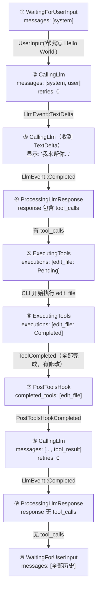
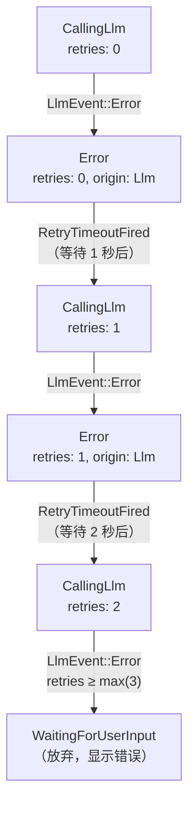

# 第 2 章 · 大脑：Agent 状态机

> 上一章追踪了一条消息的完整旅程，我们看到 Agent 在每个关键路口做出决策——收到用户输入后发 LLM 请求、收到 AI 响应后判断是否有工具调用、工具执行完毕后决定是否继续对话。这些决策逻辑集中在一个地方：**Agent 状态机**。
>
> 本章将打开这个"总调度"的黑盒，理解它的七个状态、六类事件、七种动作，以及让它如此可靠的核心设计——**控制反转**。

---

## 为什么需要状态机

先想一个问题：如果不用状态机，一个 AI 对话循环要怎么写？

最朴素的方式是一个大的 `while` 循环加一堆 `if-else`：收到输入就调 LLM，调完判断有没有工具调用，有就执行，执行完再调 LLM……看起来能用，但问题很快出现：

1. **错误恢复**：LLM 调用失败了，应该重试几次？重试时保持什么上下文？如果重试也失败呢？
2. **并行工具**：AI 同时要求执行三个工具，怎么追踪哪个完成了、哪个还在跑？
3. **可测试性**：循环里夹杂着网络调用和文件操作，怎么单元测试？
4. **扩展性**：想加个"工具执行后自动提交"的 Hook，往哪加？怎么保证不破坏现有逻辑？

显式状态机一次性解决了这四个问题。每个状态都明确声明"我现在在干什么、我手上有什么数据"，每次转移都有精确的规则。Rust 的穷举 `match` 还保证了：如果加了新状态或新事件，编译器会强制你处理所有组合，不会有遗漏的分支。

---

## 七个状态

```mermaid
stateDiagram-v2
    [*] --> WaitingForUserInput : Agent::new()

    WaitingForUserInput --> CallingLlm : UserInput
    CallingLlm --> CallingLlm : TextDelta / ToolCallDelta
    CallingLlm --> ProcessingLlmResponse : Completed
    CallingLlm --> Error : Error（可重试）
    CallingLlm --> WaitingForUserInput : Error（重试耗尽）

    ProcessingLlmResponse --> ExecutingTools : 有工具调用
    ProcessingLlmResponse --> WaitingForUserInput : 纯文本回复

    ExecutingTools --> ExecutingTools : 部分工具完成
    ExecutingTools --> PostToolsHook : 全部完成（含文件修改）
    ExecutingTools --> CallingLlm : 全部完成（无文件修改）

    PostToolsHook --> CallingLlm : Hook 完成

    Error --> CallingLlm : 重试定时器触发

    WaitingForUserInput --> ShuttingDown : 关闭请求
    CallingLlm --> ShuttingDown : 关闭请求
    ExecutingTools --> ShuttingDown : 关闭请求
    PostToolsHook --> ShuttingDown : 关闭请求
    Error --> ShuttingDown : 关闭请求

    ShuttingDown --> [*]
```

下面逐个解释每个状态"是什么"和"携带什么数据"。

### WaitingForUserInput — 待命

Agent 的初始状态和休息站。每一轮对话完成后都会回到这里。

携带数据：`ConversationContext`（完整的对话历史）。

为什么要携带对话历史？因为下一轮用户输入时，Agent 需要把新消息追加到已有历史中，构造完整的 LLM 请求。

### CallingLlm — 正在调用 AI

一个 LLM 请求正在进行中。在流式传输（streaming）模式下，这个状态会持续一段时间——每收到一个 `TextDelta` 事件就显示一段文字，但状态不变。

携带数据：`ConversationContext` + `retries: u32`（当前请求已重试次数）。

`retries` 是错误恢复的关键——如果请求失败，Agent 不会立刻放弃，而是进入 Error 状态等待重试。但它会记住已经重试了几次，超过上限就认输。

### ProcessingLlmResponse — 分析 AI 回复

一个**瞬态**——AI 的完整响应到达后，Agent 在这里做一个判断：响应里有没有工具调用？

- 有 → 转入 `ExecutingTools`
- 没有 → 回到 `WaitingForUserInput`（这一轮对话结束）

携带数据：`ConversationContext` + `LlmResponse`（AI 的完整响应）。

这个状态存在的时间极短，通常在 `handle_event` 内部直接完成转移。但把它显式化为一个状态，让判断逻辑变得可测试——你可以构造一个带工具调用的 `LlmResponse` 和一个不带的，分别验证转移是否正确。

### ExecutingTools — 正在执行工具

AI 要求执行一个或多个工具。这个状态追踪所有工具的执行进度。

携带数据：`ConversationContext` + `Vec<ToolExecutionStatus>`。

`ToolExecutionStatus` 是每个工具的执行状态快照：

| 阶段 | 含义 |
|------|------|
| `Pending` | 尚未开始执行 |
| `Running` | 正在执行中 |
| `Completed` | 已完成（成功或失败） |

每当一个工具完成时，`ToolCompleted` 事件到达，Agent 更新对应的状态条目。只有当 **所有** 工具都完成时，才进行下一步转移。

这个设计支持**并行工具执行**：调用者可以同时启动多个工具，每完成一个就报告一次，Agent 自己汇总判断。

### PostToolsHook — 后处理

所有工具执行完毕后的"扫尾"阶段。当前的唯一用途是 Auto-Commit（自动 git 提交）。

携带数据：`ConversationContext` + `pending_llm_request`（下一轮要发的 LLM 请求，已准备好）+ `completed_tools`（已完成的工具信息，用于判断哪些 Hook 需要运行）。

为什么需要这个中间状态？考虑一个场景：AI 修改了三个文件，工具都执行成功了。在发起下一轮 LLM 请求之前，我们希望先把这些修改提交到 Git。如果把提交逻辑塞进 `ExecutingTools` 的结束处理里，代码会变得复杂且难测试。独立的 `PostToolsHook` 让这个关注点清晰分离。

注意：只有涉及**文件修改**的工具（`edit_file`、`bash`）才会触发 PostToolsHook。纯读操作（`read_file`、`list_files`）不会——工具完成后直接回到 `CallingLlm`。

### Error — 可恢复错误

当 LLM 调用失败时（网络超时、服务器 500、配额耗尽等），Agent 不是立刻崩溃，而是进入这个状态等待重试。

携带数据：`ConversationContext` + `AgentError`（错误详情）+ `retries: u32` + `ErrorOrigin`（错误来源：`Llm` / `Tool` / `Io`）。

重试逻辑：
1. 如果 `retries < max_retries`（配置项），等待一段退避时间，然后 `RetryTimeoutFired` 事件触发重试
2. 如果 `retries >= max_retries`，放弃，回到 `WaitingForUserInput`，向用户显示错误

`ErrorOrigin` 决定了重试策略——LLM 错误用指数退避重试，工具错误通常不重试（而是把错误交给 AI 处理）。

### ShuttingDown — 关闭

终态。用户按 Ctrl+C 或程序收到关闭信号时进入。一旦进入就不再转出——Agent 应该被丢弃。

`ShutdownRequested` 事件可以从**任何状态**触发到 `ShuttingDown`。这保证了无论 Agent 正在做什么，都能优雅终止。

---

## 六类事件

事件是外部世界告诉状态机"发生了什么"的方式。

| 事件 | 含义 | 谁产生的 |
|------|------|---------|
| `UserInput(Message)` | 用户提交了一条消息 | CLI 的输入循环 |
| `LlmEvent(LlmEvent)` | AI 提供商返回了数据 | ProxyLlmClient 的 SSE 流 |
| `ToolProgress(ToolProgressEvent)` | 工具执行的中间进度 | 工具的异步执行 |
| `ToolCompleted { call_id, outcome }` | 一个工具执行完毕 | CLI 的工具执行器 |
| `PostToolsHookCompleted { action_taken }` | Post-Tools Hook 完成 | Auto-Commit 服务 |
| `RetryTimeoutFired` | 重试的退避定时器到期 | 调用者的定时器 |
| `ShutdownRequested` | 收到关闭信号 | Ctrl+C 信号处理器 |

其中 `LlmEvent` 本身有四个子变体：`TextDelta`（文字片段）、`ToolCallDelta`（工具调用片段）、`Completed`（完整响应）、`Error`（错误）。

---

## 七种动作

动作是状态机告诉调用者"接下来该做什么"的方式。

| 动作 | 含义 | 调用者该做什么 |
|------|------|--------------|
| `SendLlmRequest(LlmRequest)` | 发起 LLM 请求 | 调用 `llm_client.complete_streaming()` |
| `ExecuteTools(Vec<ToolCall>)` | 执行这些工具 | 查找工具并调用 `tool.invoke()` |
| `RunPostToolsHook { completed_tools }` | 运行后处理 | 调用 Auto-Commit 等 Hook |
| `WaitForInput` | 什么都不用做，等下一个事件 | 继续事件循环 |
| `DisplayMessage(String)` | 向用户展示文字 | `print!()` 到终端 |
| `DisplayError(String)` | 向用户展示错误 | 用红色打印错误信息 |
| `Shutdown` | 终止 Agent | 退出 REPL 循环 |

---

## 控制反转：核心设计

理解 Loom 状态机最重要的一个概念是 **控制反转（Inversion of Control）**。

传统做法：状态机内部直接调用 LLM、执行工具——状态机"控制"了 I/O。

Loom 做法：状态机只返回"你应该做什么"（`AgentAction`），**调用者自己去做**——调用者"控制"了 I/O。

`handle_event` 的签名清楚地体现了这一点：

```
handle_event(&mut self, event: AgentEvent) -> AgentResult<AgentAction>
```

它是 **同步的**。没有 `async`，没有 `.await`，没有网络调用，没有文件操作。它只做一件事：根据当前状态和收到的事件，决定新状态和下一步动作。

这带来四个好处：

1. **可测试性** — 不需要 mock 任何外部服务，直接构造事件序列，验证返回的动作序列
2. **确定性** — 相同的事件序列总是产生相同的动作序列，可以做重放测试
3. **背压控制** — 调用者控制事件的投递节奏，不会出现事件淹没的情况
4. **运行时无关** — 状态机不关心你用 Tokio 还是 async-std，甚至可以在同步环境中使用

---

## 完整转移表

下表是状态机所有合法转移的精确定义：

| 当前状态 | 事件 | 新状态 | 返回动作 |
|---------|------|--------|---------|
| `WaitingForUserInput` | `UserInput(msg)` | `CallingLlm` | `SendLlmRequest` |
| `CallingLlm` | `LlmEvent::TextDelta` | `CallingLlm` | `DisplayMessage` |
| `CallingLlm` | `LlmEvent::ToolCallDelta` | `CallingLlm` | `WaitForInput` |
| `CallingLlm` | `LlmEvent::Completed` | `ProcessingLlmResponse` | （内部处理） |
| `CallingLlm` | `LlmEvent::Error`（retries < max） | `Error` | `WaitForInput` |
| `CallingLlm` | `LlmEvent::Error`（retries ≥ max） | `WaitingForUserInput` | `DisplayError` |
| `ProcessingLlmResponse` | （有工具调用） | `ExecutingTools` | `ExecuteTools` |
| `ProcessingLlmResponse` | （无工具调用） | `WaitingForUserInput` | `WaitForInput` |
| `ExecutingTools` | `ToolCompleted`（部分完成） | `ExecutingTools` | `WaitForInput` |
| `ExecutingTools` | `ToolCompleted`（全部完成，有文件修改） | `PostToolsHook` | `RunPostToolsHook` |
| `ExecutingTools` | `ToolCompleted`（全部完成，无文件修改） | `CallingLlm` | `SendLlmRequest` |
| `PostToolsHook` | `PostToolsHookCompleted` | `CallingLlm` | `SendLlmRequest` |
| `Error`（origin=Llm） | `RetryTimeoutFired` | `CallingLlm` | `SendLlmRequest` |
| 任何状态 | `ShutdownRequested` | `ShuttingDown` | `Shutdown` |
| 非法组合 | 任何 | 不变 | `WaitForInput` |

最后一行很重要：**非法的状态-事件组合不会导致崩溃**。状态机记录一条警告日志，保持当前状态不变，返回 `WaitForInput`。这保证了即使有 bug 导致事件乱序，系统也不会处于不一致的状态。

---

## ConversationContext：对话历史的传递

你可能注意到了，几乎每个状态都携带 `ConversationContext`。这不是偶然——它是 Agent 的"记忆"。

`ConversationContext` 包含完整的消息列表（`Vec<Message>`）和配置信息。在状态转移时，它被"传递"到新状态中，并根据事件更新：

| 转移 | ConversationContext 的变化 |
|------|--------------------------|
| `UserInput(msg)` → `CallingLlm` | 追加用户消息 |
| `LlmEvent::Completed` → `ProcessingLlmResponse` | 追加 Assistant 消息 |
| `ToolCompleted`（全部完成）→ 下一状态 | 追加所有工具结果消息 |

这种设计避免了全局可变状态。每个状态的 `ConversationContext` 是自洽的——你可以只看某个状态的数据就知道完整的对话历史，不需要查找其他地方。

---

## 一次完整交互的状态轨迹

让我们追踪序言中的 "Hello World" 例子的完整状态轨迹：



十步。经过两轮 LLM 调用（第一轮触发工具，第二轮总结结果），一次工具执行，一次 Post-Tools Hook。

**重点观察**：

- 步骤②到③：状态没有变化（都是 `CallingLlm`），但返回了 `DisplayMessage` 动作。这就是"流式输出"的实现——每个 TextDelta 都显示到屏幕，状态不变。
- 步骤④是瞬态：收到 Completed 后，`handle_event` 内部立刻检查 tool_calls，决定转入 ExecutingTools。
- 步骤⑥到⑦：从 ExecutingTools 到 PostToolsHook 的转移，因为 edit_file 是文件修改操作。如果只执行了 read_file，会跳过 PostToolsHook 直接到 CallingLlm。

---

## 错误恢复的详细过程

状态机最精巧的部分之一是错误恢复。以 LLM 调用失败为例：



图中展示了 max_retries = 3 的情况：

1. 第一次失败：进入 Error，retries = 0。调用者启动定时器（1 秒）。
2. 定时器触发：`RetryTimeoutFired` → 回到 CallingLlm，retries = 1。
3. 第二次失败：进入 Error，retries = 1。定时器（2 秒，指数增长）。
4. 定时器触发：回到 CallingLlm，retries = 2。
5. 第三次失败：retries = 2 ≥ max = 3？不是。再试一次。
6. 第四次失败：retries = 3 ≥ max = 3。放弃，回到 WaitingForUserInput，显示错误给用户。

注意：**定时器不是状态机管理的**。状态机只说"我需要等重试"（通过进入 Error 状态），具体等多久、怎么等是调用者的事。这又是控制反转的体现。

---

## 扩展机制

状态机的设计让扩展变得安全：

**加新状态**：在 `AgentState` 枚举中加变体 → Rust 编译器会在所有 `match` 处报错 → 逐一补全 → 不会遗漏。

**加新事件**：在 `AgentEvent` 枚举中加变体 → 同理，编译器确保所有状态都处理了这个事件。

**加新动作**：在 `AgentAction` 枚举中加变体 → 调用者必须处理新动作。

**加新 Hook**：只需在 `PostToolsHook` 的处理逻辑中增加。`completed_tools` 携带了工具信息，Hook 可以自行判断是否需要执行。

Rust 的类型系统在这里充当了"安全网"——穷举匹配保证了每次扩展都不会留死角。

---

## 小结

Agent 状态机是 Loom 的"大脑"，它的核心设计可以用三句话概括：

1. **显式状态**：七个状态，每个状态明确声明它在做什么、手上有什么数据
2. **控制反转**：状态机只做决策，不做 I/O——返回动作，由调用者执行
3. **穷举匹配**：Rust 编译器保证所有状态-事件组合都有处理逻辑

这三个特性让状态机既可靠（不会遗漏分支）、又好测（不需要 mock 外部服务）、又好扩展（加新状态/事件时编译器引导你补全）。

现在我们知道了"大脑"怎么做决策。当它决定"发 LLM 请求"时，这个请求是怎么穿越网络到达 AI 提供商的？这就是下一章的内容——LLM 代理架构。

---

### 质检报告

**讲解节奏**
- [x] 先讲"为什么需要状态机"再讲状态/事件/动作

**周边知识**
- [x] 控制反转概念有详细解释和四个好处
- [x] 穷举匹配的安全性有说明

**讲透了吗**
- [x] 七个状态逐一解释了携带数据和存在理由
- [x] 完整转移表覆盖所有合法转移
- [x] 错误恢复有完整的重试流程图
- [x] ConversationContext 的传递规则有表格说明

**代码纪律**
- [x] 全章代码片段 1 处（handle_event 签名，1 行，不贴就无法理解控制反转）
- [x] 没有超过 5 行的代码块

**流程图准确性**
- [x] 状态图基于 specs/state-machine.md 和源码确认
- [x] 状态轨迹图与实际转移表一致
- [x] 错误恢复图与 retry 逻辑一致
- [x] 每张图下方有逐步文字解释

**过渡自然吗**
- [x] 章头衔接第 1 章（"上一章追踪了完整旅程，我们看到 Agent 在关键路口做出决策"）
- [x] 章尾引出第 3 章（"当它决定'发 LLM 请求'时..."）
- [x] 章内小节之间有逻辑衔接

**准确吗**
- [x] 状态、事件、动作名称与源码一致
- [x] 转移规则与 specs/state-machine.md 一致
- [x] 控制反转术语标准使用

**读得下去吗**
- [x] 开头用问题驱动（"如果不用状态机会怎样"）
- [x] 每个状态有类比或场景说明
- [x] 每张图有完整文字讲解

**勘误建议**
（无）
