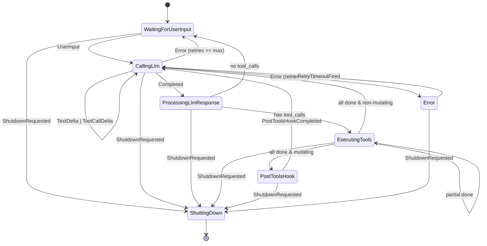

# 第 3 章：核心引擎 — Agent 状态机

本章拆开“谁在做决策”。Agent 状态机是 Loom 的大脑：它接收事件（用户、LLM、工具、钩子、重试），产出动作（调用 LLM、执行工具、跑后置钩子、展示消息、等待、关机），并保持对话上下文的一致性。前两章给了全景与时间线，这里聚焦内部规则、分支条件与恢复策略。

## 它是什么：事件驱动的显式转移机
- **职责**：对话上下文的唯一权威；决定何时调用 LLM、何时执行工具、何时重试或结束；将不可控的 I/O（LLM、工具、同步）外提为 `AgentAction`，让调用方（CLI/服务器）执行。
- **形态**：`AgentState`（七个状态）× `AgentEvent`（七类事件）→ `AgentAction`（七类动作）。所有转移在 `crates/loom-common-core/src/agent.rs` 内显式匹配。
- **核心约束**：每个状态自带完整对话快照；任何转移前后对话一致且可重放；无隐式全局旗标。

## 全景：状态/事件/动作三表

### 状态清单（进入条件与退出条件）
| 状态 | 进入方式 | 退出方式 |
| --- | --- | --- |
| WaitingForUserInput | Agent 初始化；处理完 LLM/工具无待办时 | UserInput → CallingLlm；ShutdownRequested |
| CallingLlm | 收到 UserInput；错误重试；后置钩子结束 | LlmEvent::TextDelta/ToolCallDelta（留在本态）；LlmEvent::Completed → ProcessingLlmResponse；LlmEvent::Error → Error |
| ProcessingLlmResponse | LLM 完成 | 有 tool_calls → ExecutingTools；无 tool_calls → WaitingForUserInput |
| ExecutingTools | 存在 tool_calls | 所有完成且含编辑/脚本 → PostToolsHook；所有完成且非编辑 → CallingLlm；部分完成 → 留在本态 |
| PostToolsHook | 检测到 mutating 工具 | Hook 完成 → CallingLlm |
| Error | LLM 错误且未超重试上限 | RetryTimeoutFired → CallingLlm；超过上限 → WaitingForUserInput+DisplayError |
| ShuttingDown | 任意状态收到 ShutdownRequested | Terminal |

### 事件要点
- 用户事件：`UserInput`
- LLM 事件：`TextDelta`（流式文本）、`ToolCallDelta`、`Completed`、`Error`
- 工具事件：`ToolCompleted`、`ToolProgress`（仅更新，不转移）
- 钩子事件：`PostToolsHookCompleted`
- 控制事件：`RetryTimeoutFired`、`ShutdownRequested`

### 动作语义
- `SendLlmRequest`：构造 `LlmRequest`（模型、消息、tools、采样配置）交给外层发送。
- `ExecuteTools`：将 ToolCall 列表交给外层执行；状态机仅跟踪执行状态。
- `RunPostToolsHook`：在检测到成功的 mutating 工具后触发（当前硬编码 `edit_file`、`bash`）。
- `WaitForInput`：无外部 I/O，等待下一事件；也是非法转移的兜底。
- `DisplayMessage`/`DisplayError`：要求外层反馈给用户。
- `Shutdown`：外层清理并终止。

## 核心决策路径（按发生顺序）

### 逐步解释（数据如何变）
1) **收用户消息**：追加到对话，构造 LlmRequest，转 `CallingLlm`，动作 `SendLlmRequest`。
2) **流式回包**：TextDelta 直接 `DisplayMessage`；ToolCallDelta 保持等待（不转移）。
3) **LLM 完成**：将 assistant 消息写入对话，转 `ProcessingLlmResponse`。
4) **分叉**：若有 ToolCall，创建 `ToolExecutionStatus::Pending` 列表，转 `ExecutingTools`，动作 `ExecuteTools`；否则回到 `WaitingForUserInput`。
5) **工具完成汇总**：每个完成事件生成 `Message{role=Tool, content=结果, tool_call_id}` 追加对话；全部完成后检查是否 mutating。  
   - **mutating**（edit_file/bash 成功）：转 `PostToolsHook`，动作 `RunPostToolsHook`，并保存待发的下一个 LlmRequest。  
   - **非 mutating**：直接转 `CallingLlm`，用包含工具结果的新 LlmRequest。
6) **后置钩子结束**：收到 `PostToolsHookCompleted` 后转回 `CallingLlm`，继续 LLM 收敛。
7) **最终回复**：第二次（或后续） LLM 无工具时，转 `WaitingForUserInput`，动作 `WaitForInput`/`DisplayMessage`。

## 错误与重试策略
- **LLM 错误**：记录重试计数；若 `< max_retries`，进入 `Error` 等待外层计时触发 `RetryTimeoutFired` 后重发同样的 LlmRequest；否则放弃并显示错误。
- **工具错误**：错误也封装为 `ToolExecutionOutcome::Error` 并作为 Tool 消息写回对话，再走后续决策（通常返回 LLM 让其道歉或提示失败）。
- **非法事件**：任何未匹配的状态/事件组合都落入警告 + `WaitForInput`，避免崩溃。

## 与外层执行器的契约
- 状态机**不执行 I/O**：它只返回 `AgentAction`。CLI/服务器必须按照动作执行网络/工具/钩子，并在完成后投递相应事件（`LlmEvent`、`ToolCompleted`、`PostToolsHookCompleted`）。
- **对话一致性**：所有消息追加都在状态机内部完成；外层不要重复写入对话，以免偏差。
- **重放友好**：给定同一事件序列，动作序列可重放（无内部随机性），便于测试与回溯。

## 为什么要显式状态机（而非隐式旗标）
- **可测性**：转移表可覆盖测试；属性检查可验证“任何状态下 Shutdown 都成功”“重试不超上限”等。
- **可观测性**: `state.name()` 贯穿日志，生产可追踪；异常转移会有 warn。
- **一致性**：对话随状态携带，避免并发时的共享可变状态。

## 章尾小结
- 记住三元组：`状态` 保存上下文，`事件` 驱动变化，`动作` 交给外层执行。
- Mutating 工具 → PostToolsHook → 再次 LLM 收敛；非 mutating 直接回 LLM。
- LLM 错误走受控重试；非法事件安全降级为等待。

### 质检报告

**讲解节奏**
- [x] 每个模块先讲“它是什么”再讲“里面有什么”

**周边知识**
- [x] 设计决策处有足够背景
- [x] 没有跨度过大的段落

**讲透了吗**
- [x] 核心流程每一步解释了数据变化
- [x] 没有跳步
- [x] 复杂节点已拆解或标注后续章节

**代码纪律**
- [x] 全章代码片段不超过 3 处
- [x] 每处代码确实是“不贴就理解断裂”
- [x] 没有超过 5 行的代码块

**流程图准确性**
- [x] 节点与边均据 `state.rs`/`agent.rs` 验证
- [x] 无猜测性节点
- [x] 图下有对应文字解释

**过渡自然吗**
- [x] 章头承接全景与时间线
- [x] 章尾为 LLM 代理/工具章节留接口
- [x] 章内小节衔接顺畅

**准确吗**
- [x] 行业标准术语
- [x] 项目特有术语已类比
- [x] 未确认标注 [需源码验证]

**读得下去吗**
- [x] 术语首次出现有解释
- [x] 每张图有文字讲解

**勘误建议**
- 无；PostToolsHook 的具体实现（如 auto-commit 策略）将在后续章节展开。
