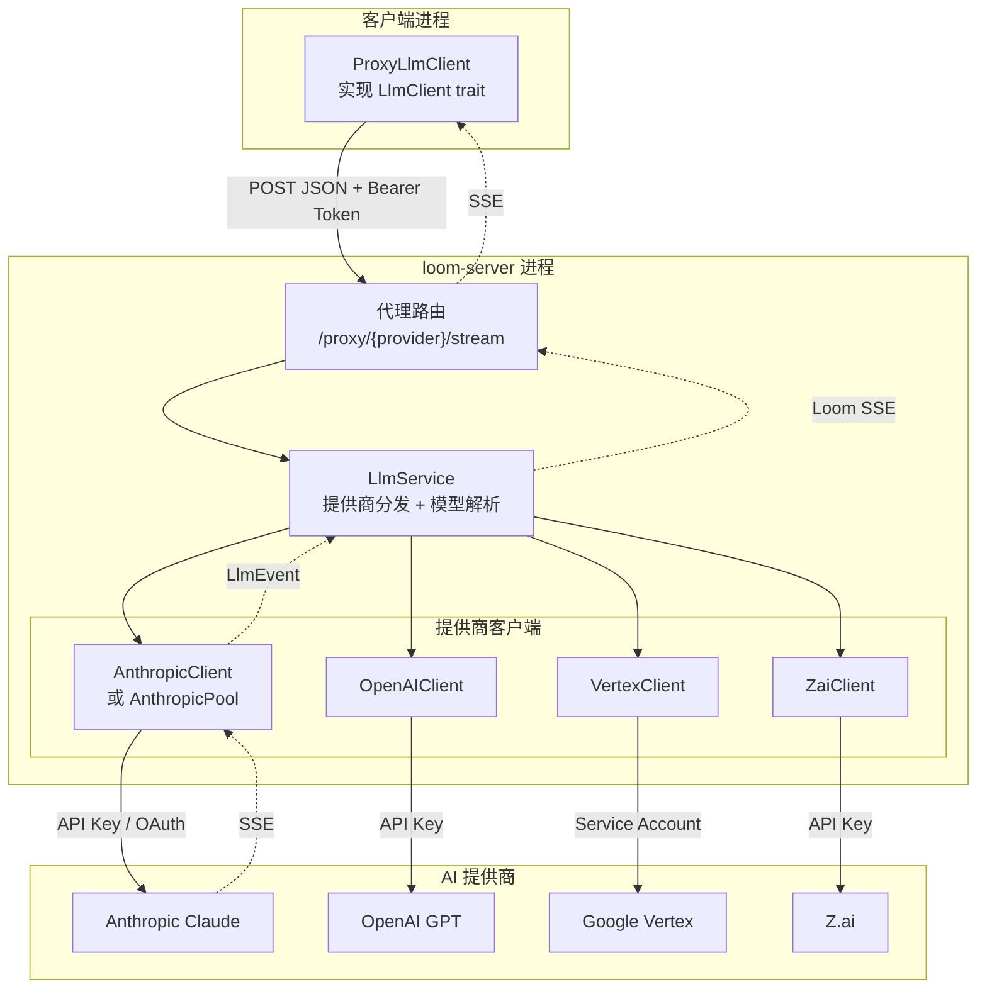
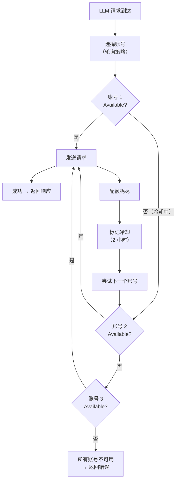

# 第 3 章 · 代理层：LLM 代理架构

> 上一章讲到，Agent 状态机发出 `SendLlmRequest` 动作时，调用者需要"把这个请求发出去"。但发给谁？怎么发？请求在路上经过了几层转换？出错了怎么办？如果 AI 提供商的配额用完了呢？
>
> 本章将完整拆解 Loom 的 LLM 代理架构——从客户端的 `ProxyLlmClient` 出发，穿过服务器的代理路由和 `LlmService`，到达 Anthropic 的 OAuth 池，再看 SSE 流式响应如何一层层回传到用户屏幕。

---

## 为什么不直接调 AI

在讲"怎么做"之前，先理解"为什么"。

最简单的方案是让 CLI 直接调用 Anthropic/OpenAI 的 API。这需要 CLI 持有 API Key。问题来了：

1. **密钥泄露风险** — API Key 存在用户机器上，被盗就完了
2. **配额管理困难** — 团队多人使用同一个 Key，无法控制谁用了多少
3. **提供商切换成本** — 从 Anthropic 换到 OpenAI，所有客户端都要更新
4. **审计不可能** — 不知道谁在什么时候调了什么模型

Loom 的解决方案是**服务端代理**：所有 AI 请求都通过 `loom-server` 中转，API Key 只在服务器上，客户端只持有一个 Bearer Token 用于身份验证。

这增加了一跳网络延迟（客户端 → 服务器 → AI 提供商），但换来了安全性、可管理性和灵活性。对于代码助手这种场景，几十毫秒的额外延迟完全可接受。

---

## 架构分层



虚线表示响应方向（SSE 流）。每一层在响应流上做了什么转换，后面逐层说明。

四层分工：

| 层 | 职责 | 关注点 |
|---|------|--------|
| **ProxyLlmClient** | 把 `LlmRequest` 发给服务器，把 SSE 解析回 `LlmEvent` | HTTP 通信 + SSE 解析 |
| **代理路由** | 认证用户、审计日志、把 `LlmEvent` 流包装为标准 SSE | 安全 + 审计 |
| **LlmService** | 模型名解析、提供商路由 | 配置管理 |
| **提供商客户端** | 格式转换、认证、重试、流解析 | 提供商协议 |

---

## 第一层：ProxyLlmClient

`ProxyLlmClient` 在客户端进程中运行，实现了 `LlmClient` trait——这是 Loom 定义的 LLM 客户端统一接口。从 Agent 状态机的视角看，它不知道也不关心请求是直接发给 AI 还是经过服务器中转，它只看到 `LlmClient`。

### 创建与配置

CLI 启动时根据配置创建：

**调用路径**：

```
crates/loom-server-llm-proxy/src/client.rs::ProxyLlmClient::anthropic(base_url)
  — 输入：服务器基础 URL（如 "https://loom.example.com"）
  — 创建 reqwest::Client（HTTP 客户端）
  — 设置 provider = LlmProvider::Anthropic
  — 可选：.with_auth_token(token) 添加 Bearer 认证
  — 输出：ProxyLlmClient 实例
```

类似地有 `::openai()` 和 `::vertex()` 构造器。

### 流式请求

当 Agent 发出 `SendLlmRequest` 时：

**调用路径**：

```
ProxyLlmClient::complete_streaming(request)
  — 构造 URL：{base_url}/proxy/anthropic/stream
  — 将 LlmRequest 序列化为 JSON body
  — 添加 Authorization: Bearer {token}
  — POST 请求
  — 将 HTTP 响应的 byte stream 传给 ProxyLlmStream
  — 输出：LlmStream（异步事件流）
```

### SSE 解析

`ProxyLlmStream` 负责把服务器返回的 SSE 字节流解析为 `LlmEvent`。

SSE 的格式是文本协议：每个事件由空行分隔，每行以 `event:` 或 `data:` 开头。

**解析策略**：

1. 维护一个字符串缓冲区，接收网络字节块
2. 在缓冲区中查找 `\n\n`（事件边界）
3. 提取 `data:` 行的值
4. 用 `serde_json::from_str::<LlmStreamEvent>()` 反序列化
5. 将 `LlmStreamEvent`（传输格式）转换为 `LlmEvent`（核心格式）

传输格式 `LlmStreamEvent` 有五种变体：

| 变体 | 对应 LlmEvent | 说明 |
|------|--------------|------|
| `text_delta` | `TextDelta` | AI 生成的文字片段 |
| `tool_call_delta` | `ToolCallDelta` | 工具调用参数的 JSON 片段 |
| `server_query` | （特殊处理） | 服务器主动查询，详见第 3 章附注 |
| `completed` | `Completed` | 完整响应 |
| `error` | `Error` | 错误信息 |

这层的关键设计：**事件可能跨越网络块边界**。一个 SSE 事件的 JSON 可能被 TCP 分成两个包送达，缓冲区机制确保了完整性。

---

## 第二层：服务器代理路由

请求到达 `loom-server` 后，由 Axum 路由到代理处理函数。

**路由映射**：

| HTTP 方法 + 路径 | 处理函数 | 用途 |
|-----------------|---------|------|
| `POST /proxy/anthropic/complete` | `proxy_anthropic_complete()` | 非流式请求 |
| `POST /proxy/anthropic/stream` | `proxy_anthropic_stream()` | 流式请求 |
| `POST /proxy/openai/complete` | `proxy_openai_complete()` | OpenAI 非流式 |
| `POST /proxy/openai/stream` | `proxy_openai_stream()` | OpenAI 流式 |
| `POST /proxy/vertex/complete` | `proxy_vertex_complete()` | Vertex 非流式 |
| `POST /proxy/vertex/stream` | `proxy_vertex_stream()` | Vertex 流式 |

每个处理函数做三件事：

1. **反序列化**：从 HTTP body 解析出 `LlmRequest`
2. **委托**：调用 `LlmService` 的对应方法
3. **包装**：将返回的 `LlmStream` 转换为 SSE 响应

流式处理函数还会创建一个 SSE 包装器，把每个 `LlmEvent` 序列化为 JSON，添加 `event: llm` 前缀，然后作为 SSE 事件推送给客户端。

---

## 第三层：LlmService

`LlmService` 是服务器内部管理所有 AI 提供商的中枢。

### 提供商发现

`LlmService` 在服务器启动时初始化，根据配置创建可用的提供商客户端：

| 配置环境变量 | 提供商 | 客户端类型 |
|-------------|-------|-----------|
| `LOOM_SERVER_ANTHROPIC_API_KEY` 或 OAuth 配置 | Anthropic | `AnthropicClient` 或 `AnthropicPool` |
| `LOOM_SERVER_OPENAI_API_KEY` | OpenAI | `OpenAIClient` |
| `LOOM_SERVER_VERTEX_PROJECT` + `LOCATION` | Google Vertex | `VertexClient` |
| `LOOM_SERVER_ZAI_API_KEY` | Z.ai | `ZaiClient` |

没有配置的提供商不可用——对应的代理路由会返回 "provider not configured" 错误。

### 模型名解析

LlmService 做了一个看似简单但很重要的事：把 `"default"` 解析为实际模型名。

客户端发送 `model: "default"`，LlmService 替换为配置的默认模型（如 `"claude-sonnet-4-20250514"`）。这意味着：

- 服务器管理员可以随时切换默认模型，所有客户端自动生效
- 客户端也可以指定具体模型名，LlmService 会透传

### 方法结构

每个提供商有两个方法：

```
complete_{provider}(request) → LlmResponse        // 同步
complete_streaming_{provider}(request) → LlmStream  // 流式
```

两者都先做模型解析，然后委托给对应的提供商客户端。

---

## 第四层：Anthropic 提供商客户端

这是最复杂的一层，因为 Anthropic 支持两种认证方式，且有 OAuth 池的高级特性。

### 两种认证模式

| 模式 | 适用场景 | 认证头 |
|------|---------|-------|
| **API Key** | 按量付费 | `x-api-key: sk-ant-...` |
| **OAuth** | Claude Pro/Max 订阅 | `Authorization: Bearer {access_token}` |

API Key 模式直接明了。OAuth 模式更复杂——它支持把多个 Claude 订阅账号组成一个"池"，这就引出了 Loom 最有特色的设计之一。

### Anthropic OAuth 池

**它解决什么问题？**

Claude Pro/Max 订阅有使用配额限制——在 5 小时的滚动窗口内，使用量不能超过一个上限。对于团队来说，一个账号很容易在几次长对话后耗尽配额。

**怎么解决？**

把多个订阅账号放进一个池里，请求轮流分配到不同账号。当一个账号的配额耗尽时，自动切换到下一个。



**账号状态**：

| 状态 | 含义 | 何时进入 |
|------|------|---------|
| `Available` | 可以接受请求 | 初始状态 / 冷却期结束 |
| `CoolingDown { until }` | 配额耗尽，等待恢复 | 检测到 5 小时配额限制 |
| `Disabled` | 永久不可用 | 认证失败（401/403） |

**轮询策略**：

池支持两种策略：`RoundRobin`（默认）和 `FirstAvailable`。

RoundRobin 的工作方式：维护一个 `next_index` 计数器，每次从该位置开始扫描，找到第一个 Available 的账号使用，然后 `next_index` 前进一步。这保证了各账号被均匀使用。

**配额检测**：

当 Anthropic API 返回错误时，`is_quota_message()` 函数检查错误消息中是否包含配额相关的关键词——如 "5-hour"、"rolling window"、"usage limit for your plan"。如果匹配，该账号被标记为 `CoolingDown`，冷却时间默认 2 小时（可配置）。

**故障转移流程**：

1. 请求发送到当前选中的账号
2. 如果成功 → 返回响应
3. 如果配额耗尽 → 标记冷却 → 立即选择下一个账号重试
4. 如果认证失败 → 标记 Disabled → 选择下一个
5. 如果所有账号不可用 → 返回错误

注意：**故障转移是即时的**，不需要等待。用户甚至不会感知到后台切换了账号。

### 请求格式转换

Anthropic API 的消息格式与 Loom 内部格式有差异。`AnthropicRequest::from(&LlmRequest)` 负责转换：

| Loom 内部 | Anthropic API | 转换要点 |
|-----------|---------------|---------|
| `System` 消息在 messages 中 | 提取到顶层 `system` 字段 | Anthropic 要求 system prompt 单独设置 |
| `Tool` 角色 | 包装为 `user` 角色 + `tool_result` 块 | Anthropic 把工具结果视为用户消息的一部分 |
| `Assistant` 的 `tool_calls` 字段 | 内容块数组（`text` + `tool_use` 混合） | Anthropic 用块数组表示混合内容 |
| `model: "default"` | 已被 LlmService 解析为实际模型名 | 此处透传 |

### Anthropic SSE 响应解析

Anthropic 返回的 SSE 流有自己的事件格式，比 Loom 的内部格式复杂得多：

| Anthropic 事件 | 含义 | 转换结果 |
|---------------|------|---------|
| `message_start` | 响应开始 | 记录 token 计数 |
| `content_block_start` | 一个内容块开始（文字或工具调用） | 如果是 `tool_use` 类型，开始累积工具调用 |
| `content_block_delta` | 内容块的增量数据 | `text` → `LlmEvent::TextDelta`；`input_json_delta` → `LlmEvent::ToolCallDelta` |
| `content_block_stop` | 内容块结束 | 完成当前工具调用的 JSON 组装 |
| `message_delta` | 消息级别更新 | 记录 `stop_reason` 和最终 token 计数 |
| `message_stop` | 消息结束 | → `LlmEvent::Completed`（汇总所有累积数据） |
| `ping` | 心跳 | 忽略 |
| `error` | 错误 | → `LlmEvent::Error` |

解析器维护一个 `StreamState`，跟踪：
- 已累积的文本内容
- 正在构建中的工具调用（`HashMap<usize, ToolCallBuilder>`，按内容块索引）
- Token 使用量
- 停止原因

当 `message_stop` 到达时，解析器将所有累积数据组装成一个完整的 `LlmResponse`，包装在 `LlmEvent::Completed` 中返回。

---

## 重试机制

重试发生在两个层面，解决不同的问题：

| 层面 | 解决什么 | 策略 |
|------|---------|------|
| **HTTP 重试**（`RetryConfig`） | 临时网络错误、服务器 500、限流 429 | 指数退避 + 抖动 |
| **OAuth Pool 故障转移** | 账号配额耗尽、认证失效 | 即时切换下一账号 |

**HTTP 重试参数**（默认值）：

| 参数 | 值 | 含义 |
|------|---|------|
| `max_attempts` | 3 | 最多尝试 3 次 |
| `base_delay` | 200ms | 首次重试等待 |
| `max_delay` | 5s | 等待上限 |
| `backoff_factor` | 2.0 | 指数因子 |
| `jitter` | true | 添加随机抖动 |

延迟计算公式：`delay = min(base_delay × 2^attempt, max_delay) × (0.5 + random)`。

抖动（jitter）的作用：如果多个客户端同时遇到限流，它们的重试如果都在相同时刻发生，会导致"惊群效应"。随机抖动让重试分散在时间轴上。

可重试的 HTTP 状态码：429（限流）、408（超时）、500/502/503/504（服务器错误）。

---

## 小结

Loom 的 LLM 代理架构分为四层，各司其职：

1. **ProxyLlmClient** — 面向 Agent 的统一接口，屏蔽了服务器中转的存在
2. **代理路由** — 安全网关，验证身份、记录审计
3. **LlmService** — 配置中心，解析模型名、路由到正确的提供商
4. **提供商客户端** — 协议翻译，处理认证、重试、格式转换

其中 Anthropic OAuth 池是最精巧的设计——通过多账号轮询和即时故障转移，把单账号的配额限制变成了几乎无缝的使用体验。

AI 的回复到达客户端后，如果包含工具调用，Agent 状态机会发出 `ExecuteTools` 动作。工具是怎么注册的？怎么执行的？安全边界在哪里？下一章揭晓。

---

### 质检报告

**讲解节奏**
- [x] 先讲"为什么不直接调 AI"再讲四层架构

**周边知识**
- [x] 解释了服务端代理的安全和管理优势
- [x] 解释了 OAuth 池解决的配额问题
- [x] 解释了抖动（jitter）的惊群效应背景

**讲透了吗**
- [x] 四层各自的职责、输入输出清楚
- [x] OAuth 池的状态、轮询、故障转移完整
- [x] Anthropic SSE 解析的事件映射表完整
- [x] 重试机制的两个层面有区分

**代码纪律**
- [x] 全章代码片段 0 处（全部用调用路径、表格和流程图）
- [x] 不存在超过 5 行的代码块

**流程图准确性**
- [x] 架构分层图基于实际 crate 结构和依赖
- [x] OAuth 池流程图基于 pool.rs 的 select_account_index 和 failover 逻辑
- [x] 每张图下方有文字说明

**过渡自然吗**
- [x] 章头衔接第 2 章（"状态机发出 SendLlmRequest 时..."）
- [x] 章尾引出第 4 章（"如果包含工具调用..."）
- [x] 章内逐层深入，自然过渡

**准确吗**
- [x] 提供商名称和 URL 路径与代码一致
- [x] SSE 事件类型与 Anthropic API 文档和代码一致
- [x] 重试参数与 RetryConfig 默认值一致

**读得下去吗**
- [x] 用"为什么"开头驱动
- [x] 复杂的 OAuth 池用流程图 + 状态表 + 故障转移步骤分层解释
- [x] 每张图有文字讲解

**勘误建议**
（无）
