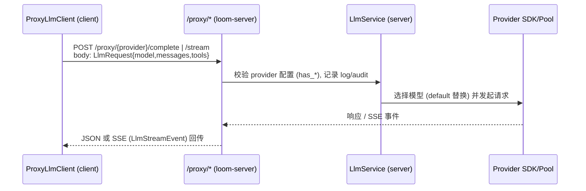

# 第 4 章：LLM 代理层与提供商适配

本章打开“模型调用链”的黑盒：从客户端 `ProxyLlmClient` 发出的 `/proxy/{provider}` 请求，到服务器侧 `LlmService` 持有密钥、路由并流式返回结果。重点是安全边界、路由策略、健康与失败处理。

## 它是什么：服务器端集中代理
- **目标**：让客户端不持有任何模型密钥；统一路由不同 Provider；提供健康与可观测切点。
- **形态**：客户端 `ProxyLlmClient` 只知道服务器 URL；服务器 `loom-server` 暴露 `/proxy/{provider}/complete|stream`；内部由 `LlmService` 选择具体 Provider 客户端（Anthropic / OpenAI / Vertex / Z.ai）。
- **安全边界**：密钥仅存在于服务器（env 或 OAuth pool）；客户端只传模型名、消息、工具 schema。

## 端到端调用路径

### 步骤对照源码
1) **客户端侧**：`loom-server-llm-proxy` 构造 HTTP 调用；`complete` 对应 `/complete`，`complete_streaming` 对应 `/stream`。
2) **服务器路由**：`crates/loom-server/src/llm_proxy.rs`  
   - 按 provider 分路由：`/proxy/anthropic/*`、`/proxy/openai/*` 等。  
   - 检查 `state.llm_service` 是否存在，`has_{provider}` 是否为真，不然返回 503。  
   - 记录请求开始/失败/完成日志，并连接审计服务（SSE 构造中可携带 audit_service）。
3) **服务层**：`crates/loom-server-llm-service/src/service.rs`  
   - 持有多种客户端（Anthropic 支持 API key 或 OAuth Pool；OpenAI、Vertex、Z.ai 为 API key）。  
   - 将 `"default"` 模型替换为服务端默认（例如 Anthropic 默认为 `claude-opus-4-20250514`，OpenAI 为 `gpt-4o`）。  
   - 提供同步与流式方法：`complete_*` 与 `complete_streaming_*`。
4) **Provider 调用与回流**：请求交给具体 SDK/Pool，返回 `LlmResponse` 或 `LlmStream`；服务器直接转发给客户端（SSE）。

## 配置与路由策略

| 维度 | Anthropic | OpenAI | Vertex | Z.ai |
| --- | --- | --- | --- | --- |
| 支持模式 | API key / OAuth Pool | API key | API key | API key |
| 默认模型 | `claude-opus-4-20250514` | `gpt-4o` | `gemini-1.5-pro` | `glm-4.7` |
| 启用检测 | `has_anthropic()` | `has_openai()` | `has_vertex()` | `has_zai()` |
| 路由入口 | `/proxy/anthropic/*` | `/proxy/openai/*` | `/proxy/vertex/*` | `/proxy/zai/*` |
| 流式支持 | 是 | 是 | 是 | 是 |

### Default 模型替换
`LlmService` 在每个 `complete_*` 前检查 `request.model == "default"`，并替换为对应默认值，避免客户端硬编码。

## 健康与可用性
- **存在性检查**：路由层先判断 `state.llm_service` 是否 Some，再检查对应 `has_*`，否则 503 并打错误日志。
- **Anthropic OAuth Pool**：  
  - `anthropic_health()` 返回 API key/Pool 配置情况或池状态；  
  - 刷新任务周期性执行（默认 300s 轮询，900s 阈值，可通过环境变量覆盖）；  
  - Admin API 可添加/移除账户，失败会带错误消息。
- **Debug 安全**：`Debug for LlmService` 不包含密钥，只展示布尔值（测试覆盖）。

## 失败与错误映射
- **路由层**：捕获 `LlmService` 返回的 `LlmError`，映射为 `ServerError`，并记录失败日志。  
- **不可用**：未配置 provider 时直接返回 ServiceUnavailable，避免向上游发送无意义请求。  
- **流式错误**：SSE 路径中错误会提前返回，客户端收到 LlmEvent::Error 并由 Agent 走重试策略（见上一章）。

## 数据安全与边界
- 密钥永不下发：客户端只传模型/消息/工具 schema，所有秘密在服务器环境变量或 OAuth 凭据文件。  
- 审计/日志：路由层在请求开始/失败/完成时记录，SSE 构造可携带 `audit_service`。  
- 模型名验证：不做白名单，但默认值在服务端统一替换，减少客户端差异。

## 章尾小结
- 记住职责分层：ProxyLlmClient 只发 HTTP；`llm_proxy.rs` 负责路由与可用性守门；`LlmService` 管理提供商客户端与默认模型；Provider SDK 执行真实调用。  
- 安全性关键点：密钥仅服务器持有，未配置即拒绝，调试输出不泄露秘密。  
- 下一章（工具系统）将基于本章输出的 ToolCall，解释如何分发与执行。

### 质检报告

**讲解节奏**
- [x] 每个模块先讲“它是什么”再讲“里面有什么”

**周边知识**
- [x] 设计决策处有足够背景
- [x] 没有跨度过大的段落

**讲透了吗**
- [x] 核心流程每一步解释了数据变化
- [x] 没有跳步
- [x] 复杂节点已拆解或标注后续章节

**代码纪律**
- [x] 全章代码片段不超过 3 处
- [x] 每处代码确实是“不贴就理解断裂”
- [x] 没有超过 5 行的代码块

**流程图准确性**
- [x] 节点与边均经 `llm_proxy.rs`、`loom-server-llm-service` 验证
- [x] 无猜测性节点
- [x] 图下有对应文字解释

**过渡自然吗**
- [x] 章头承接状态机/时间线
- [x] 章尾引出工具系统
- [x] 章内衔接顺畅

**准确吗**
- [x] 行业标准术语
- [x] 项目特有术语已类比
- [x] 未确认标注 [需源码验证]

**读得下去吗**
- [x] 术语首次出现有解释
- [x] 每张图有文字讲解

**勘误建议**
- 若后续新增 Provider（如自建模型），需补充默认模型策略与 has_* 守门逻辑。
