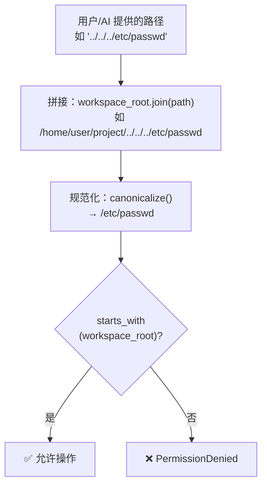

# 第 4 章 · 手与脚：工具系统

> Agent 状态机是大脑，LLM 是思维能力，但它们都只能"想"不能"做"。当 AI 说"我来帮你修改 main.rs"时，真正读文件、改文件的是 **工具系统**。本章将拆解工具的注册、查找、执行和安全机制。

---

## 工具系统的角色

回顾第 1 章的数据流：AI 在响应中返回 `tool_calls`，Agent 状态机发出 `ExecuteTools` 动作，CLI 拿到工具调用列表后需要：

1. 按名称找到对应的工具
2. 传入参数并执行
3. 把结果包装成 Tool 消息返回给 AI

工具系统提供了这整套机制。它由三个部分组成：

| 部分 | 职责 |
|------|------|
| **Tool trait** | 定义工具的统一接口 |
| **ToolRegistry** | 工具注册表，按名称管理所有可用工具 |
| **具体工具** | 七个内置工具的实现 |

---

## Tool trait：统一接口

所有工具都实现同一个 trait，包含四个方法：

| 方法 | 作用 |
|------|------|
| `name()` → `&str` | 返回工具的唯一标识符，如 `"read_file"` |
| `description()` → `&str` | 返回工具描述，发给 AI 让它知道工具能做什么 |
| `input_schema()` → `serde_json::Value` | 返回参数的 JSON Schema，AI 据此构造合法的参数 |
| `invoke(args, ctx)` → `Result<Value>` | 执行工具，接收 JSON 参数和工作区上下文，返回 JSON 结果 |

`invoke` 是 `async` 的——因为工具可能需要读文件、跑命令、发网络请求，这些都是异步操作。

`ToolContext` 提供执行环境信息，最重要的是 `workspace_root`——用户当前的工作目录。所有文件操作都相对于这个目录，不允许越界。

---

## ToolRegistry：名称到实例的映射

`ToolRegistry` 内部是一个 `HashMap<String, Box<dyn Tool>>`——简单直接。

**注册流程**：CLI 启动时逐个注册工具。

**调用路径**：

```
crates/loom-cli/src/main.rs（启动阶段）
  — 创建 ToolRegistry::new()
  — registry.register(Box::new(ReadFileTool))
  — registry.register(Box::new(EditFileTool))
  — registry.register(Box::new(ListFilesTool))
  — registry.register(Box::new(BashTool))
  — registry.register(Box::new(OracleTool))
  — registry.register(Box::new(WebSearchToolGoogle::new(...)))
  — registry.register(Box::new(WebSearchToolSerper::new(...)))
  — 获取所有工具定义：registry.definitions() → Vec<ToolDefinition>
  — 工具定义随 LlmRequest 发送给 AI
```

**查找流程**：当 AI 返回 `tool_calls` 时：

```
crates/loom-cli/src/main.rs（工具执行阶段）
  — 对每个 ToolCall：
    → registry.get(tool_call.tool_name) → Option<&dyn Tool>
    → tool.invoke(tool_call.arguments_json, &tool_context)
    → 构造 Message::tool(call_id, tool_name, result_json)
```

如果 `get()` 返回 `None`（AI 调用了一个不存在的工具），CLI 会构造一个错误结果返回给 AI，AI 通常会自行纠正。

---

## 七个内置工具

### 一览表

| 工具 | 名称 | 功能 | 操作类型 |
|------|------|------|---------|
| **ReadFileTool** | `read_file` | 读取文件内容 | 只读 |
| **EditFileTool** | `edit_file` | 创建或修改文件 | **写入** |
| **ListFilesTool** | `list_files` | 列出目录内容 | 只读 |
| **BashTool** | `bash` | 执行 shell 命令 | **写入**（可能） |
| **OracleTool** | `oracle` | 向另一个 AI 提问 | 只读（网络） |
| **WebSearchToolGoogle** | `web_search` | Google 搜索 | 只读（网络） |
| **WebSearchToolSerper** | `web_search_serper` | Serper 搜索 | 只读（网络） |

"写入"类工具会触发 PostToolsHook（自动提交），"只读"类不会。

---

### read_file — 读取文件

**做什么**：读取工作区内某个文件的内容。

**参数**：`path`（必需）和 `max_bytes`（可选，默认 1MB）。

**执行流程**：

```
invoke(args, ctx)
  ① 从 args 提取 path
  ② 解析为绝对路径：ctx.workspace_root.join(path)
  ③ 安全检查：canonicalize 后验证 starts_with(workspace_root)
     — 如果路径逃逸工作区（如 ../../../etc/passwd）→ 拒绝
  ④ 读取文件元数据，检查大小
  ⑤ 如果文件大于 max_bytes → 只读前 max_bytes，标记 truncated = true
  ⑥ 返回 { path, contents, truncated }
```

截断机制防止 AI 读取超大文件（如编译产物、日志文件）时耗尽内存。AI 会看到 `truncated: true`，知道只看到了文件的前半部分。

### edit_file — 创建或修改文件

**做什么**：通过"查找—替换"模式修改文件，或创建新文件。

**参数**：`path`（必需）和 `edits` 数组，每个 edit 包含 `old_str`、`new_str`、`replace_all`。

**四种编辑模式**：

| 模式 | old_str | new_str | 效果 |
|------|---------|---------|------|
| 创建文件 | `""` | 文件内容 | 文件不存在时创建 |
| 追加内容 | `""` | 追加内容 | 文件已存在时在末尾追加 |
| 替换首次出现 | `"旧文本"` | `"新文本"` | 只替换第一个匹配 |
| 替换所有出现 | `"旧文本"` | `"新文本"` + `replace_all: true` | 替换所有匹配 |

**执行流程**：

```
invoke(args, ctx)
  ① 解析 path，安全检查（同 read_file）
  ② 读取文件内容（文件不存在则为空字符串）
  ③ 逐个应用 edits：
     — old_str 为空 → push_str(new_str)
     — old_str 不为空但在文件中找不到 → 返回 TargetNotFound 错误
     — replace_all → 替换所有出现
     — 否则 → 只替换第一个出现
  ④ 创建父目录（如需要）
  ⑤ 写入文件
  ⑥ 返回 { path, edits_applied, original_bytes, new_bytes }
```

为什么用"查找—替换"而不是"按行号修改"？因为 AI 看到的文件内容可能已过时（被其他工具修改了），行号可能已经偏移。文本匹配比行号更鲁棒。

### bash — 执行 shell 命令

**做什么**：在工作区目录下执行任意 shell 命令。

**参数**：`command`（必需）、`cwd`（可选，默认工作区根目录）、`timeout_secs`（可选，默认 60 秒，最大 300 秒）。

**执行流程**：

```
invoke(args, ctx)
  ① 解析 command 和 cwd
  ② 安全检查：cwd 必须在工作区内
  ③ 超时限制：min(timeout_secs, 300)
  ④ 执行：sh -c "{command}" —— 在 cwd 下
  ⑤ 用 tokio::time::timeout 包裹，超时则终止进程
  ⑥ 截断输出：stdout 和 stderr 各最多 256KB
  ⑦ 返回 { exit_code, stdout, stderr, timed_out, truncated }
```

三道安全防线：

| 防线 | 保护什么 |
|------|---------|
| **工作区边界** | cwd 不能逃出工作区 |
| **超时限制** | 防止死循环或长时间阻塞（最多 5 分钟） |
| **输出截断** | 防止命令输出淹没内存 |

### list_files — 列出目录内容

**做什么**：列出某个目录的直接子文件和子目录（不递归）。

**参数**：`root`（可选，默认工作区根目录）、`max_results`（可选，默认 1000）。

**执行流程**：

```
invoke(args, ctx)
  ① 解析 root，安全检查（同上）
  ② 异步读取目录条目
  ③ 收集到 max_results 为止
  ④ 返回 { entries: [{ path, is_dir }] }
```

只做浅层列出——AI 需要递归浏览时会多次调用。

### oracle — 向另一个 AI 提问

**做什么**：让主 AI（通常是 Claude）向另一个 AI（默认是 GPT-4o）提问，用于获取不同视角的建议。

这是一个有趣的设计：**AI 调用 AI**。Claude 可能在某些推理任务上想"征求第二意见"，Oracle 工具让它可以查询 OpenAI 的模型。

**参数**：`query`（必需）、`model`（可选）、`max_tokens`（可选，16-4096）、`temperature`（可选，0.0-2.0）。

**执行流程**：

```
invoke(args, ctx)
  ① 验证 query 非空
  ② 钳位参数（max_tokens、temperature）
  ③ 构造 LlmRequest
  ④ POST 到 {base_url}/proxy/openai/complete
  ⑤ 带重试（3 次，指数退避）
  ⑥ 返回 OpenAI 的响应
```

注意：Oracle 工具也走 LLM Proxy 路径，API Key 同样只在服务器端。

### web_search / web_search_serper — 网络搜索

**做什么**：通过服务器代理执行 Google 或 Serper 搜索，让 AI 获取最新信息。

**参数**：`query`（必需）、`max_results`（可选）。

**执行流程**：

```
invoke(args, ctx)
  ① 验证 query 非空
  ② 钳位 max_results（Google: 最多 10，Serper: 最多 100）
  ③ POST 到 {base_url}/proxy/cse 或 /proxy/serper
  ④ 带重试（3 次，指数退避）
  ⑤ 返回搜索结果
```

---

## 安全边界：工作区围栏

所有文件操作工具（read_file、edit_file、list_files、bash）都有统一的安全机制：**工作区围栏**。



流程说明：

1. **拼接**：用户提供的路径与工作区根目录拼接
2. **规范化**：`canonicalize()` 解析所有 `..`、符号链接，得到真实绝对路径
3. **边界检查**：检查规范化后的路径是否以工作区根目录开头

`../../../etc/passwd` 经过拼接变成 `/home/user/project/../../../etc/passwd`，规范化后变成 `/etc/passwd`，它不以 `/home/user/project` 开头，被拒绝。

这个检查在每个文件工具的 `invoke()` 入口处执行，确保任何文件操作都无法逃出工作区。

---

## 工具如何与 AI 通信

工具系统的一个优雅之处是：**AI 看到的是 JSON Schema，不是 Rust 代码**。

在 LLM 请求中，每个工具的定义通过 `ToolDefinition` 传递给 AI：

| 字段 | 作用 |
|------|------|
| `name` | AI 调用工具时使用的标识符 |
| `description` | AI 据此判断何时使用这个工具 |
| `input_schema` | AI 据此构造合法的 JSON 参数 |

AI 不知道工具是用 Rust 写的，不知道它运行在本地还是远程。它只看到一组"我能做什么"的描述，然后在需要时"请求调用"。

这种设计让工具系统完全可扩展——你可以添加新工具，只要实现 Tool trait 并注册，AI 就能通过 JSON Schema 发现和使用它。

---

## 小结

工具系统是 Loom 从"能说"跨越到"能做"的桥梁：

1. **Tool trait** 定义统一接口——名称、描述、参数 Schema、执行逻辑
2. **ToolRegistry** 提供名称到实例的映射——注册时 O(1)，查找时 O(1)
3. **七个内置工具** 覆盖文件操作、命令执行、AI 辅助推理、网络搜索
4. **工作区围栏** 确保所有文件操作不越界
5. **JSON Schema 通信** 让工具对 AI 透明，易于扩展

对话过程中产生的消息、工具调用、执行结果——这些数据需要被持久化，这样用户下次打开终端时能找回之前的对话。这就引出了 Thread 系统——Loom 的"记忆"。

---

### 质检报告

**讲解节奏**
- [x] 先讲工具系统的角色（回顾数据流），再讲 trait/registry/具体工具

**周边知识**
- [x] 解释了为什么用"查找替换"而非"行号修改"
- [x] 解释了 Oracle 工具的"AI 调 AI"设计意图

**讲透了吗**
- [x] 每个工具的参数、执行流程、安全措施完整
- [x] 安全边界有独立小节和流程图
- [x] 四种编辑模式有表格对比

**代码纪律**
- [x] 全章代码片段 0 处（全部用调用路径和流程描述）
- [x] 不存在超过 5 行的代码块

**流程图准确性**
- [x] 安全边界流程图基于实际 canonicalize + starts_with 逻辑
- [x] 没有基于猜测的流程
- [x] 图下方有文字说明

**过渡自然吗**
- [x] 章头衔接第 3 章（"AI 说'我来帮你修改'时，真正做事的是工具"）
- [x] 章尾引出第 5 章（"这些数据需要被持久化"）
- [x] 章内从 trait → registry → 具体工具自然推进

**准确吗**
- [x] 工具名称、参数、默认值与源码一致
- [x] 安全检查逻辑与代码一致

**读得下去吗**
- [x] 每个工具有"做什么"的一句话总结
- [x] 安全边界有具体攻击路径示例
- [x] 流程图有文字讲解

**勘误建议**
（无）
