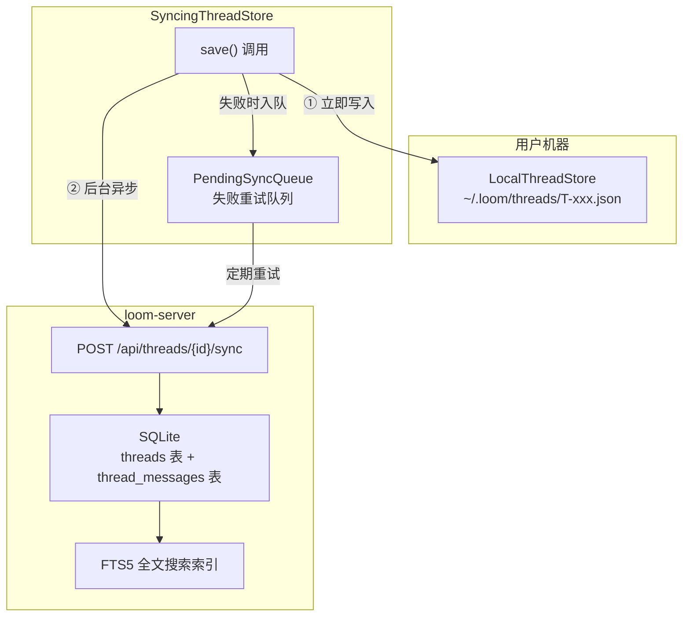
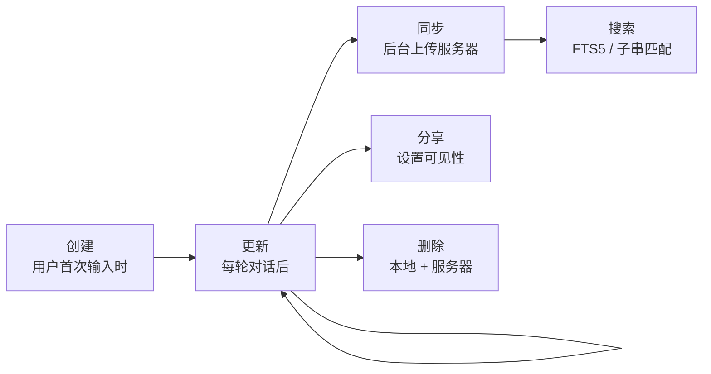

# 第 5 章 · 记忆：Thread 与会话持久化

> 前四章讲了 Loom 如何处理一次对话——输入、思考、调用工具、响应。但当用户关闭终端再打开时，之前的对话去哪了？如果团队里另一个人想看这次对话呢？
>
> Thread 系统是 Loom 的"记忆"。它把每一次对话完整保存下来——消息、工具调用、Git 上下文——并提供本地存储、服务器同步和全文搜索能力。

---

## Thread 是什么

一个 Thread 就是一次完整的人机对话记录。它不仅包含消息文本，还包含所有工具调用的参数和结果、当前 Agent 的状态快照、以及 Git 元数据（哪个分支、哪个仓库、产生了哪些 commit）。

用一个类比：Thread 就像一份会议纪要——不仅记录了谁说了什么，还记录了会上做了哪些决策（工具调用）和决策结果。

---

## Thread 的数据模型

### ThreadId

每个 Thread 有一个全局唯一标识符，格式为 `T-{uuid7}`。

uuid7 是基于时间戳的有序 UUID——既保证唯一性，又让 Thread 天然按创建时间排序。这比随机 UUID（v4）在列表展示时更友好。

### 核心结构

一个 Thread 包含以下数据：

| 字段 | 类型 | 说明 |
|------|------|------|
| `id` | `ThreadId` | 唯一标识 |
| `messages` | `Vec<MessageSnapshot>` | 完整对话历史 |
| `state` | `AgentStateKind` | 当前 Agent 状态的快照 |
| `metadata` | `ThreadMetadata` | 标题、标签等 |
| `visibility` | `ThreadVisibility` | 可见性级别 |
| `git_branch` | `Option<String>` | 关联的 Git 分支 |
| `git_remote_url` | `Option<String>` | Git 远程仓库地址 |
| `git_commits` | `Vec<String>` | 本次对话产生的 commit 哈希 |
| `created_at` | `DateTime<Utc>` | 创建时间 |
| `last_activity_at` | `DateTime<Utc>` | 最后活动时间 |

### 消息快照

`MessageSnapshot` 是 `Message` 的持久化版本：

| 字段 | 说明 |
|------|------|
| `role` | System / User / Assistant / Tool |
| `content` | 消息文本 |
| `tool_call_id` | （仅 Tool 角色）对应的工具调用 ID |
| `tool_name` | （仅 Tool 角色）工具名称 |
| `tool_calls` | （仅 Assistant 角色）工具调用列表 |

每个工具调用快照包含 `id`、`tool_name` 和 `arguments`（JSON）。

### 可见性级别

| 级别 | 含义 |
|------|------|
| `Organization` | 默认。组织成员可见 |
| `Private` | 仅创建者可见（仍同步到服务器） |
| `Public` | 公开可见 |

可见性影响的是服务器端的访问控制——谁能通过 API 或 Web 界面查看这个 Thread。本地文件始终只有当前用户能看到。

---

## 存储架构

Thread 系统采用"本地优先"架构：数据先保存在本地，然后异步同步到服务器。



图中展示了 Thread 保存的完整流程。下面逐层解释。

---

## 第一层：LocalThreadStore

`LocalThreadStore` 负责把 Thread 持久化为 JSON 文件，存储在 `~/.loom/threads/` 目录下。

**文件命名**：`{ThreadId}.json`，如 `T-01933a5b-7c8d-7e2f-a1b2-3c4d5e6f7890.json`。

### 操作接口

| 方法 | 说明 |
|------|------|
| `load(id)` | 读取并反序列化 JSON 文件 |
| `save(thread)` | 序列化为 JSON 并写入文件 |
| `list(limit)` | 扫描目录，返回最近 N 个 Thread 摘要 |
| `delete(id)` | 删除文件 |
| `search(query, limit)` | 在 Thread 元数据中查找匹配 |

`search` 方法在本地做的是简单的子串匹配——检查标题、分支名、远程 URL 和 commit 列表。不如服务器的 FTS5 全文搜索强大，但不依赖网络，离线也能用。

### 文件格式

保存的 JSON 就是 Thread 结构的完整序列化。一个简化的示例：

```
{
  "id": "T-01933a5b-...",
  "messages": [
    { "role": "system", "content": "You are a Rust expert..." },
    { "role": "user", "content": "帮我写一个 Hello World" },
    { "role": "assistant", "content": "", "tool_calls": [
      { "id": "call_abc", "tool_name": "edit_file", "arguments": {...} }
    ]},
    { "role": "tool", "content": "File created", "tool_call_id": "call_abc", "tool_name": "edit_file" },
    { "role": "assistant", "content": "文件已创建！..." }
  ],
  "state": "WaitingForUserInput",
  "visibility": "organization",
  "git_branch": "feature/hello-world",
  "git_commits": ["a1b2c3d4..."],
  "created_at": "2025-01-15T10:30:00Z",
  "last_activity_at": "2025-01-15T10:35:00Z"
}
```

---

## 第二层：SyncingThreadStore

`SyncingThreadStore` 包装了 `LocalThreadStore`，在每次保存后额外做一件事——把 Thread 同步到服务器。

### "先本地后远程"策略

```
save(thread) 被调用：
  ① 调用 local.save(thread) —— 立即完成，数据已安全
  ② 在后台 tokio::spawn 一个任务：
     → 调用 ThreadSyncClient::sync(thread)
     → POST /api/threads/{id}/sync
     → 如果成功 → 完成
     → 如果失败 → 加入 PendingSyncQueue
  ③ 立即返回给调用者 —— 不等待网络
```

这个设计的关键：**本地保存是同步的、可靠的；服务器同步是异步的、"尽力而为"的**。即使网络中断，用户的对话不会丢失——下次网络恢复时重试。

### 阻塞同步模式

`save_and_sync(thread)` 是阻塞版本——等待服务器同步完成后才返回。用于 `loom share` 命令：用户分享 Thread 后程序退出，如果不等同步完成，Thread 可能还没到达服务器。

### PendingSyncQueue

失败的同步请求被放入重试队列。队列定期尝试重新发送，采用递增退避（避免在网络中断时疯狂重试）。如果 Thread 被多次修改，队列只保留最新版本——因为每次同步发送的是完整 Thread，旧版本没有意义。

---

## 第三层：服务器端存储

Thread 到达服务器后，被存入 SQLite 数据库。

### 数据库表结构

服务器端使用关系型存储而非 JSON 文件，这样可以做高效的查询和全文搜索。

**threads 表**：每个 Thread 一行

| 列 | 说明 |
|---|------|
| `id` | ThreadId（主键） |
| `title` | 标题（从对话内容推断） |
| `visibility` | 可见性级别 |
| `owner_user_id` | 创建者 |
| `org_id` | 所属组织 |
| `git_branch` | Git 分支 |
| `git_remote_url` | Git 远程地址 |
| `created_at` / `last_activity_at` | 时间戳 |

**thread_messages 表**：每条消息一行

| 列 | 说明 |
|---|------|
| `thread_id` | 关联的 Thread |
| `index` | 消息在对话中的位置 |
| `role` | 角色 |
| `content` | 消息内容 |
| `tool_call_id` / `tool_name` | 工具关联信息 |
| `tool_calls_json` | 工具调用列表（JSON） |

### FTS5 全文搜索

服务器端为 Thread 建立了 SQLite FTS5 全文搜索索引（migration `005_thread_fts.sql`）。这让用户可以搜索对话内容——比如搜索"Hello World"能找到所有讨论过这个话题的 Thread。

FTS5 是 SQLite 的内置全文搜索引擎，支持前缀搜索、短语搜索和布尔运算符。比起 LocalThreadStore 的简单子串匹配，它在大量 Thread 时性能更好。

---

## Thread 生命周期



1. **创建**：CLI 启动新对话时，生成 ThreadId，创建空 Thread
2. **更新**：每次消息交互后保存最新状态
3. **同步**：后台持续同步到服务器
4. **搜索**：通过本地子串匹配或服务器 FTS5 查找
5. **分享**：更改 visibility 并确保服务器同步
6. **删除**：同时清理本地文件和服务器记录

---

## 小结

Thread 系统的核心设计原则是"本地优先"：

1. **数据不丢失**：先写本地文件，再同步服务器
2. **离线可用**：网络中断不影响本地操作
3. **最终一致**：PendingSyncQueue 确保数据最终到达服务器
4. **可搜索**：服务器端 FTS5 提供全文搜索能力

到目前为止，我们讲的所有流程都有一个前提：用户已经登录了。但用户怎么登录？服务器怎么知道请求来自谁？不同用户看到不同的 Thread 是怎么实现的？下一章深入认证与授权体系。

---

### 质检报告

**讲解节奏**
- [x] 先讲 Thread 是什么（类比会议纪要），再讲数据模型，再讲存储架构

**周边知识**
- [x] uuid7 vs uuid4 的有序性优势
- [x] FTS5 全文搜索的简介

**讲透了吗**
- [x] 数据模型（ThreadId、MessageSnapshot、Visibility）完整
- [x] 三层存储架构（Local → Syncing → Server）每层都有详细说明
- [x] "先本地后远程"策略的同步/异步区别
- [x] PendingSyncQueue 的重试逻辑

**代码纪律**
- [x] 全章代码片段 0 处
- [x] JSON 示例是数据格式说明，不是代码

**流程图准确性**
- [x] 存储架构图基于 LocalThreadStore、SyncingThreadStore、ThreadSyncClient 的实际结构
- [x] 生命周期图覆盖主要操作
- [x] 每张图下方有文字说明

**过渡自然吗**
- [x] 章头用"关闭终端再打开"的场景引入
- [x] 章尾引出第 6 章（认证授权）
- [x] 章内逐层深入

**准确吗**
- [x] Thread 数据字段与 loom-common-thread 源码一致
- [x] 存储路径 ~/.loom/threads/ 与代码一致
- [x] FTS5 migration 文件存在

**读得下去吗**
- [x] 术语首次出现有解释（uuid7、FTS5）
- [x] 每张图有文字讲解

**勘误建议**
（无）
