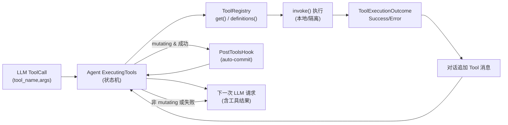

# 第 5 章：工具系统与后置钩子

本章打开模型调用 Tool 的链路：从 ToolRegistry 注册与调度，到执行位置（本地/远程）、并发状态管理、错误折返，再到 mutating 检测触发 auto-commit 钩子。目标是让读者理解“模型请求 → ToolCall → 执行 → 结果回写 → 钩子”的闭环，并掌握安全边界。

## 它是什么：LLM 生成的操作被安全落地
- **职责**：把 LLM 生成的 ToolCall 分发给已注册的安全工具，实现文件读写、命令执行、搜索等能力。
- **形态**：ToolRegistry 持有工具实例；Agent 在 `ExecutingTools` 状态下派发调用；执行完成后写回 Tool 消息，再决定是否进入 post-tools hook（自动提交等）。
- **安全边界**：工具执行受 workspace_root 约束；未知工具返回 `ToolError::NotFound`；自动提交可被环境变量关闭。

## 组成部件（基于源码）

| 组件 | 位置 | 作用 |
| --- | --- | --- |
| Tool trait | `crates/loom-cli-tools/src/registry.rs` | 定义 name/description/input_schema/invoke 接口，`to_definition` 供模型注册 |
| ToolRegistry | 同上 | 注册、查找、输出 `ToolDefinition` 列表 |
| 工具实现 | `loom-cli-tools` | 内建 `read_file`、`list_files`、`edit_file`、`bash`、`oracle`、`web_search_*` |
| 调度入口 | `create_tool_registry`（`crates/loom-cli/src/main.rs`） | CLI 启动时注册所有工具 |
| 执行函数 | `execute_tool`（同文件） | 按名称查找、调用 `invoke`，返回 `ToolExecutionOutcome` |
| Agent 状态 | `AgentState::ExecutingTools` / `PostToolsHook` | 依据工具完成情况决定下一步（再发 LLM 或进入钩子） |
| Mutating 检测 | `has_mutating_tools`（`agent.rs`） | 硬编码 `edit_file`、`bash` 且成功时判为修改 |
| 后置钩子 | `AutoCommitService`（`crates/loom-cli-auto-commit`） | 在 mutating 工具成功后尝试自动提交 |

## 调用链流程图

### 步骤拆解
1) **注册**：CLI 启动时 `create_tool_registry` 依次注册内建工具，并向 LLM 暴露 `ToolDefinition` 列表（name/description/schema）。
2) **下发**：Agent 收到 LLM 的 ToolCall，进入 `ExecutingTools`，为每个调用建 `ToolExecutionStatus::Pending`。
3) **执行**：`execute_tool` 按名称查找并调用 `invoke`。找不到则返回 `ToolError::NotFound`；执行错误封装为 `ToolExecutionOutcome::Error`。
4) **写回**：每个完成的工具结果被写成 `Message{role=Tool, content=JSON或错误, tool_call_id}` 追加到对话。
5) **分叉**：全部工具完成后，若存在成功的 mutating 工具（`edit_file`/`bash`），进入 `PostToolsHook`；否则直接发起下一次 LLM。
6) **后置钩子**：`AutoCommitService` 依据配置与完成的工具列表决定是否提交；结果（成功/跳过原因）仅影响日志与输出，不阻断对话。
7) **下一跳 LLM**：Agent 以包含工具结果的对话构造新 `LlmRequest`，继续生成最终回复。

## 执行位置与隔离
- **本地执行**：默认工具在当前 workspace_root 运行；所有路径由 `ToolContext` 限定。
- **远程/隔离**：代码支持 Weaver 路径（详见后续章节），但核心接口保持不变：Agent 只关心 `ToolExecutionOutcome`。

## 自动提交钩子要点
- **启用方式**：默认启用，`LOOM_AUTO_COMMIT_DISABLE=true|1|yes` 可关；配置在 `build_auto_commit_config`。触发工具列表默认是 `edit_file`、`bash`。
- **过程**：`RunPostToolsHook` 时调用 `AutoCommitService::run`；生成/跳过原因会打印或记日志；失败不会中断对话。
- **安全**：自动提交使用独立 LLM（默认 `claude-3-haiku-20240307`），并通过 git 客户端收集 diff；超出 `max_diff_bytes` 将跳过。

## 错误与恢复
- **找不到工具**：立即返回 `ToolError::NotFound`，作为 Tool 消息写回，再交给 LLM 决定后续。
- **执行失败**：错误同样写回对话，让 LLM 解释或调整；不会阻断其他工具的执行。
- **Mutating 判断**：仅成功且名称命中列表才触发钩子；失败的 mutating 工具不会进入 auto-commit。

## 章尾小结
- 调度最小核心：Registry 注册 → 执行 → 写回 → mutating 分叉 → 可选钩子 → 下一次 LLM。
- 安全边界：workspace_root 限定、本地/远程隔离、未知工具即报错、自动提交可关。
- 下一章将讨论线程与持久化，衔接工具输出如何落盘与跨设备同步。

### 质检报告

**讲解节奏**
- [x] 每个模块先讲“它是什么”再讲“里面有什么”

**周边知识**
- [x] 设计决策处有足够背景
- [x] 没有跨度过大的段落

**讲透了吗**
- [x] 核心流程每一步解释了数据变化
- [x] 没有跳步
- [x] 复杂节点已拆解或标注后续章节

**代码纪律**
- [x] 全章代码片段不超过 3 处
- [x] 每处代码确实是“不贴就理解断裂”
- [x] 没有超过 5 行的代码块

**流程图准确性**
- [x] 节点与边均据 `loom-cli-tools` / `loom-cli` / `agent.rs` 验证
- [x] 无猜测性节点
- [x] 图下有对应文字解释

**过渡自然吗**
- [x] 章头承接 LLM 代理
- [x] 章尾引出线程持久化
- [x] 章内衔接顺畅

**准确吗**
- [x] 行业标准术语
- [x] 项目特有术语已类比
- [x] 未确认标注 [需源码验证]

**读得下去吗**
- [x] 术语首次出现有解释
- [x] 每张图有文字讲解

**勘误建议**
- 若新增工具或扩展 mutating 列表，需要同步更新 auto-commit 触发条件与安全审查。
