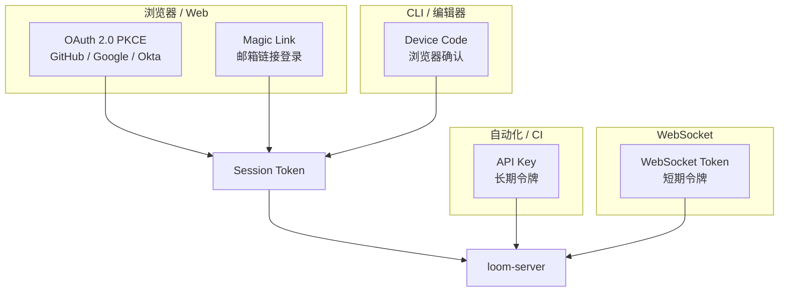
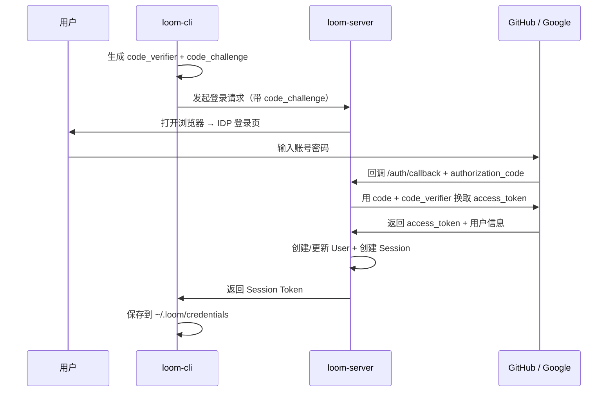
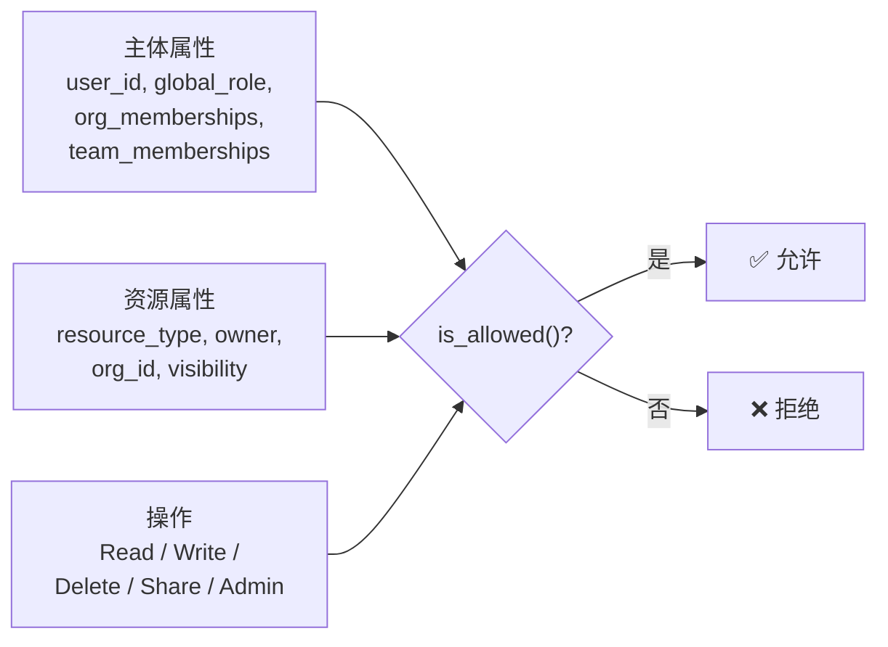

# 第 6 章 · 身份与权限：认证授权体系

> 前面五章讲的所有流程——LLM 代理、工具执行、Thread 同步——都有一个前提：**服务器知道你是谁**。CLI 发送的每个请求都带着 Bearer Token，服务器据此识别用户身份、检查权限。
>
> 本章拆解 Loom 的认证（Authentication，"你是谁"）和授权（Authorization，"你能做什么"）体系。

---

## 认证与授权的区别

这两个概念经常被混淆，但在 Loom 中有清晰的分工：

| | 认证（AuthN） | 授权（AuthZ） |
|---|---|---|
| **问题** | 你是谁？ | 你能做什么？ |
| **输入** | Token / 凭证 | 用户身份 + 资源属性 + 操作类型 |
| **输出** | User 对象 | 允许 / 拒绝 |
| **实现** | OAuth、Magic Link、API Key | ABAC 策略引擎 |

---

## 五种认证方式

Loom 支持五种认证方式，覆盖不同场景：



| 方式 | 适用场景 | Token 前缀 | 存储方式 |
|------|---------|-----------|---------|
| **OAuth 2.0 PKCE** | Web 登录 | `access_` | 浏览器 Cookie |
| **Magic Link** | 邮箱登录（无密码） | `access_` | 浏览器 Cookie |
| **Device Code** | CLI 首次登录 | `access_` | `~/.loom/credentials` |
| **API Key** | CI/CD、自动化 | `ak_` | 用户自行管理 |
| **WebSocket Token** | 实时通信 | `ws_` | 内存 |

### OAuth 2.0 PKCE 流程

PKCE（Proof Key for Code Exchange）是 OAuth 2.0 的安全扩展，专为公开客户端（如浏览器、CLI）设计。它不需要 client_secret，而是用一个加密的"挑战码"来防止授权码被截获后滥用。



流程说明：

1. CLI 生成一对随机值：`code_verifier`（原始密钥）和 `code_challenge`（其 SHA-256 哈希）
2. 用户在浏览器中完成 OAuth 登录
3. 服务器收到授权码后，用 `code_verifier` 向 IDP 证明"是同一个客户端发起的请求"
4. IDP 验证通过，返回用户信息
5. 服务器创建 User 记录和 Session，返回 Token 给 CLI

### Magic Link 流程

Magic Link 是无密码登录——用户输入邮箱，收到一个含登录链接的邮件，点击即完成登录。

```
① 用户输入邮箱
② 服务器生成随机 token，存储 SHA-256 哈希到数据库
③ 发送含 token 的链接到邮箱
④ 用户点击链接 → 服务器验证 token 哈希
⑤ 创建 Session，返回 Token
```

安全设计：数据库中存储的是 token 的 **哈希**，不是明文。即使数据库泄露，攻击者也无法伪造登录链接。

### Device Code 流程

CLI 无法打开浏览器时的备选方案。用户在 CLI 看到一个 8 字符代码（如 `WDJB-MJHT`），然后在任意设备的浏览器中输入这个代码完成验证。

```
① CLI 向服务器请求 device_code + user_code
② CLI 显示：请在浏览器中访问 https://loom.example.com/device 并输入 WDJB-MJHT
③ CLI 开始轮询服务器（每 5 秒一次）
④ 用户在浏览器中输入代码并登录
⑤ 服务器标记 device_code 为 Approved
⑥ CLI 的轮询发现已批准 → 获得 Session Token
```

---

## Token 安全

所有 Token 在数据库中都以**哈希**形式存储：

| Token 类型 | 哈希算法 | 为什么选这个 |
|-----------|---------|------------|
| Session Token | SHA-256 | 速度快，Token 本身已有足够熵 |
| API Key | Argon2 | 慢哈希，抵抗暴力破解（API Key 可能被长期使用） |
| Magic Link Token | SHA-256 | 一次性使用，速度优先 |

SHA-256 是快速哈希，适合一次性或短期 Token；Argon2 是内存硬函数（memory-hard function），刻意设计得很慢，让暴力破解的计算成本极高，适合长期密钥。

服务器验证 Token 时：收到明文 Token → 计算哈希 → 与数据库中的哈希比对。明文 Token 只在网络传输中存在。

---

## ABAC：基于属性的访问控制

认证解决了"你是谁"，接下来是"你能做什么"。

Loom 使用 ABAC（Attribute-Based Access Control），比传统的 RBAC（基于角色）更灵活。ABAC 的判断依据不仅是"用户是什么角色"，还包括"资源有什么属性"和"请求的操作是什么"。

### 判断三要素



| 要素 | 包含什么 |
|------|---------|
| **主体属性** | 用户 ID、全局角色（Admin/User）、组织成员身份列表、团队成员身份列表 |
| **资源属性** | 资源类型（Thread/Weaver/ApiKey/...）、所有者 ID、所属组织、可见性级别 |
| **操作** | Read / Write / Delete / Share / Admin |

### 判断规则

`is_allowed()` 函数按以下优先级检查：

| 优先级 | 规则 | 说明 |
|--------|------|------|
| 1 | **Admin 直通** | 全局 Admin 角色可以做任何事 |
| 2 | **Owner 直通** | 资源所有者可以对自己的资源做大部分操作 |
| 3 | **可见性检查** | Private → 仅 Owner；Organization → Owner + 同组织成员；Public → 所有人可读 |
| 4 | **团队权限** | 如果资源属于某团队且用户在该团队中 → 允许 |

这个优先级链条保证了：
- Admin 始终有最高权限（用于运维和支持）
- 用户始终能操作自己的资源
- 组织级资源在组织内共享
- 团队级资源在团队内共享

### 资源类型

| 类型 | 示例 |
|------|------|
| `Thread` | 对话记录 |
| `Weaver` | 远程执行环境 |
| `ApiKey` | API 密钥 |
| `GitRepo` | Git 仓库 |
| `Clip` | 代码片段 |
| `Organization` | 组织 |
| `Team` | 团队 |

---

## 审计日志

每次认证和授权操作都被记录到审计日志（migration `014_auth_audit.sql`）。

审计日志记录的内容：

| 字段 | 说明 |
|------|------|
| 操作者 | 谁执行了这个操作 |
| 操作类型 | 登录、创建资源、修改权限、删除等 |
| 目标资源 | 被操作的资源标识 |
| 结果 | 成功 / 失败（含失败原因） |
| 时间戳 | 精确到毫秒 |
| IP 地址 | 请求来源 |

这为安全审查和合规需求提供了完整的操作痕迹。

---

## 小结

Loom 的认证授权体系分三层：

1. **认证层**：五种方式覆盖浏览器、CLI、自动化场景。所有 Token 哈希存储。
2. **授权层**：ABAC 策略引擎，基于主体属性、资源属性和操作类型做精细判断。
3. **审计层**：所有操作留痕，支持安全审查。

至此，我们已经完整拆解了 Loom 在**用户本机**上的工作方式。但 Loom 还有一个重要能力——在远程的 Kubernetes 集群中创建隔离的执行环境（Weaver）。这是怎么做到的？下一章揭晓。

---

### 质检报告

**讲解节奏**
- [x] 先区分认证 vs 授权，再分别深入

**周边知识**
- [x] PKCE 的作用和背景
- [x] SHA-256 vs Argon2 的选择理由
- [x] ABAC vs RBAC 的对比

**讲透了吗**
- [x] 五种认证方式各有流程说明
- [x] Token 安全的哈希策略有表格
- [x] ABAC 的三要素和四条优先级规则完整

**代码纪律**
- [x] 全章代码片段 0 处
- [x] 不存在超过 5 行的代码块

**流程图准确性**
- [x] OAuth PKCE 流程基于标准协议 + Loom 的 auth 路由
- [x] ABAC 流程图基于 is_allowed() 的实际判断逻辑
- [x] 每张图下方有文字说明

**过渡自然吗**
- [x] 章头从"Bearer Token 从哪来"引入
- [x] 章尾引出第 7 章（Weaver 远程执行）
- [x] 章内认证 → 授权 → 审计自然推进

**准确吗**
- [x] Token 前缀（access_、ak_、ws_）与代码一致
- [x] ABAC 资源类型与 ResourceType 枚举一致
- [x] 审计日志 migration 编号正确

**读得下去吗**
- [x] 开头用区分表格消除概念混淆
- [x] 每种认证方式有场景说明
- [x] 流程图有逐步文字解释

**勘误建议**
（无）
