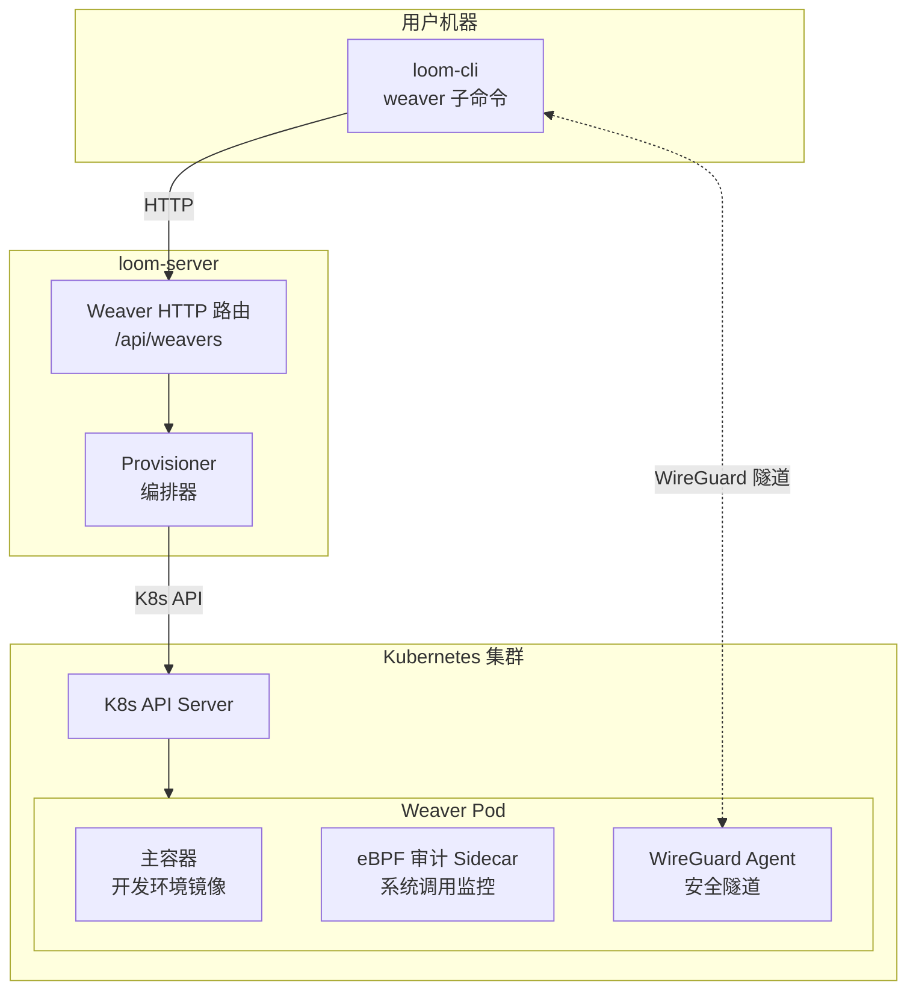
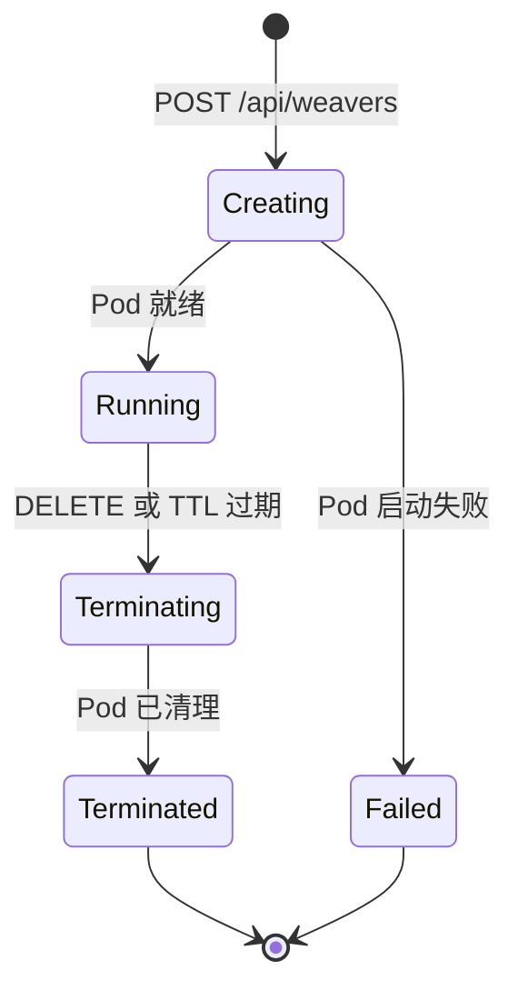

# 第 7 章 · 远程织机：Weaver 远程执行环境

> 到目前为止，所有工具都在用户的本地机器上执行——读文件、改文件、跑命令。但如果你想在一个干净的、隔离的环境中运行代码呢？如果你不想在自己的机器上执行 AI 建议的 shell 命令呢？
>
> Weaver（织机）是 Loom 的远程执行能力——按需在 Kubernetes 集群中创建隔离的容器，让 AI 在里面安全地工作。

---

## 为什么需要远程执行

本地执行有三个痛点：

1. **安全风险** — AI 建议执行 `rm -rf` 之类的危险命令，在你的机器上后果很严重
2. **环境差异** — 你的 Mac 上能跑的代码，在 Linux 生产环境不一定能跑
3. **资源限制** — 编译大项目可能需要更多 CPU 和内存

Weaver 把执行环境搬到云端——每次创建一个全新的容器，用完即销毁。AI 在容器里随便折腾，不会影响你的机器。

---

## 架构概览



四个核心组件：

| 组件 | 位置 | 职责 |
|------|------|------|
| **Weaver CLI 命令** | 客户端 | 创建/列出/删除 Weaver |
| **Provisioner** | loom-server | 编排 Weaver 的完整生命周期 |
| **K8sClient** | loom-server | Kubernetes API 的抽象层 |
| **Weaver Pod** | K8s 集群 | 实际的远程执行环境 |

---

## Weaver 的生命周期



| 状态 | 含义 |
|------|------|
| `Creating` | Pod 正在创建中（拉取镜像、启动容器） |
| `Running` | Pod 就绪，可以使用 |
| `Failed` | 创建失败（镜像不存在、资源不足等） |
| `Terminating` | 正在清理（用户删除或生存期到期） |
| `Terminated` | 已完全清理 |

---

## 创建 Weaver 的完整流程

**调用路径**：

```
loom-cli::weaver_client → POST /api/weavers
  — 输入：CreateWeaverRequest { image, tags, resource_spec, lifetime_hours }
→ loom-server/src/routes/weaver.rs
  — 验证用户身份和权限（ABAC）
→ loom-server-weaver/src/provisioner.rs::Provisioner::create_weaver()
  — 生成 WeaverId（uuid7 格式）
  — 构建 K8s Pod 规格：
    • 主容器：用户指定的镜像，带资源限制
    • eBPF 审计 Sidecar：监控系统调用
    • WireGuard Agent：建立安全隧道
    • Service Account：用于 SPIFFE 身份
    • Volume：工作区挂载
  — Pod 命名：weaver-{uuid7}
→ loom-server-k8s/src/kube_client.rs::KubeClient::create_pod()
  — 调用 Kubernetes API 创建 Pod
→ Provisioner 记录 Weaver 到数据库
→ 发送 Webhook 通知（如配置）
→ 返回 Weaver { id, status: Creating, pod_name, ... }
```

### 资源规格

用户可以指定容器的资源限制：

| 参数 | 默认值 | 说明 |
|------|--------|------|
| `memory_limit` | 无 | 内存上限，如 "8Gi" |
| `memory_request` | 无 | 内存请求（K8s 调度保证） |
| `cpu_limit` | 无 | CPU 上限，如 "4"（4 核） |
| `cpu_request` | 无 | CPU 请求 |
| `lifetime_hours` | 24 | 自动销毁时间（TTL） |

### K8sClient 抽象

`K8sClient` 是一个 trait，定义了与 Kubernetes 交互的接口：

| 方法 | 说明 |
|------|------|
| `create_pod(pod)` | 创建 Pod |
| `get_pod(namespace, name)` | 获取 Pod 状态 |
| `list_pods(namespace)` | 列出所有 Pod |
| `delete_pod(namespace, name)` | 删除 Pod |
| `get_pod_logs(namespace, name, options)` | 获取日志流 |
| `exec_in_pod(namespace, name, cmd)` | 在 Pod 中执行命令 |

生产环境使用 `KubeClient`（基于 `kube` crate），测试中可以注入 Mock 实现。

---

## 安全三件套

每个 Weaver Pod 配备三层安全保障：

### 1. WireGuard 隧道

Loom 使用 WireGuard 在 CLI 和 Weaver Pod 之间建立点对点加密隧道。所有通信（SSH、文件传输、API 调用）都通过这个隧道，不走公共网络。

当 Pod 之间无法直接建立 UDP 连接时（比如两端都在 NAT 后面），会通过 DERP（Designated Encrypted Relay Protocol）中继节点转发。DERP 是 Tailscale 设计的协议——中继节点只能看到加密后的数据，无法解密内容。

loom-server 在这个过程中只负责**协调**（交换双方的公钥和端点信息），不参与实际的数据传输。

### 2. eBPF 审计

每个 Weaver Pod 运行一个 eBPF 审计 Sidecar，它在 Linux 内核层面监控容器内的系统调用——哪些文件被访问、哪些网络连接被建立、哪些进程被启动。

eBPF（Extended Berkeley Packet Filter）是 Linux 内核的可编程追踪框架。它能在不修改内核的情况下，以极低的性能开销捕获系统调用。

审计数据用于：安全审查（AI 做了什么操作）和合规记录。

### 3. SPIFFE 身份

每个 Weaver Pod 有自己的加密身份（基于 SPIFFE 标准），用于：
- 向 loom-server 证明"我是合法的 Weaver Pod"
- 获取运行所需的密钥和配置（而不是硬编码在镜像中）

---

## 自动清理

Weaver Pod 不是永久运行的——它们有 TTL（Time To Live），默认 24 小时。

**调用路径**：

```
loom-server 启动时注册定期清理任务（JobScheduler）
  — 每隔固定间隔执行一次
  → 列出所有 Weaver 记录
  → 对每个 Weaver 检查：age_hours ≥ lifetime_hours?
  → 如果过期：调用 provisioner.delete_weaver()
     → K8sClient::delete_pod()
     → 更新数据库状态为 Terminated
     → 发送 Webhook 通知
  → 记录清理结果（删除了几个，失败了几个）
```

清理是"尽力而为"的——如果某个 Pod 删除失败（比如 K8s API 暂时不可用），下一轮清理会再次尝试。

---

## 小结

Weaver 系统让 Loom 从本地工具跨越到云端执行平台：

1. **按需创建**：用户发一个请求，几秒钟内就有一个干净的开发容器
2. **隔离安全**：WireGuard 加密通信 + eBPF 审计 + SPIFFE 身份
3. **自动清理**：TTL 到期自动销毁，不浪费集群资源
4. **抽象良好**：K8sClient trait 让 Kubernetes 细节与业务逻辑分离

有了对话能力、工具执行、远程环境之后，Loom 还需要知道系统运行得怎么样——用户行为、错误模式、功能采用率。下一章讲可观测性平台。

---

### 质检报告

**讲解节奏**
- [x] 先讲为什么需要远程执行，再讲架构

**周边知识**
- [x] WireGuard + DERP 中继的背景
- [x] eBPF 的简要说明
- [x] SPIFFE 标准的用途

**讲透了吗**
- [x] 完整的创建流程（调用路径）
- [x] 五个生命周期状态
- [x] 三层安全保障各有说明
- [x] 自动清理机制

**代码纪律**
- [x] 全章代码片段 0 处
- [x] 不存在超过 5 行的代码块

**流程图准确性**
- [x] 架构图基于实际 crate 结构
- [x] 生命周期状态图基于 WeaverStatus 枚举
- [x] 每张图有文字说明

**过渡自然吗**
- [x] 章头从"本地执行的痛点"引入
- [x] 章尾引出第 8 章（可观测性）
- [x] 章内从概览 → 创建 → 安全 → 清理自然推进

**准确吗**
- [x] WeaverStatus 枚举与代码一致
- [x] K8sClient trait 方法与代码一致
- [x] Pod 命名规则 weaver-{uuid7} 与代码一致

**读得下去吗**
- [x] 三个痛点开头建立动机
- [x] 安全三件套逐个解释
- [x] 图表配合文字

**勘误建议**
（无）
