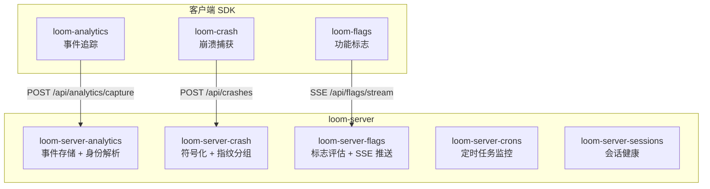
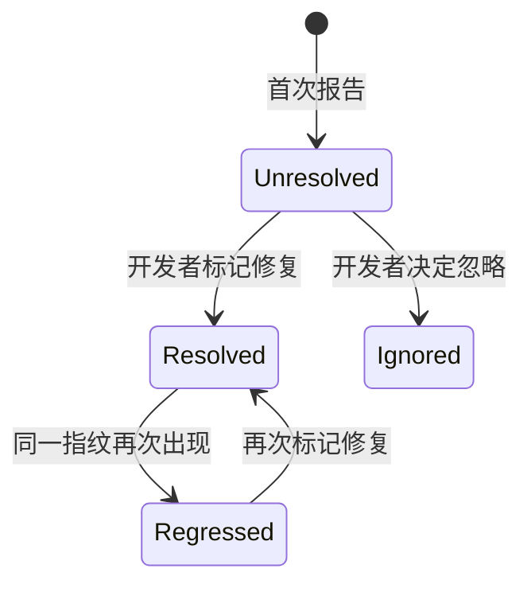

# 第 8 章 · 可观测性平台

> Loom 不仅是一个 AI 编程助手——它还内置了一个完整的可观测性平台，类似于 PostHog + Sentry + LaunchDarkly 的组合。本章讲解 Loom 如何追踪用户行为、捕获崩溃、管理功能发布和监控后台任务。

---

## 为什么要自建可观测性

大多数项目会接入第三方服务（如 PostHog、Sentry）。Loom 选择自建，原因是：

1. **数据主权** — AI 编程助手处理敏感的代码上下文，数据不能发送到第三方
2. **架构一致性** — 所有组件遵循同一套 crate 分层模式（core / client / server）
3. **深度集成** — 崩溃报告能关联到 Analytics 的用户身份，Feature Flag 能关联到 A/B 实验

---

## 四个子系统



| 子系统 | 解决什么问题 | 类比 |
|--------|------------|------|
| **Analytics** | 用户在做什么？功能采用率如何？ | PostHog |
| **Crash Reporting** | 出了什么错？多少用户受影响？ | Sentry |
| **Feature Flags** | 新功能该给谁开放？A/B 实验怎么做？ | LaunchDarkly |
| **Crons + Sessions** | 后台任务在跑吗？用户在线吗？ | Cronitor + 心跳监控 |

---

## Analytics：PostHog 风格的用户行为追踪

### 核心概念

| 概念 | 说明 |
|------|------|
| **Person** | 一个用户实体，可能有多个匿名身份和一个认证身份 |
| **Event** | 一次用户操作记录（名称 + 属性 + 时间戳） |
| **Identity Resolution** | 将匿名操作与登录用户关联——用户登录前的操作也归入其名下 |

### 身份解析

这是 Analytics 最精巧的设计。用户在登录前就开始产生事件（匿名 ID），登录后需要把这些事件归到真实用户名下。

```
匿名阶段：distinct_id = "anon-abc123"
  ↓ 产生事件 A、B
用户登录：调用 identify(distinct_id="anon-abc123", user_id="user-456")
  ↓ 身份解析：合并 Person
登录后：distinct_id = "user-456"
  ↓ 事件 A、B 和后续事件都归入同一个 Person
```

### 三层架构

每个可观测性子系统都遵循相同的分层模式：

| 层 | crate | 职责 |
|---|-------|------|
| **Core** | `loom-analytics-core` | 类型定义（Event、Person、验证规则） |
| **Client SDK** | `loom-analytics` | 客户端：事件收集、批量发送 |
| **Server** | `loom-server-analytics` | 接收、存储、查询 |

---

## Crash Reporting：崩溃分析

### 核心能力

| 能力 | 说明 |
|------|------|
| **堆栈追踪** | 捕获 Rust panic 和 JavaScript 错误的完整调用栈 |
| **符号化** | 将编译后的地址还原为源码文件名和行号 |
| **指纹分组** | 相同原因的崩溃归为一个 Issue，避免重复报告 |
| **回归检测** | 已修复的 Issue 再次出现时自动标记为"回归" |

### Issue 生命周期



### 与 Analytics 的集成

崩溃发生时，crash 客户端会附带当前的 Analytics Person ID。这样在服务器端，崩溃事件能关联到具体用户——不仅知道"出了什么错"，还知道"谁受到了影响"。

---

## Feature Flags：功能标志与实验

### 它解决什么问题

发布新功能时，你不想一次性开放给所有用户——万一有 bug，所有人都受影响。Feature Flag 让你可以：

- **渐进式发布**：先给 10% 的用户，再 50%，再 100%
- **A/B 实验**：一半用户看到新 UI，一半看到旧 UI，比较效果
- **紧急熔断**：发现问题时一键关闭功能，不需要部署新版本

### 核心类型

| 类型 | 说明 |
|------|------|
| **Flag** | 功能标志，包含多个变体和分发策略 |
| **Variant** | 一个标志的可能取值（如 `true`/`false`，或 `v1`/`v2`/`control`） |
| **Strategy** | 决定哪些用户看到哪个变体（百分比、属性匹配、地理位置、时间窗口） |
| **KillSwitch** | 紧急熔断器，一键关闭关联的所有标志 |
| **EvaluationContext** | 评估时提供的上下文（user_id、org_id、地理位置、自定义属性） |

### 评估流程

```
标志评估请求到达
  ① 检查 KillSwitch → 如果激活 → 返回默认值（功能关闭）
  ② 检查前置条件（prerequisites）→ 前置标志必须满足特定值
  ③ 遍历策略列表（按优先级）：
     — 百分比策略：基于 user_id 的哈希，确定性地分配变体
     — 属性策略：检查用户属性是否匹配规则
     — 地理策略：基于 GeoIP 解析用户位置
     — 时间策略：在指定时间窗口内生效
  ④ 无策略匹配 → 返回默认变体
```

### 实时推送

标志变更通过 SSE 实时推送给客户端——管理员修改标志后，所有在线客户端几秒内就能收到新配置，无需重启或轮询。

客户端维护一个本地缓存（`FlagCache`），带 TTL。在 SSE 连接正常时，缓存由推送更新；连接断开时，缓存在 TTL 内仍然可用。

---

## Crons 与 Sessions 监控

### Crons 监控

后台定时任务（如 Weaver 清理、Token 刷新）通过"ping"机制报告健康状态。每次任务执行后向服务器发送一个 ping，服务器检测：

- **错过执行**：预期的 ping 没有到达 → 任务可能挂了
- **超时执行**：ping 到达但报告执行时间过长 → 任务可能卡住

### Sessions 监控

客户端定期发送心跳（heartbeat），服务器据此计算：

- **在线用户数**：当前活跃的 Session 数量
- **崩溃率**：在线 Session 中出现崩溃的比例
- **版本分布**：各版本的用户数量

---

## 小结

Loom 的可观测性平台是一个"微缩版全栈监控系统"：

| 子系统 | 回答什么问题 |
|--------|------------|
| Analytics | 用户在用什么功能？怎么用的？ |
| Crash Reporting | 哪里出了问题？多少人受影响？ |
| Feature Flags | 新功能该开放给谁？效果如何？ |
| Crons + Sessions | 后台服务正常吗？用户在线吗？ |

所有子系统共享同一套身份解析机制（Person），数据可以交叉关联——这是自建的核心优势。

接下来看 Loom 的两个用户界面——终端 TUI 和 Web 前端。

---

### 质检报告

**讲解节奏**
- [x] 先讲为什么自建，再讲四个子系统

**周边知识**
- [x] PostHog/Sentry/LaunchDarkly 类比帮助定位
- [x] 身份解析的匿名→登录场景有完整说明

**讲透了吗**
- [x] Analytics 的身份解析流程
- [x] Crash Reporting 的生命周期
- [x] Feature Flags 的评估流程和 KillSwitch
- [x] Crons + Sessions 的监控机制

**代码纪律**
- [x] 全章代码片段 0 处

**流程图准确性**
- [x] 架构图基于实际 crate 结构
- [x] Issue 生命周期基于 IssueStatus 枚举
- [x] 每张图有文字说明

**过渡自然吗**
- [x] 章头从"为什么自建"引入
- [x] 章尾引出第 9 章（界面层）

**准确吗**
- [x] crate 名称与代码一致
- [x] API 端点与路由一致

**勘误建议**
（无）
