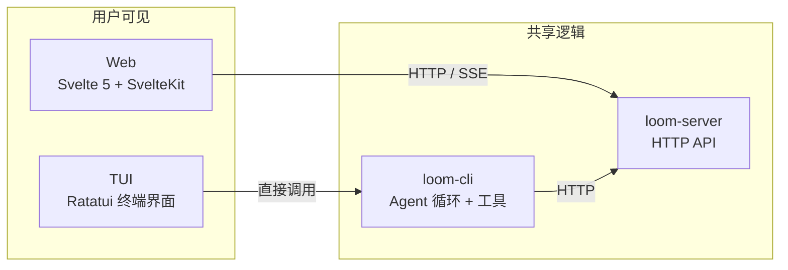

# 第 9 章 · 界面层：TUI 与 Web 前端

> 到目前为止，我们一直在讲 Loom 的"幕后"——状态机、LLM 代理、工具、存储。但用户实际接触到的是两个界面：终端中的 TUI（Terminal User Interface）和浏览器中的 Web 前端。本章讲解它们的架构和设计。

---

## 两个界面，一个后端



TUI 和 Web 的定位不同：

| | TUI | Web |
|---|---|---|
| **用户** | 开发者，在终端里工作 | 管理员、团队成员 |
| **核心功能** | 与 AI 实时对话 | 查看 Thread、管理用户/组织、监控仪表盘 |
| **数据来源** | 直接使用 CLI 的 Agent 循环 | 通过 HTTP API 访问服务器 |

---

## TUI：Ratatui 终端界面

### 技术栈

Loom 的 TUI 基于 **Ratatui 0.30**（Rust 终端渲染库）+ **crossterm**（终端事件处理）。

### 模块化组件架构

TUI 被拆分成十多个独立 crate，每个 crate 是一个 UI 组件：

| crate | 功能 |
|-------|------|
| `loom-tui-app` | 主应用：布局、焦点管理、事件循环 |
| `loom-tui-core` | 核心类型：事件、动作 |
| `loom-tui-component` | Component trait + 组件注册 |
| `loom-tui-theme` | 主题：颜色、边框、样式 |
| `loom-tui-widget-message-list` | 消息列表（对话主体） |
| `loom-tui-widget-input-box` | 输入框 |
| `loom-tui-widget-tool-panel` | 工具执行面板 |
| `loom-tui-widget-thread-list` | Thread 侧边栏 |
| `loom-tui-widget-status-bar` | 底部状态栏 |
| `loom-tui-widget-header` | 顶部标题栏 |
| `loom-tui-widget-markdown` | Markdown 渲染 |
| `loom-tui-widget-modal` | 模态对话框 |
| `loom-tui-widget-spinner` | 加载动画 |
| `loom-tui-widget-scrollable` | 可滚动容器 |
| `loom-tui-storybook` | 组件画廊（开发调试用） |
| `loom-tui-testing` | 测试工具（insta 快照测试） |

为什么拆这么细？**增量编译**。Rust 的编译单元是 crate——修改一个 widget 只需重编译那个 crate，不用重编译整个 TUI。对于开发体验来说，这大幅缩短了编译等待时间。

### 焦点管理

TUI 屏幕分为三个焦点区域：

```
┌────────────────────────────────┐
│          Header                 │
├───────────┬────────────────────┤
│ Thread    │  Message List      │
│ List      │                    │
│           │                    │
│           ├────────────────────┤
│           │  Input Box         │
├───────────┴────────────────────┤
│          Status Bar            │
└────────────────────────────────┘
```

Tab 键在三个焦点之间循环：`ThreadList` → `MessageList` → `InputBox`。方向键在当前焦点内滚动或选择。

### 国际化与 RTL

TUI 支持多语言，包括阿拉伯语和希伯来语等 RTL（从右到左）语言。消息列表组件会根据语言方向调整文字对齐和布局。

---

## Web 前端：Svelte 5 + SvelteKit

### 技术栈

| 技术 | 用途 |
|------|------|
| **Svelte 5** | UI 框架（使用 Runes 语法） |
| **SvelteKit** | 路由和 SSR |
| **Tailwind CSS** | 样式 |
| **TypeScript** | 类型安全 |
| **Vitest** | 测试 |

### 页面结构

| 路径 | 功能 |
|------|------|
| `/threads` | Thread 列表 |
| `/threads/[id]` | Thread 详情 |
| `/login` | 登录页面 |
| `/device` | Device Code 登录 |
| `/(app)/admin/*` | 管理面板（用户、日志、Anthropic 账号池、Jobs、审计） |
| `/(docs)/docs/*` | 文档系统（基于 Diátaxis 框架） |

### 实时通信

Web 前端通过两种方式与服务器保持实时连接：

| 方式 | 用途 |
|------|------|
| **SSE** | Feature Flag 更新、LLM 流式响应 |
| **HTTP 轮询** | Thread 列表刷新、状态更新 |

SSE 连接由 `lib/realtime/` 模块管理，自动处理重连和缓冲。

---

## 小结

Loom 的两个界面覆盖了不同的用户需求：TUI 面向在终端工作的开发者，Web 面向需要管理和监控的团队。它们共享同一个后端 API，但各自优化了自己的使用场景。

接下来看 Loom 的一系列支线系统——版本控制、代码片段、外部集成。

---

### 质检报告

**讲解节奏**
- [x] 先区分两个界面的定位，再分别深入

**周边知识**
- [x] Ratatui 框架简介
- [x] 增量编译的解释

**讲透了吗**
- [x] TUI 组件列表完整
- [x] 焦点管理有布局图
- [x] Web 页面结构有路由表

**代码纪律**
- [x] 全章代码片段 0 处

**流程图准确性**
- [x] 架构图正确反映 TUI → CLI → Server 的关系
- [x] 布局图与 loom-tui-app 的 Focus 枚举一致

**过渡自然吗**
- [x] 章头从"幕后到台前"引入
- [x] 章尾引出第 10 章

**准确吗**
- [x] crate 名称与 Cargo.toml 一致
- [x] 页面路由与 web/loom-web 目录一致

**勘误建议**
（无）
