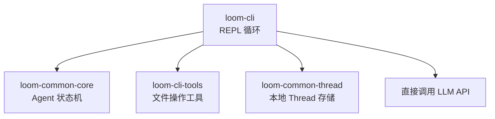
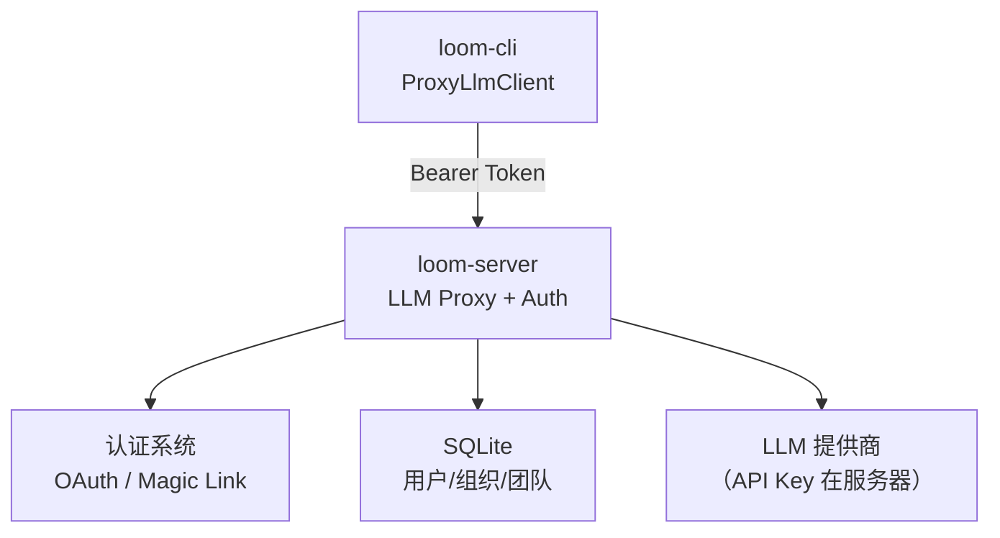
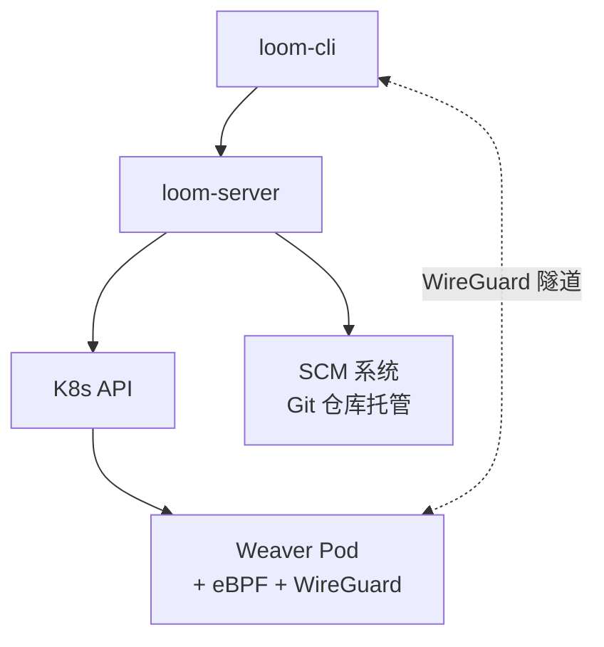
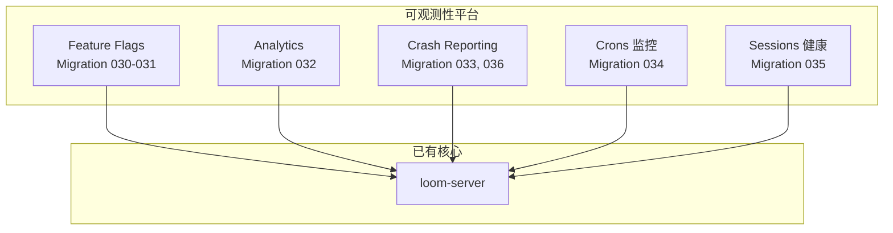
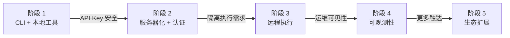

# 第 11 章 · 项目演进史

> 理解一个系统"为什么是现在这个样子"，比理解"它现在是什么样"更有价值。本章通过分析 Loom 的架构设计和 spec 文件，还原项目从构想到当前形态的演进脉络。

---

## 特殊说明

Loom 的代码仓库目前只有 2 个 commit（"Test deployment commit" 和 "Trigger rebuild"），这意味着完整的代码是一次性提交的。我们无法通过逐个 commit 追溯增量变化。

但 Loom 有 **50+ 个 spec 文件**和 **40 个数据库 migration 文件**，它们的编号和内容清晰地揭示了架构的成长轨迹。下面基于这些证据，还原项目的演进阶段。

---

## 第一阶段：核心对话引擎

**Migration 001-005 | 核心 Spec：state-machine, tool-system, thread-system**

**这个阶段做了什么**：

最初的 Loom 是一个纯客户端的 AI 编程助手。CLI 直接持有 API Key，直接调用 LLM，在本地执行工具，在本地保存 Thread。

核心设计决策在这个阶段就确立了：
- **显式状态机**（控制反转，同步的 `handle_event`）
- **工具作为 trait 对象**（可扩展的工具系统）
- **Thread 的本地 JSON 存储**
- **FTS5 全文搜索**（migration 005）

为什么一开始就用状态机而不是简单的循环？因为 Loom 从一开始就需要处理并行工具执行和错误重试，这些用 if-else 会变得不可维护。

---

## 第二阶段：服务器化与安全

**Migration 006-017 | Spec：architecture, auth-abac-system, configuration-system, secret-system**

**这个阶段做了什么**：

核心变化：**API Key 从客户端移到服务器**。这需要一整套基础设施：

1. **loom-server**：HTTP 服务器（Axum），承载 LLM 代理和数据存储
2. **ProxyLlmClient**：客户端不再直连 LLM，而是通过服务器中转
3. **认证体系**：OAuth（GitHub/Google/Okta）、Magic Link、Session 管理
4. **ABAC**：基于属性的访问控制
5. **组织和团队**：多租户支持
6. **Secret 类型**：`SecretString` 确保密钥不被意外打印
7. **Redact 系统**：日志中自动脱敏

Migration 008-015 集中创建了用户、Session、组织、团队、API Key、审计等表——这是一个密集的"基础设施建设期"。

---

## 第三阶段：Weaver 与远程执行

**Migration 018-028 | Spec：weaver-provisioner, wgtunnel-system, weaver-ebpf-audit, weaver-secrets-system**

**这个阶段做了什么**：

从本地工具到云端执行的跨越。需要解决的问题：

1. **容器编排**：K8sClient trait + Provisioner
2. **安全通信**：WireGuard 隧道 + DERP 中继
3. **身份与密钥**：SPIFFE 身份 + 密钥注入（migration 025）
4. **审计**：eBPF 系统调用监控
5. **SCM**：Git 仓库托管和镜像（migration 020-022），为 Weaver 提供代码来源

同时期加入的 migration 018（SCM 维护）和 019（Jobs 系统）表明后台任务调度也在此阶段成形。

---

## 第四阶段：可观测性平台

**Migration 030-039 | Spec：analytics-system, crash-system, feature-flags-system, sessions-system, crons-system**

**这个阶段做了什么**：

一口气建立了完整的可观测性基础设施。Migration 030-036 在短时间内创建了五个子系统的数据库表，表明这是一个有计划的"平台化"工作。

关键设计决策：
- **三层架构统一**：每个子系统都分为 core / client / server 三个 crate
- **身份关联**：所有子系统共享 Analytics 的 Person ID，数据可交叉分析
- **实时推送**：Feature Flags 使用 SSE 实时通知

---

## 第五阶段：生态扩展

**Migration 037-040 | Spec：clips-system, whatsapp-system, scim-system, acp-system**

最后一批 migration 扩展了 Loom 的生态：

| 系统 | Migration | 目的 |
|------|-----------|------|
| Clips | 037-039 | 代码片段分享（含 FTS 搜索） |
| WhatsApp | 040 | 消息平台集成 |
| SCIM | 029 | 企业 IdP 用户同步 |
| ACP | (spec) | 编辑器集成协议 |

这个阶段的特征是**向外延伸**——从核心的 CLI + Server 扩展到更多的用户接触点和企业集成。

---

## 架构演进总结

每个阶段都是前一个阶段"自然生长"的结果——不是随机添加功能，而是解决上一阶段带来的新问题。这种演进方式让架构保持了一致性和可预测性。

---

### 质检报告

**讲解节奏**
- [x] 按阶段递进，每阶段先讲动机再讲变化

**讲透了吗**
- [x] 五个阶段各有架构图
- [x] Migration 编号作为时间线证据

**流程图准确性**
- [x] 每阶段架构图反映了实际的 crate 依赖
- [x] Migration 编号与文件一致

**过渡自然吗**
- [x] 每个阶段之间有因果链接
- [x] 章尾总结演进逻辑

**勘误建议**
- 由于只有 2 个 commit，演进史主要基于 migration 编号和 spec 文件推断，标注为架构分析而非严格的历史记录
