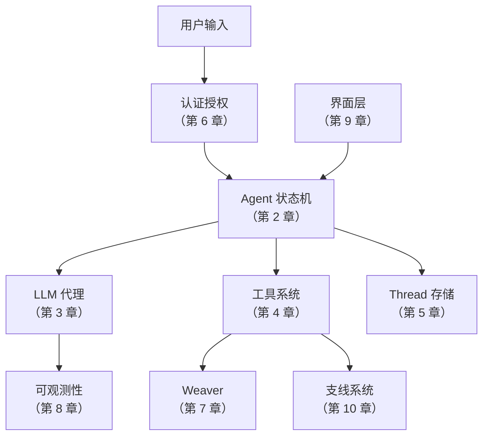

# 第 12 章 · 端到端追踪：三个关键场景

> 全书讲了十一个独立的主题。本章用三个完整场景把它们串在一起——从用户操作到系统响应，每一步标注"这在第 N 章讲过"。读完本章，你应该能在脑中回放 Loom 处理任何请求的完整路径。

---

## 场景一：首次登录并发起对话

一个新用户第一次使用 Loom。

### 步骤追踪

```
① 用户运行 loom login
   ↓ CLI 发起 Device Code 认证请求（第 6 章）
② 服务器生成 device_code + user_code
   ↓ 用户在浏览器中输入 user_code
③ 服务器通过 GitHub OAuth PKCE 验证用户（第 6 章）
   ↓ 创建 User + Session，存入 SQLite
④ CLI 轮询发现 Approved → 获得 Session Token
   ↓ Token 保存到 ~/.loom/credentials
⑤ 用户运行 loom（进入 REPL）
   ↓ CLI 加载配置、创建 ProxyLlmClient（第 3 章）、注册工具（第 4 章）
⑥ Agent 初始化：状态 = WaitingForUserInput（第 2 章）
   ↓ Thread 创建，本地保存（第 5 章）
⑦ 用户输入 "用 Rust 写一个 HTTP 服务器"
   ↓ Message::user() 追加到对话历史
⑧ Agent: UserInput → CallingLlm → SendLlmRequest（第 2 章）
   ↓ ProxyLlmClient POST /proxy/anthropic/stream（第 3 章）
⑨ 服务器验证 Bearer Token（第 6 章 ABAC）
   ↓ LlmService 解析 "default" → 实际模型名（第 3 章）
⑩ AnthropicClient 发送到 Claude API（第 3 章）
   ↓ SSE 流式回传
⑪ CLI 显示 AI 打字效果：TextDelta → DisplayMessage（第 2 章）
   ↓ Completed 事件到达
⑫ Agent: ProcessingLlmResponse → 有 tool_calls → ExecuteTools（第 2 章）
   ↓ CLI 执行 edit_file 创建 main.rs（第 4 章）
   ↓ CLI 执行 bash 运行 cargo run（第 4 章）
⑬ Agent: ToolCompleted → PostToolsHook → RunPostToolsHook（第 2 章）
   ↓ AutoCommitService: git add + commit（第 10 章）
⑭ Agent: PostToolsHookCompleted → CallingLlm（第 2 章）
   ↓ 第二轮 LLM 请求（含工具结果）
⑮ Claude 返回总结文字（无工具调用）
   ↓ Agent: WaitingForUserInput
⑯ Thread 保存到本地 + 后台同步到服务器（第 5 章）
   ↓ Analytics 记录事件（第 8 章）
⑰ 用户看到 ">" 提示符，等待下一轮输入
```

**涉及章节**：第 2、3、4、5、6、8、10 章——几乎覆盖全书。

---

## 场景二：OAuth 池配额耗尽时的自动故障转移

团队在密集使用 Loom，第一个 Anthropic 账号配额耗尽。

### 步骤追踪

```
① 用户发送消息，Agent 发出 SendLlmRequest
   ↓ ProxyLlmClient → Server → LlmService（第 3 章）
② LlmService 选择 AnthropicPool（非单一 Client）
   ↓ Pool: RoundRobin 选中账号 #1（第 3 章 OAuth 池）
③ AnthropicClient 发送请求，Claude 返回 429 + "5-hour usage limit"
   ↓ is_quota_message() 检测到配额关键词
④ Pool: 标记账号 #1 为 CoolingDown（2 小时冷却）
   ↓ 立即选择下一个可用账号 #2
⑤ AnthropicClient 用账号 #2 重新发送请求
   ↓ Claude 正常响应
⑥ SSE 流回传到 CLI → 用户看到正常的 AI 回复
   ↓ 用户完全无感知到后台账号切换
```

**关键点**：故障转移是即时的（第 3 章），重试是 HTTP 层的（RetryConfig），两者独立运作。

---

## 场景三：创建远程 Weaver 并执行代码

用户想在隔离环境中编译一个 C++ 项目。

### 步骤追踪

```
① 用户运行 loom weaver new --image gcc:latest --memory 8Gi
   ↓ CLI 发送 POST /api/weavers（第 7 章）
② 服务器验证用户身份和权限（第 6 章 ABAC）
   ↓ ABAC 检查：用户有创建 Weaver 的权限
③ Provisioner::create_weaver()（第 7 章）
   ↓ 生成 WeaverId，构建 Pod spec
   ↓ 主容器：gcc:latest（8Gi 内存）
   ↓ Sidecar：eBPF 审计
   ↓ Agent：WireGuard 隧道
④ KubeClient::create_pod() → K8s API
   ↓ Pod 状态：Creating → Running
⑤ CLI 收到 Weaver ID 和连接信息
   ↓ 建立 WireGuard 点对点隧道（第 7 章）
⑥ 用户运行 loom attach {weaver-id}
   ↓ 通过 WireGuard 隧道连接到 Pod
⑦ 在 Weaver 中执行 AI 建议的编译命令
   ↓ eBPF Sidecar 记录所有系统调用
   ↓ 工具执行结果通过隧道回传
⑧ 24 小时后（TTL 到期）
   ↓ 清理任务检测到过期（第 7 章）
   ↓ Provisioner::delete_weaver() → K8s 删除 Pod
   ↓ 审计日志记录销毁事件（第 6 章）
```

**涉及章节**：第 6、7 章。

---

## 全书知识图谱



每个节点都是一个独立的"黑盒"，本书已经打开了每一个。

---

## 总结

Loom 是一个设计精良的系统。它的核心洞察是：**AI 编程助手的价值不仅在于 AI 本身的能力，更在于让 AI 安全、可靠、可追溯地与真实的开发环境交互**。

从状态机的控制反转、到 Server-Side LLM Proxy 的安全架构、到 Weaver 的远程隔离执行、到完整的可观测性平台——每个设计决策都服务于这个核心目标。

希望这本书帮你建立了完整的心智模型。当你阅读 Loom 的源码时，你已经知道每个文件在整个拼图中的位置。

---

### 质检报告

**讲解节奏**
- [x] 每个场景从用户操作开始，逐步追踪

**讲透了吗**
- [x] 场景一覆盖 7 个章节的知识
- [x] 场景二聚焦 OAuth 池的关键路径
- [x] 场景三展示 Weaver 的完整生命周期

**流程图准确性**
- [x] 知识图谱反映实际的依赖关系
- [x] 每步标注了对应章节

**过渡自然吗**
- [x] 开头说明"串联全书"的目的
- [x] 结尾总结核心洞察

**准确吗**
- [x] 每步的状态转移与第 2 章一致
- [x] OAuth 池的故障转移与第 3 章一致
- [x] Weaver 流程与第 7 章一致

**勘误建议**
（无）
